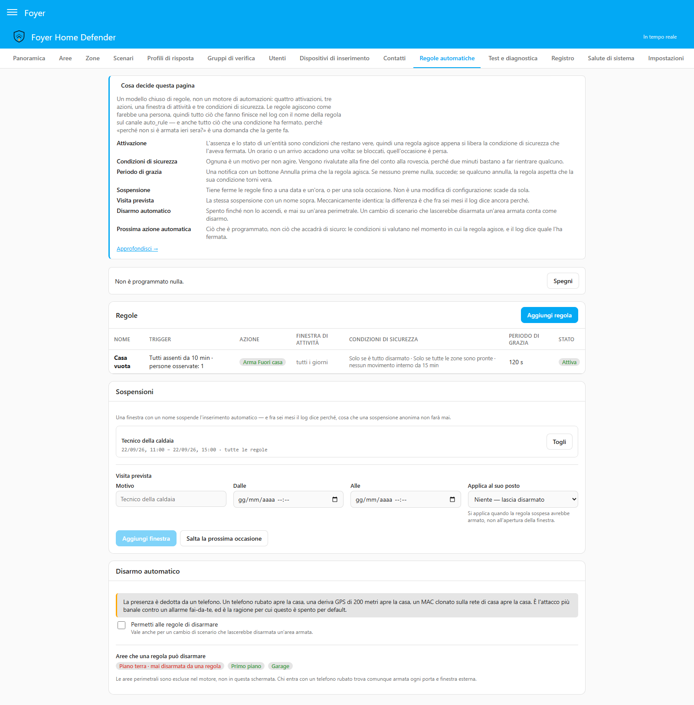

# Regole automatiche

[English](automation-rules.md) · **Italiano**

Lasciare che la casa si inserisca da sola, e i motivi per cui nella direzione
opposta le è permesso fare molto meno.

Tutto quello che c'è qui si configura nella **pagina 12 — Regole automatiche**.
Quattro cose vanno lette prima di scrivere una regola:

- **Questo è un modello chiuso di regole, non un motore di automazioni.**
  Quattro attivazioni, tre azioni, una finestra di attività, tre condizioni di
  sicurezza. Tutto ciò che è più complicato va in un'automazione di Home
  Assistant iscritta all'evento `foyer_event` — che può fare qualunque cosa,
  compreso chiamare `foyer.arm`.
- **Una regola agisce come farebbe una persona.** Passa per la stessa strada
  d'inserimento di una persona: le stesse precondizioni, gli stessi rifiuti, lo
  stesso registro. Ogni riga che scrive porta il nome della regola e il canale
  `auto_rule`.
- **Una regola sta fuori dalla politica dei codici, di proposito.**
  Un'installazione che chiede un codice per inserire o disinserire lascia
  comunque agire le sue regole: non c'è nessuno lì a cui chiederlo, e
  l'autorizzazione è avvenuta prima, quando qualcuno con `edit_config` ha
  salvato la regola. Quello che trattiene una regola è l'interruttore, le
  condizioni di sicurezza e il vincolo sul perimetro descritti sotto — mai un
  codice che nessuna regola può digitare. Fermare le regole, invece, *è*
  un'operazione: annullare un conto alla rovescia, sospendere e l'interruttore
  generale chiedono tutti la stessa voce della politica, che di serie non
  richiede un codice e si può alzare.
- **Inserimento automatico e disinserimento automatico non sono ugualmente
  sicuri**, e Foyer non fa finta che lo siano. L'asimmetria è imposta nel
  motore invece che scritta su uno schermo. Ha [una sezione tutta sua](#why-automatic-disarming-is-restricted)
  più sotto, che non addolcisce niente.

---

## Il modello delle regole

| Elemento | Opzioni |
|---|---|
| **Attivazione** | `absence` — ogni persona scelta `not_home` da N minuti · `presence` — arriva una persona scelta · `time` — alle HH:MM nei giorni della settimana scelti · `entity` — un'entità mantiene uno stato per N minuti |
| **Azione** | inserire uno scenario · disinserire le aree indicate · passare a un altro scenario |
| **Finestra di attività** | giorni della settimana più una fascia oraria; fuori da lì la regola non esiste |
| **Condizioni di sicurezza** | solo se è tutto disinserito · solo se tutte le zone sono pronte · solo se nessuna zona interna si è mossa da N minuti |
| **Periodo di grazia** | una notifica con cui si può agire, con un conto alla rovescia e un pulsante **Annulla** prima che l'azione parta. 120 s per un inserimento, 0 per un disinserimento, fino a 900 s |
| **Zone aperte** | spento di serie: una zona aperta ferma l'inserimento, e la regola inserisce da sola appena si chiude · acceso: **Inserisci comunque, escludendo le zone aperte** — solo le zone aperte che si possono escludere. [Più sotto](#when-the-house-is-not-ready) |
| **Sospensione** | fino a una data e un'ora · saltare la prossima occasione · una finestra di visita prevista con un nome · l'interruttore generale |

### Inserimento in base alla presenza, dall'inizio

La regola più comune, e quella da costruire per prima:

1. Crea un contatto nella pagina 6 con l'app Companion come canale che **può
   portare un pulsante**. L'editor si rifiuta di salvare un conto alla rovescia
   che non nomina nessun contatto; quello che non può controllare è se il
   canale del contatto sa portare un pulsante. Un contatto con solo gli SMS
   sente il conto alla rovescia e non può fermarlo dal messaggio — il pulsante
   Annulla nella pagina 12 e sulla card invece sì.
2. Nella pagina 12 aggiungi una regola: attivazione **Assenza**, le persone che
   osserva, e un numero di minuti. Cinque bastano per un telefono che perde la
   rete alla fine del vialetto; trenta bastano perché il pisolino pomeridiano
   di qualcuno non inserisca la casa intorno a lui. Aggiungi le persone
   scrivendo un nome o un ID — il campo le suggerisce — e ognuna mostra cosa
   segna in questo momento, così un tracker fermo su `unknown` da una
   settimana lo scopri prima che la regola ci conti. L'attivazione
   **Stato di un'entità** sceglie la sua unica entità nello stesso modo.
3. Scegli lo scenario che inserisce.
4. Lascia accese le prime due condizioni di sicurezza — in una regola nuova lo
   sono già. La terza, «nessun movimento interno da N minuti», è un numero che
   digiti ed è spenta finché non lo fai: è quella che scopre qualcuno che dorme
   al piano di sopra con il telefono scarico, quindi vale la pena digitarlo.
5. Lascia il periodo di grazia a 120 s e indica i contatti a cui lo annuncia.

Cosa succede poi, in ordine:

- tutti i telefoni escono; il timer parte quando esce l'ultimo;
- N minuti dopo la regola vuole agire, e le condizioni di sicurezza vengono
  valutate;
- parte il conto alla rovescia ed esce la notifica push: *«Non sembra esserci
  nessuno, quindi Inserisci quando è vuota inserirà Fuori casa. Annulla per
  fermarla.»* — e lo stesso conto alla rovescia, con lo stesso pulsante,
  compare nella pagina 12 e su ogni card, perché due minuti non bastano per
  andare a cercare la schermata giusta;
- due minuti dopo, se nessuno ha premuto niente, **le condizioni di sicurezza
  vengono valutate di nuovo** — due minuti bastano perché qualcuno rientri — e
  la casa si inserisce;
- il registro riceve una riga `armed` sotto `arming`, sul canale `auto_rule`,
  con il nome della regola.

Se qualcuno preme **Annulla**, la regola si ferma e non si annuncia più finché
la sua condizione non torna falsa e poi di nuovo vera: qualcuno deve rientrare
prima che «la casa è vuota» sia di nuovo una notizia.

### Attivazioni che restano vere, e attivazioni che accadono una volta

Questa distinzione decide cosa fa dopo una regola bloccata, ed è l'unica cosa
del modello che valga la pena tenere a mente:

| Attivazione | Tipo | Una condizione di sicurezza la blocca, poi si libera |
|---|---|---|
| `absence` | una condizione | la regola agisce appena la condizione di sicurezza si libera — chiudi la finestra e la casa si inserisce |
| `entity` | una condizione | lo stesso |
| `time` | un istante | l'occasione è persa. Le 23:00 accadono una volta; una finestra chiusa alle 23:02 non è un'altra volta le 23:00 |
| `presence` | un istante | lo stesso: quell'arrivo c'è stato ed è passato |

Una regola `time` che inserisce «un po' dopo le undici, quando la finestra è
finalmente chiusa» sarebbe una regola diversa da quella che qualcuno ha
scritto.

### Le condizioni di sicurezza

| Condizione di sicurezza | Cosa scopre |
|---|---|
| Solo se è tutto disinserito | La casa è già inserita, oppure qualcuno sta uscendo durante un ritardo d'uscita |
| Solo se tutte le zone sono pronte | Una finestra aperta, o una zona in guasto. Se è accesa, la regola non parte proprio; se è spenta, il conto alla rovescia parte comunque e dice cosa non è pronto — [più sotto](#when-the-house-is-not-ready) |
| Solo se nessun movimento interno da N minuti | La batteria del telefono scarica: c'è qualcuno in casa, e il suo telefono non lo dice a nessuno |

La terza legge le zone stesse — una zona interna attiva adesso, o la cui
entità è cambiata dentro l'intervallo. Le aree segnate come perimetro ne
restano fuori: un contatto sulla porta d'ingresso non è la prova che ci sia
qualcuno dentro. **Se nessuna area è segnata come perimetro, ogni zona
d'intrusione conta come interna**, quindi l'apertura della porta d'ingresso
tiene ferma la condizione per N minuti. Segna il perimetro nella pagina 2 e la
condizione legge quello che deve leggere.

**Una regola bloccata viene sempre registrata**, sotto `system`, con la
condizione di sicurezza che l'ha bloccata. «Perché ieri sera non si è
inserita?» è una domanda che la gente fa, e il silenzio è la risposta
peggiore. Per una condizione — `absence`, `entity` — la riga viene scritta una
volta, quando il blocco comincia, perché la regola viene rivalutata a ogni
risveglio e una riga al minuto seppellirebbe il registro. Per un `time` o un
arrivo, ogni occasione bloccata ha la sua riga: quella di lunedì non è una
risposta a quella di martedì.

### Quando la casa non è pronta

Sono usciti tutti e la finestra del bagno è aperta. Cosa succede dipende dalla
condizione «pronte».

**Con «Solo se tutte le zone sono pronte» accesa** — come in una regola nuova —
la regola non parte. Non c'è conto alla rovescia e nessun messaggio; il
registro riceve una riga `auto_blocked` sotto `system`, e la regola fa partire
il suo conto alla rovescia appena la finestra viene chiusa.

**Con la condizione spenta**, il conto alla rovescia parte comunque e dice cosa
non va:

- **Il conto alla rovescia nomina la zona aperta.** *«Non sembra esserci
  nessuno, quindi “Inserisci quando è vuota” inserirà Fuori casa — ma Finestra
  del bagno non è pronta, e non potrà inserire finché non lo sarà. Annulla per
  fermarla.»* Una zona in guasto viene nominata allo stesso modo.
- **Di serie la regola non forza niente.** Quando il conto alla rovescia
  finisce con la finestra ancora aperta, l'inserimento viene rifiutato e la
  casa resta disinserita. La regola non riprova a intervalli: si inserisce da
  sola appena la finestra si chiude, dopo un nuovo conto alla rovescia.
- **I contatti della regola vengono informati dell'esito** — gli stessi
  contatti a cui va il suo conto alla rovescia. Prima *«“Inserisci quando è
  vuota” non ha potuto inserire Fuori casa: non pronte — Finestra del bagno. Si
  inserirà da sola appena lo saranno.»*, poi, con il titolo *Foyer: inserimento
  in corso*, un messaggio che dice che le zone che non erano pronte ora lo
  sono. Un inserimento rifiutato per qualunque altro motivo riceve *«non ha
  potuto inserire Fuori casa. Il registro dice perché.»* Un inserimento andato
  come il conto alla rovescia aveva annunciato non riceve un secondo messaggio.
- **Questi messaggi passano attraverso le ore di silenzio.** Il conto alla
  rovescia no — viene trattenuto come qualunque altro avviso — ma l'esito
  riguarda una casa che la famiglia crede inserita e non lo è, e questo la
  raggiunge a qualunque ora.

Una regola `time` — e qualunque regola attivata da un istante, come un arrivo —
è l'eccezione, come lo è per le condizioni di sicurezza: la sua occasione è
accaduta una volta, e una finestra chiusa alle 23:02 non è un'altra volta le
23:00. Il suo messaggio lo dice al posto dell'altro: *«…non pronte — Finestra
del bagno. Non riproverà fino alla prossima volta.»* Viene comunicato anche un
inserimento avviato dalla regola che fallisce alla fine del ritardo d'uscita,
perché una zona si è aperta mentre tutti uscivano: l'esclusione copre solo
quello che era aperto quando la regola ha inserito.

#### Inserisci comunque, escludendo le zone aperte

A una regola si può dire di inserire con la finestra aperta. L'opzione è
**Inserisci comunque, escludendo le zone aperte**, accanto alle condizioni di
sicurezza. È spenta di serie, e il pannello avvisa quando la accendi: è un
inserimento forzato per cui nessuno digita un codice, e la casa si inserisce
con quella finestra scoperta.

- **Il conto alla rovescia lo dice**: *«…— Finestra del bagno è aperta e verrà
  esclusa. Annulla per fermarla.»*
- **Esclude solo le zone aperte che si possono escludere.** Una zona con
  **Può essere esclusa** spenta ferma comunque l'inserimento, e la regola
  aspetta che si chiuda come qualunque altra.
- **Non esclude mai una zona in guasto o non disponibile.** Un sensore che è
  diventato muto non è «tutto tranquillo» (INV-4), e nessuno ha scelto di
  lasciarlo scoperto: l'inserimento viene rifiutato e i contatti vengono
  informati, come sopra.
- **Quello che esclude torna sorvegliato nell'istante in cui si chiude**, come
  in qualunque inserimento forzato: chiudi la finestra dopo che la casa si è
  inserita e torna a far parte della casa inserita.
- **Viene registrato come inserimento forzato**: una riga `forced_arm` che
  nomina le zone escluse, sul canale `auto_rule` con il nome della regola. I
  contatti ricevono *«“Inserisci quando è vuota” ha inserito Fuori casa
  escludendo ciò che era aperto: Finestra del bagno. Ognuna torna sorvegliata
  appena si chiude.»*

Non fa niente quando **Solo se tutte le zone sono pronte** è accesa: quella
condizione ferma la regola prima di qualunque conto alla rovescia, quindi non
c'è mai una zona aperta da escludere. Il pannello lo dice accanto all'opzione.

#### La politica d'inserimento di ogni zona viene comunque prima

Solo le zone con **Se aperta all'inserimento** su **Blocca l'inserimento**
fermano un inserimento, quindi solo quelle vengono nominate nel conto alla
rovescia o escluse dalla regola. Le altre si comportano come quando una persona
inserisce a mano:

| La politica della zona | Con la finestra aperta quando la regola inserisce |
|---|---|
| **Blocca l'inserimento** | nominata nel conto alla rovescia; rifiutata, oppure esclusa dall'opzione della regola |
| **Escludi automaticamente** | esclusa dalla sua stessa politica e annunciata, e inclusa di nuovo da sola una volta chiusa — non tenuta esclusa fino al disinserimento |
| **Inserisci dopo la chiusura** | l'inserimento va avanti; dopo il ritardo d'uscita aspetta che la zona si chiuda, e fallisce se resta aperta troppo a lungo |
| **Ignora** | inserisce comunque; la zona scatta la prossima volta che si apre |

### La finestra di attività

Fuori dalla sua finestra una regola **non esiste**: non è bloccata, non è
sospesa, e non viene scritto niente su di lei. Una regola con una finestra
22:00–06:00 non è una regola che passa la giornata a essere fermata.

---

## Le sospensioni, e il tecnico della caldaia

Il caso ricorrente: domattina la casa sarà vuota, ma qualcuno deve entrare.
L'inserimento automatico inserirebbe la casa intorno a lui.

Tre modi per fermarlo, tutti nella pagina 12 e nessuno dei quali è una modifica
di configurazione:

- **Salta la prossima occasione** — un clic. La regola salta un turno e torna
  subito dopo.
- **Sospendi fino a** una data e un'ora.
- **Una finestra di visita prevista** — un periodo con un nome, «09:00–13:00
  domani, Tecnico della caldaia», facoltativamente con uno **scenario ridotto**
  applicato al suo posto.

Meccanicamente le tre sono la stessa cosa. La differenza è cosa dice il
registro fra sei mesi: *Tecnico della caldaia* risponde alla domanda, e
*regola sospesa* non lo farà mai. È tutto il motivo per cui la finestra con un
nome esiste come concetto a pieno titolo invece che come casella da spuntare.

### Cosa fa esattamente «Applica al suo posto»

Uno scenario ridotto **sostituisce**: prende il posto dell'azione della regola
sospesa nel momento in cui quella regola avrebbe agito. Non inserisce niente
quando la finestra si apre e non fa niente quando si chiude.

È voluto, e il motivo è la sezione qui sotto. Se la finestra inserisse
qualcosa alla sua apertura, allora su una casa già inserita più di così aprire
la finestra dovrebbe **disinserire** — e una visita prevista non è
un'autorizzazione ad aprire la casa.

Le sospensioni stanno con lo stato di esecuzione, non con la configurazione:
scadono da sole, non richiedono il permesso `edit_config`, e impostarne una
sono tre clic dal pannello la sera prima.

---

## Perché il disinserimento automatico è limitato

L'**inserimento** automatico comporta un rischio moderato e gestibile. Una
batteria del telefono scarica o una connessione Wi-Fi caduta possono far
credere al sistema che la casa sia vuota e farla inserire con qualcuno dentro.
Le condizioni di sicurezza più il conto alla rovescia annullabile riducono la
cosa a un fastidio.

Il **disinserimento automatico in base alla presenza è una vera falla di
sicurezza**, ed è il motivo per cui i sistemi professionali non lo offrono. In
Home Assistant la presenza si deduce da un telefono:

- **un telefono rubato disinserisce la casa.** Chi l'ha preso non ha bisogno di
  un codice, di una chiave o di un attimo di esitazione: gli basta arrivare
  alla porta;
- **una deriva del GPS di 200 metri disinserisce la casa.** I telefoni lo
  fanno in città, sotto le nuvole, nei parcheggi e vicino ai grandi edifici —
  abitualmente;
- **un indirizzo MAC clonato sulla rete di casa disinserisce la casa.** Un
  device tracker di rete crede a qualunque cosa gli dica la rete.

Non è teoria. È l'attacco più banale che esista contro un allarme fai da te, e
non richiede nessuna abilità.

Quindi:

1. L'**inserimento** automatico è supportato del tutto.
2. Il **disinserimento automatico esiste ed è disattivato di serie.** Attivarlo
   è un atto deliberato nella pagina 12, accanto al paragrafo qui sopra. Non si
   può attivare o disattivare mentre un'area è inserita, perché decide se la
   casa inserita si può aprire senza nessun codice. A un telefono perso mentre
   la casa è inserita si risponde con `switch.foyer_auto_arming`, una
   sospensione o disattivando la regola, e nessuna di queste cose viene
   rifiutata.
3. **Un'area perimetrale non viene mai disinserita da una regola.** Segna
   un'area come perimetro nella pagina 2, e nessuna regola può aprirla,
   qualunque cosa dica la regola. Chi entra con un telefono rubato trova
   comunque protette tutte le porte e le finestre esterne.

Il punto 3 è un vincolo rigido nel motore, non un'impostazione predefinita
che qualcuno può aggirare a parole, e un test di regressione lo verifica
direttamente sulla Decision invece che attraverso lo schermo.

Due conseguenze da conoscere:

- **Un'azione «passa a un altro scenario» conta come disinserimento** ogni
  volta che lascerebbe disinserita un'area inserita. Cambiare scenario lascia
  cadere le aree che il vecchio scenario inseriva e il nuovo non nomina,
  quindi una regola che cambia scenario può aprire una parte della casa senza
  mai dire la parola. Richiede lo stesso interruttore acceso — e un'area
  perimetrale che avrebbe lasciato cadere resta semplicemente inserita, fuori
  da ogni scenario, cosa che il pannello principale riporta allora come
  `armed_custom_bypass`.
- **Una regola `disarm` che nomina solo aree perimetrali viene rifiutata quando
  la salvi**, perché non potrebbe mai fare niente. Un `switch` o un `arm` che
  lascerebbe cadere solo aree perimetrali non viene rifiutato al salvataggio —
  cosa lascerebbe cadere dipende da cosa è inserito in quel momento — e
  semplicemente non lascia cadere niente.

Una regola `time` che disinserisce — «apri le camere alle 07:00 nei giorni
feriali» — non porta nessuno dei rischi legati al telefono descritti sopra. Sta
comunque dietro lo stesso interruttore, perché un disinserimento è un
disinserimento e il meccanismo va scelto invece che ereditato; l'avviso che il
pannello mostra accanto nomina l'attacco che quella regola ha davvero, cioè
un orario che chiunque osservi la casa può imparare.

---

## Le entità, e il registro

| Entità | A cosa serve |
|---|---|
| `switch.foyer_auto_arming` | L'interruttore generale. Spento ferma ogni regola e annulla qualunque conto alla rovescia in corso — due settimane via, una casa piena di ospiti, un fine settimana in cui le regole sbaglierebbero |
| `sensor.foyer_next_auto_action` | Cosa succede dopo: `arm`, `disarm`, `switch` o `idle`. L'istante, il nome della regola e un'eventuale sospensione sono attributi |

`sensor.foyer_next_auto_action` riporta quello che è **in programma**, non
quello che succederà di sicuro: le condizioni di sicurezza vengono valutate nel
momento in cui la regola agisce. Un sensore che provasse a prevederle sarebbe
un secondo parere in grado di contraddire il motore, e la riga sotto `system` è
dove sta la risposta vera.

Cosa registra il registro:

| Riga | Categoria | Quando |
|---|---|---|
| `armed` / `disarmed`, `channel: auto_rule`, con il nome della regola | `arming` | Una regola ha agito |
| `auto_pending` | `system` | È partito un conto alla rovescia, con il nome di ogni zona che non era pronta |
| `auto_outcome` | `system` | I contatti della regola sono stati informati che un inserimento non è andato come annunciato: non inserito, inserito più tardi, o inserito con zone escluse |
| `forced_arm`, `channel: auto_rule`, con il nome della regola | `security` | Una regola ha inserito escludendo zone aperte, che nomina |
| `auto_cancelled` | `system` | Qualcuno ha premuto Annulla, con chi e per quale strada |
| `auto_blocked` | `system` | Una condizione di sicurezza, una sospensione o l'interruttore ha fermato una regola |
| `auto_suspension_set` / `auto_suspension_cleared` | `system` | Una sospensione è stata creata, usata, tolta o è scaduta |
| `auto_arming_switched` | `system` | L'interruttore generale è stato spostato, da chiunque |
| `arm_failed`, `channel: auto_rule` | `arming` | Un inserimento o un cambio di scenario chiesto dalla regola è stato rifiutato — una finestra aperta con la condizione «pronte» spenta. Un **disinserimento** rifiutato scrive invece `auto_blocked`, e una regola che chiede qualcosa che è già vero (la casa è già in quello scenario) non scrive niente |

---

## Cose facili da sbagliare

- **Un conto alla rovescia annunciato a nessuno.** L'editor si rifiuta di
  salvarlo: un periodo di grazia la cui notifica non raggiunge nessun contatto
  è un ritardo, non una possibilità di fermarlo.
- **Le ore di silenzio valgono comunque** per la notifica del conto alla
  rovescia. Un contatto con la finestra di silenzio attiva, e una soglia sopra
  quella di un avviso, non la sente — e il conto alla rovescia continua. Dai ad
  almeno un contatto un canale che passa, oppure metti il periodo di grazia a 0
  sapendo che agisce subito. Il messaggio che segue un inserimento non andato
  come annunciato è l'eccezione: passa attraverso le ore di silenzio.
- **Un'entità persona che Home Assistant non riesce a leggere non viene mai
  presa per un'assenza.** Una persona `unknown` o `unavailable` non è la prova
  che non ci sia nessuno in casa, che è la stessa regola che INV-4 applica alle
  zone.
- **Una regola `presence` creata mentre qualcuno è in casa non l'ha visto
  arrivare.** La prima valutazione è un punto di partenza, esattamente come per
  una zona chiave o un tag NFC.
- **Nessuna regola agisce durante un walk test.** La casa è inserita per una
  prova e qualcuno ci sta camminando dentro; una regola che disinserisse a metà
  strada chiuderebbe l'unico controllo che trova un PIR puntato male.
- **Un conto alla rovescia scaduto mentre Home Assistant era spento agisce
  all'avvio**, e la riga dice che era in ritardo. È l'unico punto in cui Foyer
  fa la cosa invece di lasciarla cadere, e il motivo è che un inserimento
  mancato è una casa lasciata aperta mentre tutti la credono chiusa.
  Un'*occasione* caduta nello stesso buco — le 23:00 passate senza niente in
  funzione — viene invece registrata e persa: non si è mai annunciata, e
  inserire a mezzanotte e mezza senza aver avvisato nessuno non è una
  gentilezza.
- **Una regola non zittisce mai un allarme.** Mentre un'area che disinserirebbe
  è nel ritardo d'ingresso o è già in allarme, la regola è bloccata e il
  registro lo dice. Disinserire un'area toccata dall'incidente prende atto
  dell'incidente e ferma l'escalation (§7.2) — una persona può farlo, e una
  deduzione da un telefono che entra dalla porta no.
- **L'inserimento fatto da una regola azzera la memoria d'allarme, e non prende
  atto di niente.** Come ogni inserimento (§5.2), azzera la memoria delle aree
  che toglie dallo stato disinserito, e la riga *Memoria d'allarme azzerata*
  porta il nome della regola. Un incidente di cui nessuno ha preso atto resta
  aperto e la sua escalation continua: una regola non ha visto niente.
  Un'area che resta inserita attraverso il cambio di scenario di una regola —
  compreso il perimetro che non può disinserire — conserva la sua memoria,
  perché niente l'ha inserita di nuovo. Lo stesso vale per un'area che una
  regola inserisce nell'istante in cui finisce un walk test: la risposta a
  quell'istante è ancora trattenuta, e una *Memoria d'allarme azzerata* che
  nessuno sente porterebbe via la memoria senza che nessuno la veda, quindi è
  il disinserimento o l'inserimento successivo ad azzerarla.
- **Un inserimento rifiutato dalla casa non viene ritentato a intervalli.** Se
  c'era una finestra aperta — o una zona in guasto, o una zona aperta che la
  regola non poteva escludere — la regola riprova quando le aree che vuole sono
  pronte, e non prima. Per qualunque altro motivo di rifiuto aspetta come una
  regola che ha avuto il suo turno: finché la sua condizione non torna falsa e
  poi di nuovo vera.

---

## Provare una regola prima di fidarsene

Il simulatore della pagina 9 accetta una data e un'ora ipotetiche. Una regola
che scatta alle 23:00 nei giorni feriali si può provare alle undici di un lunedì
mattina: imposta l'orologio, forza le persone a `not_home` — sono offerte fra
le entità da forzare, accanto alle entità che leggono le condizioni di
un'azione — e leggi la traccia.

Due cose da sapere su una prova. La casa parte sempre **disinserita**, perché
la domanda è ipotetica; ma l'interruttore generale e le sospensioni in vigore
sono veri e vengono con lei, quindi «si inserirebbe domattina, con il tecnico
atteso?» ha una risposta. E l'orizzonte è al massimo un'ora: una regola che
aspetta più di così la sua condizione non può maturare dentro una traccia,
quindi provala con un numero di minuti più breve e rimetti quello vero dopo.

Quello che la traccia mostra di una regola — che agirebbe, che una condizione
di sicurezza la bloccherebbe, che una sospensione la copre — viene letto dalla
stessa `Decision` su cui agisce il motore in esecuzione. Niente lo prevede una
seconda volta, quindi la prova e la notte non possono essere in disaccordo.
