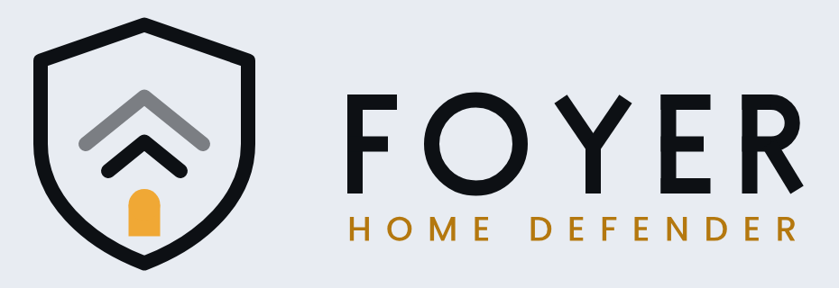

# Visual identity

**English** · [Italiano](brand.it.md)

This page describes Foyer Home Defender's mark: what it is drawn from, its
three colours, the files in [`docs/logo/`](logo/) and where each one is used,
and the few rules that keep them coherent. It is for contributors touching the
panel, the card or the README, and for anyone who wants to put the icon on a
dashboard of their own. The design record is [SPEC §17](SPEC.md#17-visual-identity).

## The mark

The mark extends the earlier **Foyer** symbol — nested arches receding into the
distance, a lit arched doorway and a threshold line — by enclosing it in a
shield. The shield was chosen for immediate legibility as a security product,
which matters more for a project nobody has heard of yet than an internal
geometric echo would (decision 17).

Inside the shield the drawing is reduced to what reads at small sizes: two
arches, the nearer one solid and the farther one at half opacity, and the
doorway beneath them. The doorway is the only warm, filled element; everything
else is a line.

## Palette

| Token | Value | Role |
|---|---|---|
| Ink | `#0D1014` | Ground on dark, stroke on light |
| Paper | `#E8ECF2` | Stroke on dark, ground on light |
| Amber | `#F0A835` | The doorway — the only warm, filled element |
| Amber on light | `#B4780F` | The *HOME DEFENDER* subtitle of the light-ground lockup, for contrast |

**Amber never inverts.** On a light ground the lines and the wordmark flip from
Paper to Ink, and the subtitle's amber darkens to `#B4780F` so that it still
reads against a pale background. The doorway stays `#F0A835` in every colour
file, light ground or dark.

## The asset set

Every file below is in [`docs/logo/`](logo/).

| File | Where it appears | Constraint |
|---|---|---|
| `foyer-hd-icon.svg` | The `foyer:shield` icon, for dashboards | A separate drawing: 24 px, single colour, `currentColor`, stroke 3.4. Not the sidebar icon |
| `foyer-hd-symbol-dark-bg.svg` `foyer-hd-symbol-light-bg.svg` | The panel header, drawn at 32 px; the dark-ground file when Home Assistant's theme is in dark mode, the light-ground one otherwise | Full colour, transparent ground |
| `foyer-hd-app.svg`, `foyer-hd-app-512.png`, `foyer-hd-app-192.png` | The 192 px PNG heads both READMEs, at a width of 120 | Ink rounded tile, the symbol scaled to 0.84 for a safe margin |
| `foyer-hd-lockup-dark-bg.svg` / `.png` `foyer-hd-lockup-light-bg.svg` / `.png` | This page | Two files, not one recoloured |

Three details of how they are wired in:

- **The header symbol is inlined into the panel at build time.** The panel
  imports the two SVG files as text, so the page draws them without a second
  request and without the files being served on their own.
- **The READMEs load the tile by an absolute GitHub address**, not a relative
  path. HACS renders the README inside Home Assistant, where a relative path
  resolves against Home Assistant instead of the repository, and the logo
  broke there once.
- **`foyer:shield` is generated, not hand-written.** Home Assistant draws a
  custom icon as one filled path in `currentColor` and does not draw strokes,
  so `scripts/build_sidebar_icon.py` outlines the strokes of
  `foyer-hd-icon.svg` with the same geometry and writes the result to
  `frontend/src/icons/icon-path.ts`. CI runs the script and fails when the
  committed path no longer matches the SVG, so the two cannot drift. If the
  icon changes, edit the SVG and run the script again.

To use the icon on a dashboard, write `icon: foyer:shield` wherever a card
takes an icon. The icon set is registered by a module Home Assistant loads on
every page, so it is available on any dashboard once the integration is set up.

### Files `docs/logo/` also holds

Five files are not part of the asset set above. They are the earlier Foyer
mark, before the shield, committed with the design specification. Nothing in
the code, the READMEs or the other documents uses them.

| File | What it is |
|---|---|
| `foyer-simbolo.svg` | The original symbol: three arches at full, 60 % and 32 % opacity, the amber doorway and a threshold line, in Paper on a transparent ground |
| `foyer-icona.svg`, `foyer-icona.png` | The same symbol on an Ink rounded tile; the PNG is a 1067 × 1067 rendering of it |
| `foyer-scuro.svg` | The original symbol with the FOYER wordmark, in Paper, for a dark ground |
| `foyer-chiaro.svg` | The same lockup in Ink, for a light ground |

They use a stroke of 3.6 rather than the 3.2 of the shielded mark.

## Rules that keep it coherent

- **The sidebar icon is `mdi:shield-home`**, and that is a concession, not a
  preference (decision 74). A custom icon set is registered by a JavaScript
  module, and Home Assistant resolves a custom icon exactly once. When the
  sidebar draws before that module has run — which is what the companion app
  does when it starts from a cached page — Home Assistant falls back to a
  legacy element and never retries, and the sidebar keeps an empty square for
  ever. So the Foyer shield is drawn where Foyer's own code is certainly
  loaded, the panel header, and `foyer:shield` stays registered for anyone who
  wants it on a dashboard of their own.
- **The 24 px icon is redrawn, never scaled.** It renders at 24 px and takes
  the theme's colour, so it cannot use the amber or the half-opacity arch that
  make the full-colour symbol work: shrinking the colour version produces grey
  mush. `foyer-hd-icon.svg` is its own drawing — the shield outline, one arch
  and a solid doorway, in `currentColor` with no fill colours, gradient or
  opacity. The fainter arch is left out because it would vanish at that size.
- **The wordmark and the subtitle carry no font dependency.** *FOYER* is
  built from bars and strokes, and *HOME DEFENDER* is stored as outlines
  (Poppins Medium, converted), spaced so that it spans the width of the
  wordmark above it. Nothing in the repository needs a font installed to draw
  the lockup.
- **Stroke weight is constant** at 3.2 in the symbol's 64-unit grid, with
  round joins and round caps, and 3.4 in the monochrome icon so that it
  survives being drawn at 24 px. The wordmark's letters are 3.4 units thick.

## Not covered here yet

- **Use of the mark by third parties.** No policy on who may use the name or
  the logo, and how, has been written. This page describes the files; it does
  not grant or withhold anything.
- **Favicon and integration image.** The panel sets no favicon of its own,
  and `custom_components/foyer/` contains no image, so neither place uses an
  asset from this set today.
