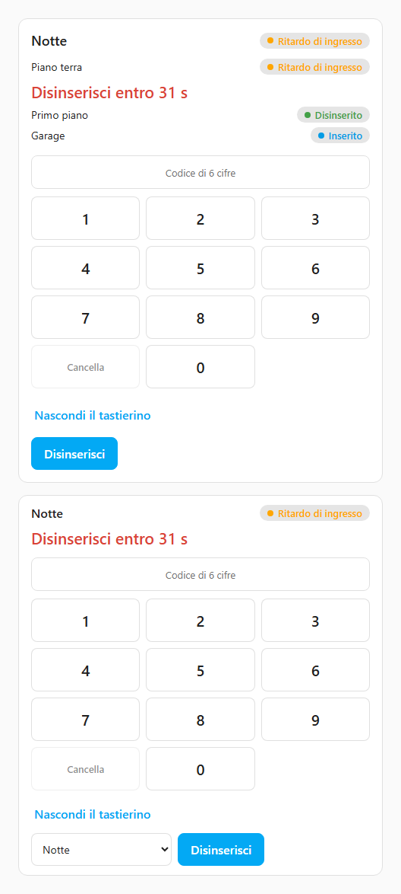
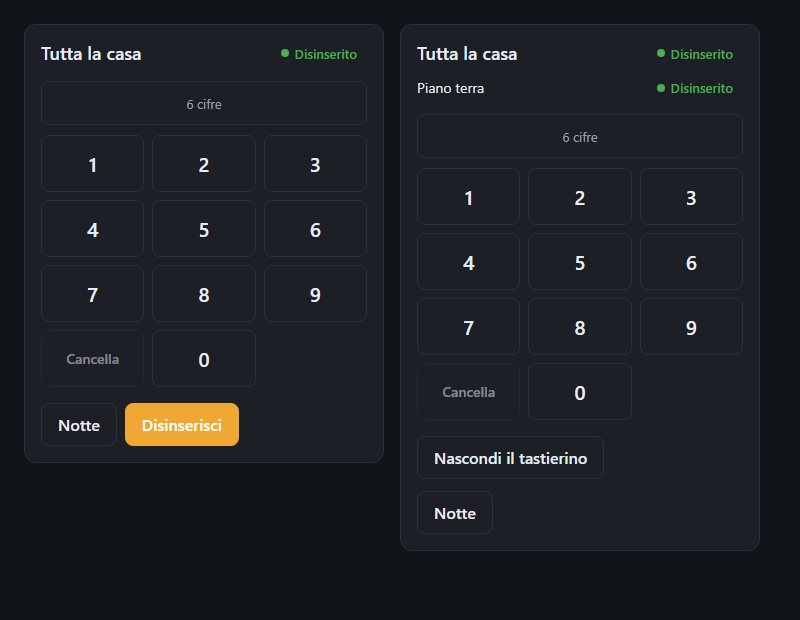
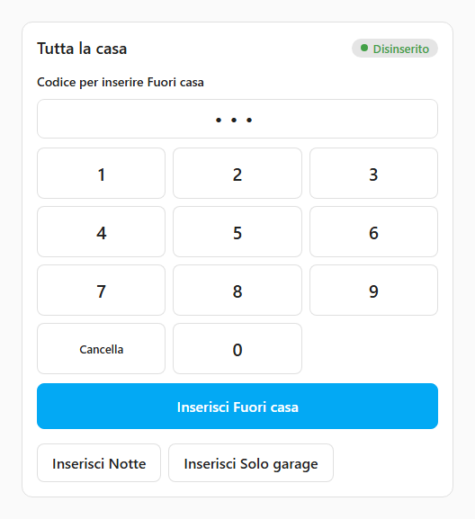
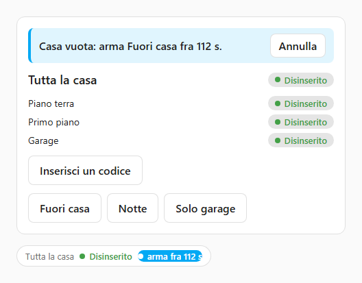

# La card

[English](card.md) · **Italiano**

Questa pagina parla di `foyer-card`, la card per la dashboard: come aggiungerla,
cosa mostra ciascuna delle sue quattro disposizioni, come chiede un codice e
come lo dimentica, e cosa dice durante un ritardo, un allarme e un walk test. È
per chi mette Foyer su una dashboard o sul tablet accanto alla porta d'ingresso.

La card non decide niente da sola. Manda un comando, il backend lo accetta o lo
rifiuta, e la card mostra la risposta — compreso il nome della zona che l'ha
rifiutato e la via per superarla. Un controllo del codice nel browser non
proteggerebbe niente, perché chiunque abbia accesso a Home Assistant può
chiamare direttamente il servizio, quindi ogni codice viene verificato lato
server ([modello di sicurezza](security-model.it.md),
[SPEC INV-2](SPEC.md#inv-2--codes-are-verified-in-the-backend-only), in
inglese).

---

## Aggiungerla

Scegli *Foyer Home Defender* nel selettore delle card della dashboard, oppure
scrivila a mano:

```yaml
type: custom:foyer-card
entity: alarm_control_panel.foyer_master   # oppure alarm_control_panel.foyer_<area>
layout: full                               # full, compact, keypad o badge
```

| Opzione | Cosa imposta |
|---|---|
| `entity` | Quale pannello di Foyer mostra la card: quello di *Tutta la casa*, o quello di un'area. Anche un'entità rinominata funziona, perché la card trova i pannelli di Foyer attraverso il registro delle entità e non per nome |
| `layout` | `full` (il valore predefinito quando l'opzione manca o non è riconosciuta), `compact`, `keypad` o `badge` |

Non ci sono altre opzioni. Aggiunta dal selettore, la card parte sul pannello
di *Tutta la casa* con la disposizione `full`, perché è la card che la maggior
parte delle persone vuole per prima.

Non serve aggiungere nessuna risorsa alla dashboard. All'avvio Foyer registra lo
script della card presso il frontend di Home Assistant, quindi viene caricato
su ogni pagina ed è disponibile in qualunque dashboard. Se il selettore non la
elenca, o una dashboard dice *Custom element doesn't exist: foyer-card*, la
pagina è stata caricata prima che Foyer fosse installato o aggiornato: vedi
[risoluzione dei problemi](troubleshooting.it.md).

### L'editor visuale

L'editor ha due scelte, e scrive lo stesso YAML che scriveresti a mano, quindi
passare dall'uno all'altro non fa perdere niente:

- *Pannello da mostrare* — ogni pannello di Foyer, *Tutta la casa* per primo.
- *Disposizione* — *Completa*, *Compatta*, *Badge* o *Tastierino*, con sotto
  una descrizione di una riga della disposizione scelta.

La card parla la lingua del tuo profilo di Home Assistant, inglese o italiano,
e si disegna con i colori del tema, quindi si legge allo stesso modo in un tema
chiaro e in uno scuro.

## Le quattro disposizioni

| Disposizione | Cosa mostra | Cosa puoi premere |
|---|---|---|
| `full` | Su *Tutta la casa*: lo scenario attivo come titolo, ogni area con il suo stato, la memoria d'allarme e il conto alla rovescia, e *Non pronto per l'inserimento* — ogni zona che impedirebbe l'inserimento di un'area, con le aree che blocca. Su un'area: quell'area, il suo conto alla rovescia e le zone che la bloccano | Un pulsante *Inserisci …* per ogni scenario (su un'area: *Inserisci*), *Disinserisci*, *Escludi* accanto a una zona bloccante che si può escludere, e *Digita il codice* per aprire il tastierino |
| `compact` | Una riga: nome, stato, memoria d'allarme, il conto alla rovescia | Su *Tutta la casa*, un menu a tendina degli scenari; su un'area, *Inserisci*. *Disinserisci* mentre qualcosa è inserito |
| `keypad` | Lo stato, il conto alla rovescia (su *Tutta la casa*, una riga per ogni area che conta, con il suo nome), e il tastierino, sempre aperto | I pulsanti degli scenari o *Inserisci*, *Disinserisci*, le cifre |
| `badge` | Nome e stato come chip colorati, senza niente intorno, da mettere tra altri badge | Niente. Toccarlo apre la finestra dell'entità, come fa ogni altro badge della dashboard |

`badge` è solo colore e stato, da inserire in una dashboard tua. Sta tra le
luci e il termostato, dove un tocco distratto non deve mai disinserire una
casa, quindi non offre niente da premere. Mostra comunque, a colpo d'occhio,
quello che è pericoloso non vedere: un conto alla rovescia d'uscita, d'ingresso
o di attesa in corso al posto dello stato, *Memoria d'allarme*, *Allarme
tecnico*, *Allarme* mentre nessuno ha preso atto di un incidente, *Walk test*,
e una regola automatica in conto alla rovescia (*inserisce fra 95 s*).

La card di un'area inserisce solo quell'area; gli scenari si inseriscono da
*Tutta la casa*, perché un pulsante d'area che inserisse un intero scenario
chiuderebbe in trappola chi si trova in altre stanze
([SPEC decisione 40](SPEC.md#21-decision-log), in inglese). Quando la casa è
disinserita ma un allarme è ancora in memoria, *Disinserisci* diventa *Azzera
memoria d'allarme*, perché è quello che fa premerlo.

## Come chiede un codice

*Completa* e *Compatta* aprono il tastierino quando serve un codice;
*Tastierino* lo mostra sempre. La card non decide mai che serve un codice. Le
cifre già digitate su un tastierino aperto partono con il prossimo comando
premuto; se non ne è stata digitata nessuna, manda il comando senza codice, e
quando il backend risponde *serve un codice*, il tastierino
si apre su quel comando.

Sopra le cifre dice a cosa servono — *Codice per inserire Fuori casa*, *Codice
per disinserire Piano terra*, *Codice per escludere Finestra della cucina*,
*Codice per chiudere il walk test* — e il tasto sotto le cifre nomina la stessa
azione: *Inserisci Fuori casa*, *Disinserisci Piano terra*. Le cifre partono
solo con quel comando. Qualunque altro pulsante parte senza, e il pulsante del
comando in attesa si fa da parte, perché premerlo manderebbe di nuovo lo stesso
comando senza codice.

Il tastierino raccoglie tante cifre quante ne dice la *Lunghezza del codice*
impostata nella pagina *Utenti* (6 di serie, da 4 a 12) e lì si ferma, perché
un tastierino deve sapere quando fermarsi; non sa mai se sono giuste. Funziona
anche una tastiera fisica mentre il tastierino ha il focus: le cifre,
Backspace, e Invio per il tasto di conferma.

Le cifre digitate vengono dimenticate:

- dopo **30 secondi** senza toccare un tasto, insieme al comando per cui erano
  state digitate e a qualunque messaggio che le riguardava, perché un codice
  digitato su un tablet a muro e poi lasciato lì non deve partire con quello
  che preme la persona successiva;
- nel momento in cui parte il comando per cui erano state digitate;
- con *Nascondi il tastierino*;
- quando la card esce dallo schermo, così chi torna sulla vista ore dopo non
  trova né le cifre né il comando.

La card non tiene nessun codice oltre il comando per cui è stato digitato.

I pulsanti di un banner — *Annulla*, *Prendi atto*, *Chiudi il walk test* — si
premono senza pensare al tastierino, quindi non prendono mai cifre digitate per
altro. Se uno di loro ha bisogno di un codice, il tastierino si apre su di lui,
cancella quello che c'era e dice *Digita di nuovo il codice per questa azione*.

Finché nessuno ha un codice, la politica dei codici è inerte e niente ne
chiederà uno ([modello di sicurezza](security-model.it.md)), quindi la card non
mostra nessun tastierino in *Completa* e *Compatta* e nessun link *Digita il
codice*. Al loro posto ogni disposizione tranne *Badge* lo dice, come la
Panoramica: *Nessuno ha ancora un codice, quindi il sistema non ne chiede…*.
Nel momento in cui il backend chiede un codice, l'avviso sparisce e il
tastierino compare.

## Ritardo d'ingresso e allarme

Il conto alla rovescia d'ingresso è scritto in grande e nel colore
dell'allarme — *Disinserisci entro 31 s* — perché è il tempo che resta prima
della sirena. Quando per disinserire servirà un codice, il tastierino si apre
da solo appena parte il conto alla rovescia, perché i secondi spesi ad aprirlo
sono proprio quelli che la persona alla porta non ha. Se lo richiudi, resta
chiuso per quel conto alla rovescia.

Durante un ritardo d'ingresso o un allarme i pulsanti degli scenari di
*Completa* e *Tastierino*, e il menu a tendina degli scenari di *Compatta*, si
fanno da parte, perché l'unica cosa rimasta da
fare è disinserire, e *Disinserisci* diventa il pulsante principale. La card
guarda solo dove punta: la card di *Tutta la casa* reagisce a qualunque area,
la card di un'area solo alla sua, quindi un allarme in garage non toglie i
pulsanti al tastierino dell'ingresso.

<p align="center">
  
</p>

<p align="center">
  
</p>

<p align="center">
  
</p>

## I banner su ogni card

Ogni disposizione che ha spazio per mostrarli li mostra in alto, qualunque sia
l'area a cui punta:

- **Il walk test** — *Walk test in corso. L'allarme non suonerà. Finisce fra
  mm:ss.*, con *Chiudi il walk test*, e un chip *Walk test* accanto allo stato.
  Finché dura un walk test un'intrusione vera non produce niente, quindi
  `badge`, che non ha niente da premere, mostra comunque il suo chip: un badge
  che dice *Inserito* mentre ogni risposta è trattenuta sarebbe la cosa più
  fuorviante della dashboard
  ([walk test](simulator.md#walk-test--which-zones-never-saw-you), in inglese).
- **Una regola automatica in conto alla rovescia** — *Tutti fuori: inserisce
  Fuori casa fra 95 s.*, con *Annulla*. Non viene filtrata in base all'area
  della card, perché una regola inserisce uno scenario, e una card
  dell'ingresso che restasse zitta mentre la casa sta per inserirsi da sola
  trarrebbe in inganno ([automation rules](automation-rules.md), in inglese).
- **Un allarme tecnico** e **un incidente**, ciascuno con il nome delle sue
  zone, ciascuno con il suo *Prendi atto* finché nessuno ne ha preso atto.

<p align="center">
  
</p>

## Quando dice di no

Un rifiuto viene mostrato nella lingua di chi legge, e dove c'è una via per
superarlo la card la offre:

| Cosa è successo | Cosa mostra la card |
|---|---|
| Codice sbagliato | *Il codice non è corretto.*, dentro il tastierino accanto alle cifre, che restano aperte per un altro tentativo |
| Troppi codici sbagliati | *Troppi codici errati: riprova dopo le 14:32.* nel tastierino. Il conteggio è per account di Home Assistant, così un account non può bloccare tutta la casa; il tastierino continua ad accettare cifre, e il blocco finisce da solo |
| Zone aperte o che non rispondono | *Inserimento non riuscito — ancora aperte: Finestra della cucina.* (o *non rispondono*), con *Inserisci senza queste zone* e una riga che dice che non sono sorvegliate finché non si chiudono e che l'inserimento viene registrato come forzato. Le stesse zone sono elencate sotto *Non pronto per l'inserimento* in `full`, con *Escludi* accanto a ciascuna che si può escludere |
| Altri rifiuti | Il motivo a parole: nessun permesso, uno scenario che non puoi usare, un walk test in corso, e così via |
| Il comando non è mai arrivato | *Il comando non è arrivato a Foyer. Non è cambiato nulla: riprova.* |

Un inserimento che riesce con una batteria scarica in una delle sue zone dice
*Batteria scarica: …* come avviso, non come errore, perché una batteria scarica
avvisa e non blocca mai.

---

## Non ancora trattato qui

- Le card d'allarme di Home Assistant e gli assistenti vocali, e quando chiedono
  un codice: vedi [le FAQ](faq.it.md).
