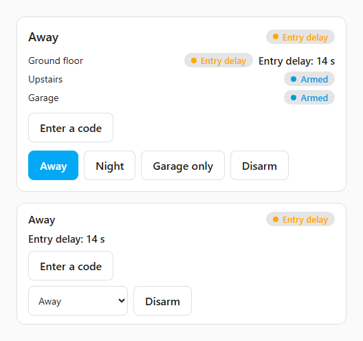
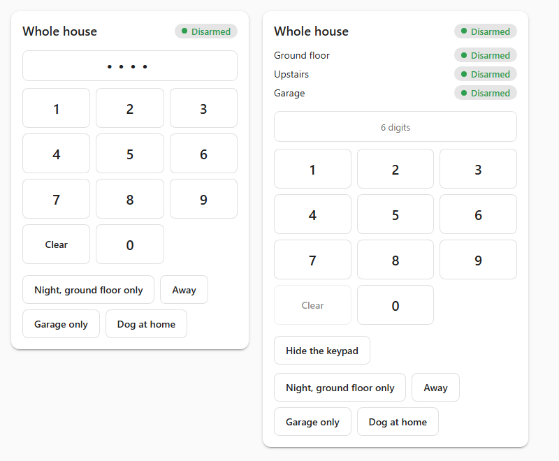
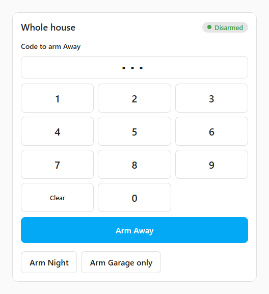
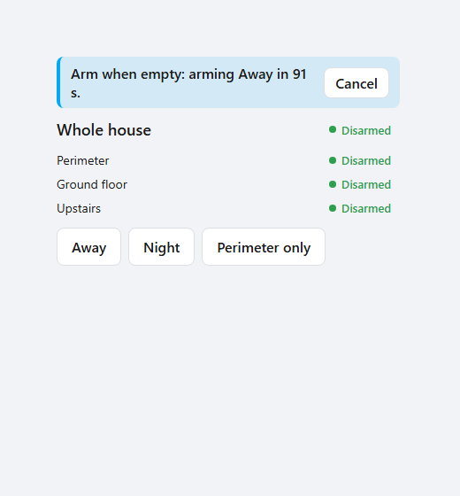

# The card

**English** · [Italiano](card.it.md)

This page is about `foyer-card`, the dashboard card: how to add it, what each
of its four layouts shows, how it asks for a code and forgets it, and what it
says during a delay, an alarm and a walk test. It is for whoever puts Foyer on
a dashboard or on the tablet by the front door.

The card decides nothing by itself. It sends a command, the backend accepts or
refuses it, and the card shows the answer — including the name of the zone that
refused it and the way past it. A code check in the browser would protect
nothing, because anyone with access to Home Assistant can call the service
directly, so every code is verified server-side
([security model](security-model.md), [SPEC INV-2](SPEC.md#inv-2--codes-are-verified-in-the-backend-only)).

---

## Adding it

Pick *Foyer Home Defender* in the dashboard's card picker, or write it by hand:

```yaml
type: custom:foyer-card
entity: alarm_control_panel.foyer_master   # or alarm_control_panel.foyer_<area>
layout: full                               # full, compact, keypad or badge
```

| Option | What it sets |
|---|---|
| `entity` | Which Foyer panel the card shows: the *Whole house* panel, or one area's. A renamed entity works, because the card finds Foyer's panels through the entity registry rather than by name |
| `layout` | `full` (the default when the option is missing or unrecognised), `compact`, `keypad` or `badge` |

There are no other options. Added from the picker, the card starts on the
*Whole house* panel with the `full` layout, because that is the card most
people want first.

No dashboard resource needs adding. Foyer registers the card's script with Home
Assistant's frontend when it starts, so it is loaded on every page and is there
on any dashboard. If the picker does not list it, or a dashboard says *Custom
element doesn't exist: foyer-card*, the page was loaded before Foyer was
installed or updated: see [troubleshooting](troubleshooting.md).

### The visual editor

The editor has two choices, and writes the same YAML you would write by hand,
so switching between the two loses nothing:

- *Panel to show* — every Foyer panel, *Whole house* first.
- *Layout* — *Full*, *Compact*, *Badge* or *Keypad*, with a one-line
  description of the chosen layout under it.

The card speaks the language of your Home Assistant profile, English or
Italian, and draws itself with the theme's own colours, so it reads the same in
a light theme and a dark one.

## The four layouts

| Layout | What it shows | What you can press |
|---|---|---|
| `full` | On *Whole house*: the active scenario as the title, every area with its state, alarm memory and countdown, and *Not ready to arm* — each zone that would stop an area arming, with the areas it blocks. On an area: that area, its countdown and the zones stopping it | One *Arm …* button per scenario (on an area: *Arm*), *Disarm*, *Exclude* beside a blocking zone that may be excluded, and *Type the code* to unfold the keypad |
| `compact` | One row: name, state, alarm memory, the countdown | On *Whole house*, a scenario drop-down; on an area, *Arm*. *Disarm* while something is armed |
| `keypad` | The state, the countdown (on *Whole house*, one line per area counting, named), and the keypad, always open | The scenario buttons or *Arm*, *Disarm*, the digits |
| `badge` | Name and state as coloured chips, with nothing around it, to sit among other badges | Nothing. Tapping it opens the entity's own dialog, as every other badge on the dashboard does |

`badge` is colour and state only, for dropping into a dashboard of your own. It
sits among the lights and the thermostat, where a stray tap must never disarm a
house, so it offers nothing to press. It still shows what is dangerous to miss
at a glance: a running exit, entry or hold countdown in place of the state, *Alarm
memory*, *Technical alarm*, *Alarm* while an incident is unacknowledged, *Walk
test*, and an automatic rule counting down (*arming in 95 s*).

An area's card arms that area only; scenarios are armed from *Whole house*,
because an area button that armed a whole scenario would trap people in other
rooms ([SPEC decision 40](SPEC.md#21-decision-log)). When the house is disarmed
but an alarm is still in memory, *Disarm* reads *Clear alarm memory*, because
that is what pressing it does.

## How it asks for a code

*Full* and *Compact* open the keypad when a code is asked for; *Keypad* always
shows it. The card never decides that a code is needed. Digits already typed
on an open keypad go with the next command pressed; with none typed, it sends
the command without a code, and when the backend answers *a code is
required*, the keypad opens on that command.

Above the digits it says what they are for — *Code to arm Away*, *Code to
disarm Ground floor*, *Code to exclude Kitchen window*, *Code to end the walk
test* — and the key under the digits names the same action: *Arm Away*,
*Disarm Ground floor*. The digits go only with that command. Any other button
sends without them, and the button of the command that is waiting steps aside,
because pressing it would send the same command again with no code.

The keypad collects as many digits as the *Code length* set on the *Users*
page (6 by default, 4 to 12) and stops there, because a keypad has to know
when to stop; it never knows whether they are right. A physical keyboard works too while the keypad
has focus: digits, Backspace, and Enter for the confirm key.

Typed digits are forgotten:

- after **30 seconds** without a key, together with the command they were for
  and any message about them, because a code typed on a wall tablet and walked
  away from must not go out with whatever the next person presses;
- the moment the command they were typed for is sent;
- with *Hide the keypad*;
- when the card leaves the screen, so coming back to the view hours later finds
  neither the digits nor the command.

The card keeps no code beyond the command it was typed for.

The buttons in a banner — *Cancel*, *Acknowledge*, *End walk test* — are pressed
without the keypad in mind, so they never take digits typed for something
else. If one of them needs a code, the keypad opens on it, clears what was
there, and says *Type the code again for this action*.

While nobody holds a code, the code policy is inert and nothing will ask for
one ([security model](security-model.md)), so the card shows no keypad in
*Full* and *Compact* and no *Type the code* link. Instead every layout but
*Badge* says so, as the Overview does: *Nobody holds a code yet, so nothing
asks for one…*. The moment the backend asks for a code, the notice goes and
the keypad appears.

## Entry delay and alarm

The entry countdown is set large and in the alarm's colour — *Disarm within
31 s* — because it is the time left before the siren. When disarming will ask
for a code, the keypad opens by itself as the countdown starts, because the
seconds spent unfolding it are the ones the person at the door does not have.
Fold it away and it stays folded for that countdown.

During an entry delay or an alarm the scenario buttons of *Full* and *Keypad*,
and the scenario drop-down of *Compact*, step aside, because the one thing left to do is disarm, and *Disarm* becomes
the primary button. The card looks only where it points: the *Whole house*
card reacts to any area, an area's card to its own, so an alarm in the garage
does not take the hall keypad's buttons away.

<p align="center">
  
</p>

<p align="center">
  
</p>

<p align="center">
  
</p>

## Banners on every card

Every layout with room for them shows, at the top and whatever area it points
at:

- **The walk test** — *Walk test running. The alarm will not sound. Ends in
  mm:ss.*, with *End walk test*, and a *Walk test* chip beside the state. For as
  long as a walk test runs a real intrusion produces nothing, so `badge`, which
  has nothing to press, shows its chip anyway: a badge reading *Armed* while
  every answer is held back would be the most misleading thing on the
  dashboard ([walk test](simulator.md#walk-test--which-zones-never-saw-you)).
- **An automatic rule counting down** — *Everybody out: arming Away in 95 s.*,
  with *Cancel*. It is not filtered by the card's area, because a rule arms a
  scenario, and a hall card that stayed silent while the house was about to
  arm itself would mislead ([automation rules](automation-rules.md)).
- **A technical alarm** and **an incident**, each naming its zones, each with
  its own *Acknowledge* while it is unacknowledged.

<p align="center">
  
</p>

## When it says no

A refusal is shown in the reader's language, and where there is a way past it
the card offers it:

| What happened | What the card shows |
|---|---|
| Wrong code | *That code is not right.*, inside the keypad next to the digits, which stay open for another try |
| Too many wrong codes | *Too many wrong codes: try again after 14:32.* in the keypad. The count is per Home Assistant account, so one account cannot lock out the household; the keypad still takes digits, and the lockout ends by itself |
| Zones open or not responding | *Not armed — still open: Kitchen window.* (or *not responding*), with *Arm without these zones* and a line saying they are not watched until they close and that the arming is recorded as forced. The same zones are listed under *Not ready to arm* in `full`, with *Exclude* beside each one that may be excluded |
| Other refusals | The reason in words: no permission, a scenario you may not use, a walk test running, and so on |
| The command never arrived | *The command did not reach Foyer. Nothing changed: try again.* |

An arming that succeeds with a low battery in one of its zones says *Low
battery: …* as a warning, not a failure, because a low battery warns and never
blocks.

---

## Not covered here yet

- Home Assistant's own alarm cards and voice assistants, and when they ask for
  a code: see [the FAQ](faq.md).
