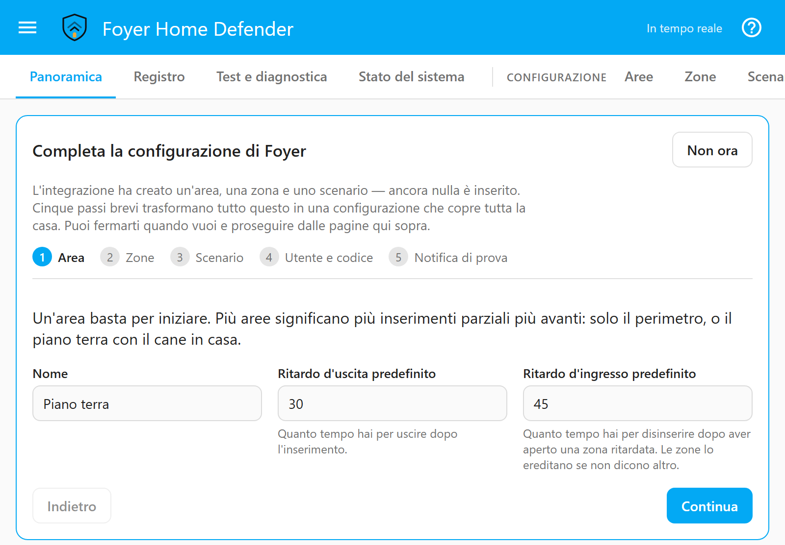
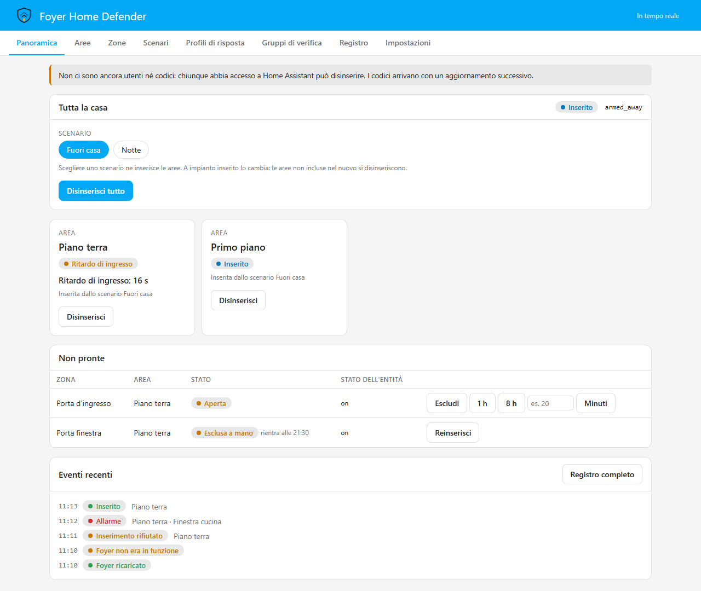

# Per iniziare

[English](getting-started.md) · **Italiano**

Questa pagina ti porta da niente di installato a una casa che si inserisce, va
in allarme e te lo fa sapere. Dice cosa ti serve, i due modi di installare, le
domande che Home Assistant ti fa quando aggiungi l'integrazione, la procedura
guidata che completa la configurazione nel pannello e i primi quindici minuti
dopo. È anche la pagina a cui porta il link *Approfondisci* della Panoramica,
quindi l'ultima parte spiega cosa mostra quella pagina e cosa fa ciascuno dei
suoi pulsanti.

È scritta per chi ha già dei sensori in Home Assistant e non ha mai usato
Foyer. Tutto quello che va più a fondo — tipi di zona, profili di risposta,
codici — ha un documento suo, linkato dove se ne parla.

---

## Cosa ti serve

- **Home Assistant 2026.6 o successivo.** Foyer è sviluppato e testato su
  2026.6 e sulla versione corrente. Le versioni precedenti permettono a
  qualsiasi account collegato di elencare i webhook di Home Assistant, e uno di
  questi può essere il webhook di presa d'atto di Foyer, che ferma l'escalation
  di un allarme: qualunque account di casa avrebbe potuto leggere l'indirizzo
  che zittisce le telefonate. La versione minima è dichiarata in `hacs.json`,
  ed è quello che HACS controlla prima di installare.
- **Almeno un sensore di porta, finestra o movimento già funzionante in Home
  Assistant.** Foyer legge le entità che hai; non parla da solo con nessun
  hardware.
- **Un servizio `notify.*` che funzioni.** Foyer decide chi avvisare e quando;
  l'invio lo fanno le integrazioni di notifica di Home Assistant.
  [Notification channels](notification-channels.md) (in inglese) ha una
  ricetta per ciascuna di quelle più comuni, compreso quali reggono a una fibra
  tagliata.
- **Una sirena, un interruttore o una presa smart**, se vuoi far rumore.
  Facoltativo.
- **Un tastierino, un tag NFC, un badge o un telecomando**, se vuoi inserire
  dal muro invece che dal telefono. Facoltativo, e [keypads](keypads.md) (in
  inglese) dice cosa vale ogni tipo di hardware prima che tu lo compri.
- **Un broker MQTT solo se un dispositivo che scegli parla MQTT.** Il contratto
  MQTT di Foyer resta spento finché non lo accendi tu, nella pagina
  *Dispositivi di inserimento*.

Nient'altro: nessun account cloud e nessun abbonamento. Foyer non apre nessuna
connessione verso l'esterno per conto suo, a meno che tu non configuri il
watchdog esterno nella pagina *Stato del sistema*
([system health](system-health.md), in inglese), che resta spento finché non
gli dai un indirizzo. Le notifiche escono di casa attraverso le integrazioni di
Home Assistant che hai scelto tu, non attraverso qualcosa di Foyer.

## Installazione

### Da HACS

1. In HACS, apri il menu → *Repository personalizzati*, e aggiungi l'URL di
   questo repository con categoria *Integrazione*.
2. Installa *Foyer Home Defender*.
3. Riavvia Home Assistant.

### A mano

1. Copia la cartella `custom_components/foyer` di questo repository dentro la
   cartella `custom_components` della configurazione di Home Assistant, in modo
   da ritrovarti con `config/custom_components/foyer/manifest.json`.
2. Riavvia Home Assistant.

Quella cartella è tutto ciò che serve a Foyer: il pannello, la card e le icone
sono già compilati e inclusi lì dentro, in `custom_components/foyer/frontend`,
quindi non c'è niente da compilare e nessuna risorsa da aggiungere alla
dashboard. Gli unici a stare fuori sono i blueprint dei tastierini, e
[keypads](keypads.md) (in inglese) spiega come importarli. HACS fa rispettare
la versione minima di Home Assistant; un'installazione a mano no, quindi
controlla prima la tua versione.

Le versioni sono normali release di GitHub, non pre-release, quindi HACS le
propone per nome di versione senza nessun interruttore per le pre-release;
[troubleshooting](troubleshooting.it.md) racconta la storia se avevi installato
durante l'alpha.

## Aggiungere l'integrazione

*Impostazioni → Dispositivi e servizi → Aggiungi integrazione → Foyer Home
Defender.* Foyer si può aggiungere una volta sola per ogni Home Assistant. Il
flusso di configurazione ha due schermate.

**Configura Foyer Home Defender** chiede tre cose:

| Campo | Cos'è |
|---|---|
| *Nome dell'area* | La parte di casa che questo allarme sorveglia, per esempio *Casa* |
| *Nome dello scenario* | Il nome del preset di inserimento, per esempio *Fuori casa* |
| *Entità della zona* | Il sensore che sorveglia l'area: un `binary_sensor`, `input_boolean`, `switch`, `cover` o `lock` |

**Quando scatta la zona?** mostra lo stato attuale dell'entità e propone gli
stati che significano un'intrusione, in base al tipo di entità: `on` per un
sensore binario, un interruttore o un input boolean; `open` e `opening` per una
copertura (`cover`); `unlocked`, `open` e `opening` per una serratura. Non si dà niente per scontato: gli stati li scegli tu, e devi
spuntare *Ho verificato questi stati sul sensore reale* prima di poter
proseguire. `unavailable` e `unknown` vengono rifiutati come stati di scatto,
perché sono guasti: bloccano l'inserimento, non contano mai come allarme.

Questa schermata conta più di qualunque altra cosa nella configurazione. I
contatti normalmente chiusi e normalmente aperti si comportano al contrario,
quindi lo stesso sensore di porta può segnare `on` a porta chiusa con una marca
e `on` a porta aperta con un'altra. Una scelta sbagliata qui è una zona che non
scatta mai, e lo scopriresti durante un furto. Apri la porta, o passa davanti
al rilevatore, e guarda cambiare lo stato prima di spuntare la casella.

Quando hai finito, Foyer crea:

- **un'area**, con 30 secondi di ritardo d'uscita e 30 secondi di ritardo
  d'ingresso, che da inserita si presenta come *Inserito fuori casa*;
- **una zona** sull'entità che hai scelto, con il suo nome, di tipo
  *istantanea*, con gli stati di scatto che hai confermato;
- **uno scenario** che inserisce quell'area, e fa presentare *Tutta la casa*
  come *Inserito fuori casa*;
- **un profilo di risposta**, *Default*, la cui unica azione è una notifica di
  Home Assistant (quella che compare sotto la campanella) per i momenti che non
  devono mai passare sotto silenzio: inserimento, disinserimento, un
  inserimento non riuscito, una zona esclusa, un guasto di zona, un allarme e
  ogni zona che vi si aggiunge, un allarme tecnico, l'inizio e la fine di un
  walk test, e i quattro problemi dello stato del sistema.

Nessuno ha ancora un codice, e niente è inserito. Da qui in poi la
configurazione vive nell'archivio di Foyer e si cambia dal pannello; il flusso
di configurazione non viene più riproposto.

## La procedura guidata del primo avvio

Nella barra laterale compare una voce **Foyer**. La prima volta che la apre
qualcuno che può cambiare la configurazione — un amministratore di Home
Assistant, o un utente Foyer con il permesso di modificare la configurazione —
un riquadro intitolato *Completa la configurazione di Foyer* compare sopra
qualunque pagina sia aperta. Riparte da quello che ha creato il flusso di
configurazione invece di ricominciare da capo, in cinque passi brevi:

1. **Area.** L'area creata dal flusso di configurazione: il suo nome, il suo
   *Ritardo d'uscita predefinito* (quanto tempo hai per uscire dopo aver
   inserito) e il suo *Ritardo d'ingresso predefinito* (quanto tempo hai per
   disinserire dopo aver aperto una zona ritardata; le zone lo ereditano se non
   dicono altro). Ogni campo viene salvato mentre lo cambi.
2. **Zone.** Le zone mappate finora, rispetto a un obiettivo di tre. *Aggiungi
   una zona* elenca le entità non ancora usate. Scegline una e la procedura ti
   dice com'è adesso e in quali stati Foyer la considererà in allarme,
   entrambe le cose lette dal vivo, così puoi aprire la porta e guardare
   cambiare la frase. Per un sensore di porta, finestra o movimento scegli
   *Istantanea* (suona subito) o *Ritardata* (lascia il ritardo d'ingresso per
   disinserire: la porta da cui entri); per tutto il resto il tipo viene
   mostrato e si può cambiare più tardi nella pagina *Zone*. Spunta *L'ho
   provato: aprendo o facendo scattare il sensore, lo stato qui sopra diventa
   quello indicato*, poi *Aggiungi la zona*. Un sensore che riporta un numero,
   o un'entità per cui Foyer non ha uno stato da proporre, viene mandato alla
   pagina *Zone*, perché la sua condizione di scatto è una cosa che devi
   scegliere, non confermare. Se gli stati proposti sono sbagliati per il tuo
   sensore, non spuntare la casella: aggiungi quella zona dalla pagina *Zone*,
   dove gli stati li scegli tu. Le zone aggiunte qui finiscono nella prima
   area.
3. **Scenario.** Il nome dello scenario, e le aree che inserisce.
4. **Utente e codice.** Il tuo nome e un codice, scritto due volte. La persona
   creata qui è collegata al tuo account di Home Assistant e ha tutti i
   permessi, perché sei tu che stai configurando l'impianto; tutti gli altri si
   aggiungono nella pagina *Utenti*, ognuno con un codice suo. Il pulsante dice
   *Crea e continua* appena hai scritto qualcosa, e *Salta* finché entrambi i
   campi sono vuoti.
5. **Notifica di prova.** Scegli un servizio di notifica in *Manda a* e premi
   *Manda la prova*. Passa da Foyer come farebbe un vero messaggio d'allarme,
   viene verificata come ogni altra prova delle azioni, e resta nel registro
   come prova. Se non arriva niente, quel canale non ti avrebbe raggiunto
   nemmeno durante un allarme. La prova dimostra che il canale funziona; quali
   notifiche Foyer manda davvero, e a chi, si imposta nelle pagine *Profili di
   risposta* e *Contatti*.

Prima di *Fine*, sotto *Ancora da fare*, la procedura elenca quello che i
cinque passi non hanno coperto, ognuno con un pulsante verso la pagina che lo
copre: meno di tre zone mappate, nessuno con un codice, o nessun contatto da
raggiungere quando nessuno prende atto di un allarme.

*Fine* e *Non ora* chiudono entrambi la procedura per tutta l'installazione, non
solo per questa visita: l'indicazione è salvata nella configurazione, e il
pannello non ha nessun pulsante che la riporti indietro. Tutto quello che fa si
trova nelle pagine normali, quindi fermarsi prima non fa perdere niente, se non
l'elenco.

## Niente chiede un codice finché qualcuno non ne ha uno

Finché almeno una persona abilitata non ha un codice utilizzabile, la politica
dei codici di Foyer è spenta, e la Panoramica lo dice con un avviso che non puoi
non vedere: *Nessuno ha ancora un codice, quindi il sistema non ne chiede:
chiunque abbia accesso a Home Assistant può disinserire.* Il motivo è pratico.
Una politica che pretendesse un codice che nessuno ha non proteggerebbe la
casa; renderebbe solo impossibile disinserire, ed è così che un allarme insegna
al suo proprietario a toglierlo.

Dal momento in cui qualcuno ha un codice, la politica si applica per intero, e a
tutti. Con le impostazioni predefinite, per inserire non serve niente, mentre
disinserire, escludere una zona, forzare un inserimento, cambiare la
configurazione, un walk test e una prova delle azioni chiedono un codice;
prendere atto di un allarme no. Un amministratore di Home Assistant se lo sente
chiedere come chiunque altro, perché essere amministratore non identifica
nessuno: il tablet a muro sbloccato è quasi sempre collegato come
amministratore. Quando il pannello lo chiede, dice a cosa serve il codice —
*Codice per disinserire Piano terra* — e lo dimentica dopo due minuti senza
usarlo, dopo ogni inserimento o disinserimento, e quando il pannello viene
chiuso.

Un amministratore che non ha un codice, in una casa dove altri ce l'hanno, può
riprendere l'accesso dal pulsante *Configura* dell'integrazione in Home
Assistant; la cosa viene annunciata a tutta la casa.
[Il modello di sicurezza](security-model.it.md) ha i dettagli, e dice da cosa
un codice protegge e da cosa no.

## I primi quindici minuti

1. **Installa e aggiungi l'integrazione** come sopra. Ottieni un'area, uno
   scenario e una zona.
2. **Verifica la condizione di scatto sul sensore vero.** Apri la porta, passa
   davanti al rilevatore, guarda cambiare lo stato. È l'unico passo che vale la
   pena fare con calma, e sia il passo *Zone* della procedura guidata sia la
   tabella di diagnostica in *Test e diagnostica* ti fanno vedere il
   cambiamento dal vivo.
3. **Crea il tuo utente con un codice.** Finché nessuno ne ha uno, non viene
   chiesto a nessuno, e il pannello lo dice. Da quel momento il pannello lo
   chiede anche a te dove la politica lo chiede, amministratore o no.
4. **Manda la notifica di prova** che la procedura guidata ti offre. Se non
   arriva, tutto il resto di Foyer non conta.
5. **Lascialo scattare una volta, apposta, mentre sei lì.** Inserisci, rientra
   e — passando da una zona ritardata — lascia scadere il ritardo d'ingresso;
   una zona istantanea suona subito. Poi apri il *Registro* e leggi cosa dice
   degli ultimi due minuti, e a chi li attribuisce.

## Aree, scenari e tutta la casa

Un'**area** è un gruppo di zone con uno stato tutto suo: *Disinserito*, *In
inserimento*, *Inserito*, *Ritardo di ingresso* o *In allarme*. Ogni area è
un'entità pannello d'allarme a sé in Home Assistant,
`alarm_control_panel.foyer_<area>`, così puoi inserire il piano terra mentre
sei di sopra. L'entità di un'area inserisce solo quell'area.

**Tutta la casa** (`alarm_control_panel.foyer_master`) non è un allarme a sé.
Il suo stato si ricava dalle aree: in allarme se lo è una qualsiasi area, e
inserita se una qualsiasi area è inserita, perché una casa inserita in parte
non è una casa disinserita. Disinserirla disinserisce ogni area. È l'entità
che vedono HomeKit e gli assistenti vocali.

Uno **scenario** è un insieme di aree, con un nome, da inserire insieme —
*Notte, solo piano terra*, *Solo garage*, *Cane in casa* — quanti ne servono
alla casa, non quattro modalità fisse. Scegliere uno scenario mentre un altro è
inserito lo sostituisce: le aree che il nuovo non elenca vengono disinserite.
`select.foyer_scenario` nomina sempre lo scenario in funzione, e conta, perché
più scenari possono presentare a Home Assistant la stessa modalità. Inserire
una singola area fuori da qualsiasi scenario si può, ed è l'eccezione.

[Zone](zones.it.md) spiega i tipi di zona, le condizioni di scatto e il resto
dei dettagli.

## La Panoramica

La Panoramica è la pagina che apri per inserire o disinserire, quindi il suo
riquadro di aiuto, *Cosa mostra questa pagina*, parte chiuso. Si aggiorna da
sola, e ogni pulsante agisce subito. La pagina non decide niente: ogni pulsante
manda un comando, e quello che vedi è la risposta del backend.

**Tutta la casa.** Lo stato della casa, e la modalità che vede Home Assistant,
poi un pulsante per ogni scenario — *Inserisci «Notte»* — ciascuno con un
lucchetto quando per inserirlo serve un codice. Accanto a ogni pulsante:
*Pronto per l'inserimento*, *Non pronto:* seguito dalle zone che lo impediscono,
oppure *in funzione* per lo scenario inserito. La riga sulla prontezza è un
consiglio, non uno sbarramento: premere un pulsante che dice *Non pronto* manda
comunque il comando, e il rifiuto, se c'è, arriva dal motore. *Disinserisci
tutto* disinserisce ogni area, ed è attivo solo mentre qualcosa è inserito o
conserva una memoria d'allarme. *Solo un'area…* mostra un pulsante *Inserisci
quest'area* su ogni area disinserita, per inserire un'area fuori da qualsiasi
scenario; è nascosto di serie perché è l'eccezione.

**Quando l'inserimento viene rifiutato.** Il motivo compare sotto i pulsanti.
Quando il rifiuto riguarda zone aperte o in guasto, *Inserisci senza queste
zone* forza l'inserimento: quelle zone non sono sorvegliate finché non si
chiudono, e il registro lo annota come inserimento forzato. Quando un
inserimento riesce con zone a batteria scarica, la pagina lo dice, ed *Escludi
queste zone* le toglie da questo inserimento.

**Le schede delle aree.** Una per area: il suo stato, *Memoria d'allarme*
quando ne conserva una, il conto alla rovescia mentre scorre un ritardo
d'uscita, un ritardo d'ingresso o l'attesa che una zona si chiuda, e se è stata
*Inserita dallo scenario …* o *Inserita da sola*. *Disinserisci* compare su
un'area inserita, o che conserva una memoria d'allarme, e disinserisce solo
quell'area.

**Non pronte.** Ogni zona aperta, in guasto o esclusa, con la sua area, il suo
stato e lo stato grezzo della sua entità — oppure *Tutte le zone sono pronte.*
Una zona che si può escludere offre *Escludi*, *1 h*, *8 h*, o un numero di
*Minuti*. Esclusa senza una durata, una zona viene inclusa di nuovo quando la
sua area viene disinserita; con una durata, viene inclusa di nuovo allo scadere
del tempo, e lo dice. *Includi di nuovo* chiude un'esclusione in anticipo. Un
rilevatore di fumo in allarme non compare qui: ha il suo banner.

**I banner in alto.** Sopra tutto il resto possono comparire quattro cose:

- **Allarme tecnico** — fumo, gas, acqua: un canale a sé. Inserire non lo
  tocca e disinserire non lo chiude; si chiude quando qualcuno preme *Prendi
  atto* e i sensori sono tornati normali.
- **Incidente** — tutte le zone di un allarme, raccolte in uno solo, con un
  solo *Prendi atto*. Disinserire un'area toccata dall'incidente vale anche come
  presa d'atto; inserire no.
- **Memoria d'allarme** — quali zone sono andate in allarme in quale area.
  Resta dopo che le sirene tacciono, finché l'area non viene disinserita o, se
  è già disinserita, inserita di nuovo.
- **Nessuno ha ancora un codice** — l'avviso descritto
  [sopra](#niente-chiede-un-codice-finché-qualcuno-non-ne-ha-uno).

**Eventi recenti.** Le ultime sei righe delle categorie inserimento, allarme,
sicurezza e sistema, con *Registro completo* per aprire la pagina *Registro*.
L'attività delle zone resta fuori, perché sei righe di «movimento ingresso» non
dicono niente della notte. Una riga di coercizione non compare mai qui,
chiunque stia guardando: questo elenco sta sul tablet su cui è stato digitato
un codice, e niente di visibile deve cambiare quando qualcuno usa un codice di
coercizione ([modello di sicurezza](security-model.it.md)).

## Orientarsi nel pannello

Chiunque apra il pannello vede le pagine di tutti i giorni: *Panoramica*,
*Registro*, *Test e diagnostica* e *Stato del sistema*. Un amministratore di
Home Assistant, o un utente Foyer a cui è permesso modificare la
configurazione, vede anche le pagine sotto *Configurazione*: *Aree*, *Zone*,
*Scenari*, *Utenti*, *Contatti*, *Profili di risposta*, *Gruppi di verifica*,
*Dispositivi di inserimento*, *Regole automatiche* e *Impostazioni*. La pagina
*API* è solo per gli amministratori. Nascondere una pagina è una cortesia: il
backend controlla ogni comando, qualunque cosa mostri il pannello.

- **Ogni pagina si apre con un riquadro di aiuto** — *Cosa mostra questa
  pagina*, *Cos'è una zona*, e così via — con una breve spiegazione e una riga
  per ogni impostazione che dice cosa cambia se la cambi. È aperto alla prima
  visita e poi ricorda la tua scelta, per utente di Home Assistant, così ti
  segue dal computer al tablet a muro. Quello della Panoramica parte chiuso.
- **Il pulsante `?`** nella barra in alto, *Mostra o nascondi tutti gli aiuti*,
  li nasconde o li mostra tutti in una volta.
- **Approfondisci**, in fondo a un riquadro di aiuto, apre il documento che
  spiega per intero quella pagina, nelle pagine che ne hanno uno.
- **Eliminare chiede prima conferma**, lì accanto al pulsante, invece che in una
  finestra di dialogo del browser che un tablet a muro potrebbe non mostrare.
- **La lingua del pannello segue ciascun utente di Home Assistant**, quindi due
  persone nella stessa casa possono leggerlo in lingue diverse. La *Lingua dei
  messaggi* in *Impostazioni* è un'altra cosa: la lingua di quello che Foyer
  manda fuori nelle notifiche ([impostazioni](settings.it.md)).

## La card

`foyer-card` porta l'allarme su una dashboard: scegli *Foyer Home Defender* nel
selettore delle card, senza nessuna risorsa da aggiungere, in una di quattro
disposizioni — *full*, *compact*, *keypad* per un tablet a muro, o *badge* per
il solo stato. Come il pannello non decide niente e chiede un codice solo
quando lo chiede la politica; [la card](card.it.md) ha il resto.

## Dove andare dopo

- [Zone](zones.it.md) — tipi di zona, condizioni di scatto, contatti NC e NA,
  politiche di inserimento, esclusioni, il canale tecnico.
- [Profili di risposta](response-profiles.it.md) — cosa succede quando, a chi,
  e perché ha suonato.
- [Notification channels](notification-channels.md) (in inglese) — ricette per
  l'app Companion, SMS, chiamate vocali, Telegram e altri.
- [Modello di sicurezza](security-model.it.md) — da cosa proteggono i codici, e
  da cosa no.
- [Simulator](simulator.md) (in inglese) — chiedere cosa succederebbe, senza
  che succeda niente.
- [Risoluzione dei problemi](troubleshooting.it.md) — una zona che non scatta
  mai, una card che non compare, e come aprire una segnalazione a cui si possa
  rispondere.
