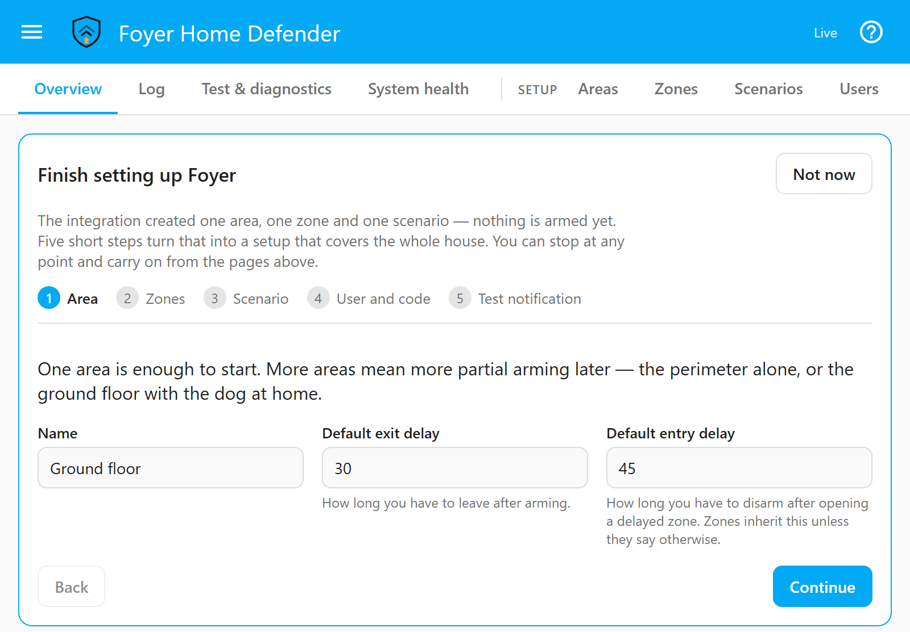
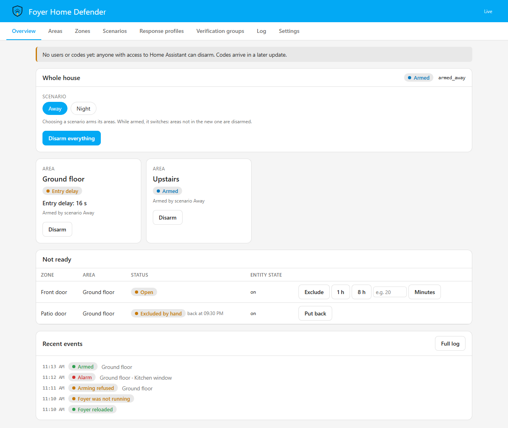

# Getting started

**English** · [Italiano](getting-started.it.md)

This page takes you from nothing installed to a house that arms, alarms and
tells you so. It covers what you need, the two ways to install, the
questions Home Assistant asks when you add the integration, the wizard that
finishes the setup in the panel, and the first fifteen minutes after it. It
is also where the Overview page's *Learn more* link lands, so the last part
explains what that page shows and what each of its buttons does.

It is written for somebody who already has sensors in Home Assistant and has
not used Foyer before. Everything deeper — zone types, response profiles,
codes — is in its own document, linked where it comes up.

---

## What you need

- **Home Assistant 2026.6 or later.** Foyer is developed and tested against
  2026.6 and the current release. Earlier releases let any signed-in account
  list Home Assistant's webhooks, and one of those can be Foyer's
  acknowledgement webhook, which stops an alarm's escalation — so any account
  in the house could have read the address that silences the phone calls. The
  minimum is declared in `hacs.json`, which is what HACS checks before it
  installs.
- **At least one door, window or motion sensor already working in Home
  Assistant.** Foyer reads the entities you have; it does not talk to any
  hardware itself.
- **A `notify.*` service that works.** Foyer decides who is told and when; the
  sending is done by Home Assistant's own notification integrations.
  [Notification channels](notification-channels.md) has a recipe for each of
  the usual ones, including which of them survive a cut fibre.
- **A siren, a switch or a smart plug**, if you want noise. Optional.
- **A keypad, an NFC tag, a badge or a remote**, if you want to arm from the
  wall rather than from a phone. Optional, and [keypads](keypads.md) says what
  each kind of hardware is worth before you buy it.
- **An MQTT broker only if a device you choose speaks MQTT.** Foyer's MQTT
  contract is off until you switch it on, on the *Arming devices* page.

Nothing else: no cloud account and no subscription. Foyer opens no outbound
connection of its own unless you set up the external watchdog on the *System
health* page ([system health](system-health.md)), which is off until you give
it an address. Notifications leave the house through the Home Assistant
integrations you chose, not through anything of Foyer's.

## Install

### From HACS

1. In HACS, open the menu → *Custom repositories*, and add this repository's
   URL with category *Integration*.
2. Install *Foyer Home Defender*.
3. Restart Home Assistant.

### By hand

1. Copy the folder `custom_components/foyer` from this repository into the
   `custom_components` folder of your Home Assistant configuration, so that
   you end up with `config/custom_components/foyer/manifest.json`.
2. Restart Home Assistant.

That folder is all Foyer needs: the panel, the card and the icons are built
and committed inside it, under `custom_components/foyer/frontend`, so there
is nothing to compile and no dashboard resource to add. The keypad
blueprints are the one thing that lives outside it, and
[keypads](keypads.md) explains how to import them. HACS enforces the minimum
Home Assistant version; a manual install does not, so check your version
first.

Releases are ordinary GitHub releases, not pre-releases, so HACS offers them
by version name without any pre-release switch;
[troubleshooting](troubleshooting.md) has the history if you installed during
the alpha.

## Adding the integration

*Settings → Devices & services → Add integration → Foyer Home Defender.*
Foyer can be added once per Home Assistant. The config flow has two screens.

**Set up Foyer Home Defender** asks for three things:

| Field | What it is |
|---|---|
| *Area name* | The part of the house this alarm watches, for example *Home* |
| *Scenario name* | The name of the arming preset, for example *Away* |
| *Zone entity* | The sensor that watches the area: a `binary_sensor`, `input_boolean`, `switch`, `cover` or `lock` |

**When is the zone triggered?** shows the entity's current state and proposes
the states that mean an intrusion, from the kind of entity: `on` for a binary
sensor, a switch or an input boolean; `open` and `opening` for a cover;
`unlocked`, `open` and `opening` for a lock. Nothing is assumed: you choose
the states, and you tick *I have checked these states against the real
sensor* before it will continue. `unavailable` and `unknown` are refused as
trigger states, because they are faults — they block arming, they never
count as an alarm.

This screen matters more than anything else in the setup. Normally-closed and
normally-open contacts behave in opposite ways, so the same door sensor can
read `on` when it is shut on one brand and `on` when it is open on another. A
wrong choice here is a zone that never fires, and you would find out during a
break-in. Open the door, or walk past the detector, and watch the state
change before you tick the box.

When you finish, Foyer creates:

- **one area**, with a 30-second exit delay and a 30-second entry delay, which
  reports as *Armed away* when armed;
- **one zone** on the entity you chose, named after it, of type *instant*,
  with the trigger states you confirmed;
- **one scenario** that arms that area, and makes *Whole house* report *Armed
  away*;
- **one response profile**, *Default*, whose single action is a Home
  Assistant notification (the kind that appears under the bell) for the
  moments that must never go unsaid: armed, disarmed, a failed arming, a zone
  excluded, a zone fault, an alarm and every zone that joins it, a technical
  alarm, the start and end of a walk test, and the four system health
  problems.

Nobody holds a code yet, and nothing is armed. From here on the configuration
lives in Foyer's own storage and is changed from the panel; the config flow
is not asked again.

## The first-run wizard

A **Foyer** entry appears in the sidebar. The first time somebody who may
change the configuration opens it — a Home Assistant administrator, or a Foyer
user with permission to edit the configuration — a panel titled *Finish
setting up Foyer* sits above whichever page is open. It continues from what
the config flow made rather than starting again, in five short steps:

1. **Area.** The area the config flow created: its name, its *Default exit
   delay* (how long you have to leave after arming) and its *Default entry
   delay* (how long you have to disarm after opening a delayed zone; zones
   inherit it unless they say otherwise). Each field is saved as you change
   it.
2. **Zones.** The zones mapped so far, against a target of three. *Add a
   zone* lists the entities not already used. Pick one and the wizard says
   what it is now and in which states Foyer will treat it as in alarm, both
   read live, so you can open the door and watch the sentence change. For a
   door, window or motion sensor you choose *Instant* (sounds at once) or
   *Delayed* (leaves the entry delay to disarm — the door you come in by);
   for anything else the type is shown and can be changed later on the
   *Zones* page. Tick *I tried it: opening or triggering it changes the state
   above to the one listed*, then *Add the zone*. A sensor that reports a
   number, or an entity for which Foyer has no state to propose, is sent to
   the *Zones* page instead, because its trigger is something you have to
   choose rather than confirm. If the proposed states are wrong for your
   sensor, do not tick the box: add that zone from the *Zones* page, where
   you choose the states yourself. Zones added here go into the first area.
3. **Scenario.** The scenario's name, and the areas it arms.
4. **User and code.** Your name and a code, typed twice. The person created
   here is linked to your Home Assistant account and holds every permission,
   because you are the one setting the system up; everybody else is added on
   the *Users* page, each with a code of their own. The button reads *Create
   and continue* once something is typed, and *Skip* while both fields are
   empty.
5. **Test notification.** Choose a notification service under *Send to* and
   press *Send the test*. It goes through Foyer as a real alarm message
   would, is checked like any other action test, and is recorded in the log
   as a test. If nothing arrives, that channel would not have reached you
   during an alarm either. The test proves the channel; which notifications
   Foyer actually sends, and to whom, is set on the *Response profiles* and
   *Contacts* pages.

Before *Finish*, under *Still to do*, the wizard lists what the five steps did
not cover, each with a button to the page that does: fewer than three zones
mapped, nobody holding a code, or no contacts to reach when nobody
acknowledges an alarm.

*Finish* and *Not now* both close the wizard for the whole installation, not
for this visit only: the flag is stored in the configuration, and the panel
has no button that brings it back. Everything it does is on the ordinary
pages, so stopping early loses nothing but the list.

## Nothing asks for a code until somebody holds one

Until at least one enabled person holds a usable code, Foyer's code policy is
switched off, and the Overview says so in a notice you cannot miss: *Nobody
holds a code yet, so nothing asks for one: anyone with access to Home
Assistant can disarm.* The reason is practical. A policy that demanded a code
nobody has would not protect the house; it would only make it impossible to
disarm, which is how an alarm teaches its owner to remove it.

From the moment somebody holds a code, the policy applies in full, and to
everybody. With the defaults, arming asks for nothing, while disarming,
excluding a zone, forcing an arming, changing the configuration, a walk test
and an action test ask for a code; acknowledging an alarm does not. A Home
Assistant administrator is asked like anybody else, because being an
administrator identifies nobody: the unlocked wall tablet is almost always
signed in as one. When the panel asks, it says what the code is for — *Code
to disarm Ground floor* — and forgets it after two minutes unused, after
every arming or disarming, and when the panel is closed.

An administrator who holds no code, in a house where others do, can recover
access from the integration's *Configure* button in Home Assistant; it is
announced to the whole household. [The security model](security-model.md)
has the detail, and what a code does and does not protect against.

## The first fifteen minutes

1. **Install and add the integration** as above. You get one area, one
   scenario and one zone.
2. **Check the trigger against the real sensor.** Open the door, walk past the
   detector, watch the state change. This is the one step worth doing slowly,
   and the wizard's *Zones* step and the diagnostics table on *Test &
   diagnostics* both let you watch it live.
3. **Create yourself a user with a code.** Until somebody holds one, nothing
   asks for one, and the panel says so. From then on the panel asks you for
   it wherever the policy asks for one, administrator or not.
4. **Send the test notification** the wizard offers. If it does not arrive,
   nothing else in Foyer matters.
5. **Let it fire once, on purpose, while you are standing there.** Arm, walk
   in, and — through a delayed zone — let the entry delay run out; an instant
   zone sounds at once. Then open the *Log* and read what it says about the
   last two minutes, and whom it credits.

## Areas, scenarios and the whole house

An **area** is a group of zones with a state of its own: *Disarmed*,
*Arming*, *Armed*, *Entry delay* or *Triggered*. Each area is its own alarm
panel entity in Home Assistant, `alarm_control_panel.foyer_<area>`, so the
ground floor can be armed while you are upstairs. An area's entity arms only
that area.

**Whole house** (`alarm_control_panel.foyer_master`) is not a separate alarm.
It is worked out from the areas: triggered if any area is, and armed if any
area is armed, because a partly armed house is not a disarmed one. Disarming
it disarms every area. It is the entity HomeKit and the voice assistants see.

A **scenario** is a named set of areas to arm together — *Night, ground floor
only*, *Garage only*, *Dog at home* — as many as the house needs, not four
fixed modes. Choosing a scenario while another is armed takes its place:
areas the new one does not list are disarmed. `select.foyer_scenario` always
names the scenario that is running, which matters because several scenarios
may report the same mode to Home Assistant. Arming a single area outside any
scenario is possible, and is the exception.

[Zones](zones.md) explains zone types, triggers and the rest of the detail.

## The Overview

The Overview is the page you open to arm or disarm, so its help panel, *What
this page shows*, starts collapsed. It updates by itself, and every button
acts at once. The page decides nothing: each button sends a command, and what
you see is the backend's answer.

**Whole house.** The house's state, and the mode Home Assistant is shown,
then one button per scenario — *Arm “Night”* — each with a lock when arming it
asks for a code. Beside each button: *Ready to arm*, *Not ready* followed by
the zones that stand in the way, or *running* for the scenario that is armed.
The readiness line is advice, not a gate: pressing a button that says *Not
ready* still sends the command, and the refusal, if there is one, comes from
the engine. *Disarm everything* disarms every area, and is active only while
something is armed or holds alarm memory. *Just one area…* shows an *Arm this
area* button on each disarmed area, for arming one area outside any scenario;
it is hidden by default because it is the exception.

**When arming is refused.** The reason is shown under the buttons. When the
refusal is about open or faulted zones, *Arm without these zones* forces the
arming: those zones are not watched until they close, and the log records it
as a forced arming. When an arming succeeds with zones on a low battery, the
page says so, and *Exclude these zones* takes them out of this arming.

**The area cards.** One per area: its state, *Alarm memory* when it holds
one, the countdown while an exit delay, an entry delay or a wait for a zone to
close is running, and whether it was *Armed by scenario …* or *Armed on its
own*. *Disarm* appears on an area that is armed, or that holds alarm memory,
and disarms that area alone.

**Not ready.** Every zone that is open, in fault or excluded, with its area,
its status and the raw state of its entity — or *Every zone is ready.* A zone
that may be excluded offers *Exclude*, *1 h*, *8 h*, or a number of
*Minutes*. Excluded without a duration, a zone is included again when its
area is disarmed; with a duration, it is included again when the time is up,
and says so. *Include again* ends an exclusion early. A smoke detector in
alarm is not listed here: it has its own banner.

**Banners at the top.** Four things can appear above everything else:

- **Technical alarm** — smoke, gas, water: its own channel. Arming does not
  affect it and disarming does not clear it; it clears once somebody presses
  *Acknowledge* and the sensors are back to normal.
- **Incident** — every zone of one alarm, gathered into one, with one
  *Acknowledge*. Disarming an area the incident touched also acknowledges it;
  arming does not.
- **Alarm memory** — which zones alarmed in which area. It stays after the
  sirens stop, until the area is disarmed, or, if it is already disarmed,
  armed again.
- **Nobody holds a code yet** — the notice described
  [above](#nothing-asks-for-a-code-until-somebody-holds-one).

**Recent events.** The last six rows of the arming, alarm, security and system
categories, with *Full log* to open the *Log* page. Zone activity is left out,
because six rows of "hall motion" say nothing about the night. A duress row
never appears here, whoever is looking: this list is on the tablet a code was
typed at, and nothing visible may differ when somebody uses a duress code
([security model](security-model.md)).

## Finding your way round the panel

Everybody who opens the panel sees the pages used day to day: *Overview*,
*Log*, *Test & diagnostics* and *System health*. A Home Assistant
administrator, or a Foyer user allowed to edit the configuration, also sees
the pages under *Setup*: *Areas*, *Zones*, *Scenarios*, *Users*, *Contacts*,
*Response profiles*, *Verification groups*, *Arming devices*, *Automatic
rules* and *Settings*. The *API* page is for administrators only. Hiding a
page is a courtesy: the backend checks every command whatever the panel
shows.

- **Every page opens with a help panel** — *What this page shows*, *What a
  zone is*, and so on — with a short explanation and one line per setting
  saying what changes if you change it. It is open on your first visit and
  then remembers your choice, per Home Assistant user, so it follows you
  from the desktop to the wall tablet. The Overview's starts closed.
- **The `?` button** in the toolbar, *Show or hide every help panel*, hides
  or shows them all at once.
- **Learn more** at the foot of a help panel opens the document that explains
  that page in full, on the pages that have one.
- **Delete asks first**, in place beside the button, rather than in a browser
  dialogue a wall tablet may not show.
- **The panel's language follows each Home Assistant user**, so two people in
  the same house can read it in different languages. The *Language of
  messages* on *Settings* is something else: the language of what Foyer
  sends out in notifications ([settings](settings.md)).

## The card

`foyer-card` puts the alarm on a dashboard: pick *Foyer Home Defender* in the
card picker, with no resource to add, in one of four layouts — *full*,
*compact*, *keypad* for a wall tablet, or *badge* for state alone. Like the
panel it decides nothing and asks for a code only when the policy does;
[card](card.md) has the rest.

## Where to go next

- [Zones](zones.md) — zone types, triggers, NC and NO contacts, arm policies,
  exclusions, the technical channel.
- [Response profiles](response-profiles.md) — what happens when, to whom, and
  why it sounded.
- [Notification channels](notification-channels.md) — recipes for the
  Companion app, SMS, voice calls, Telegram and others.
- [Security model](security-model.md) — what codes protect against, and what
  they do not.
- [Simulator](simulator.md) — asking what would happen, without anything
  happening.
- [Troubleshooting](troubleshooting.md) — a zone that never fires, a card
  that does not appear, and how to open an issue that can be answered.
