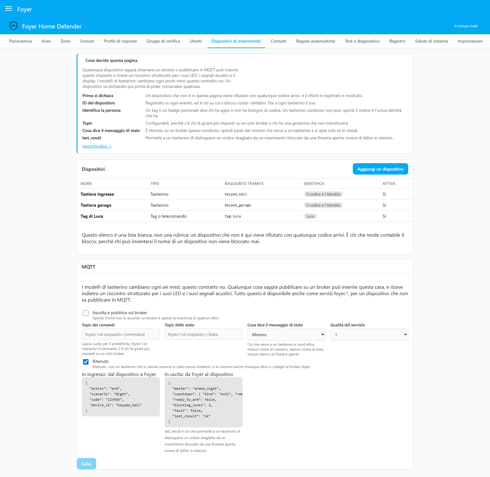
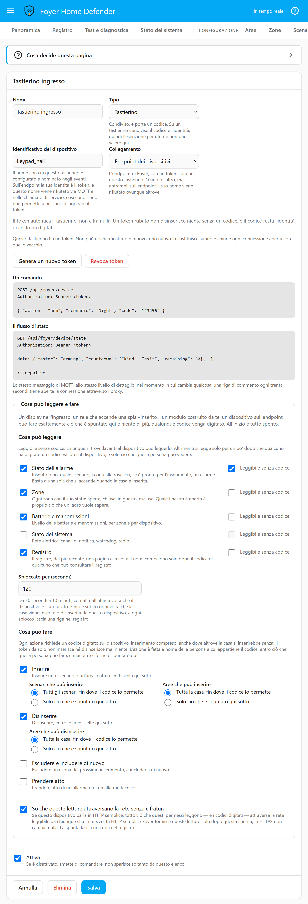
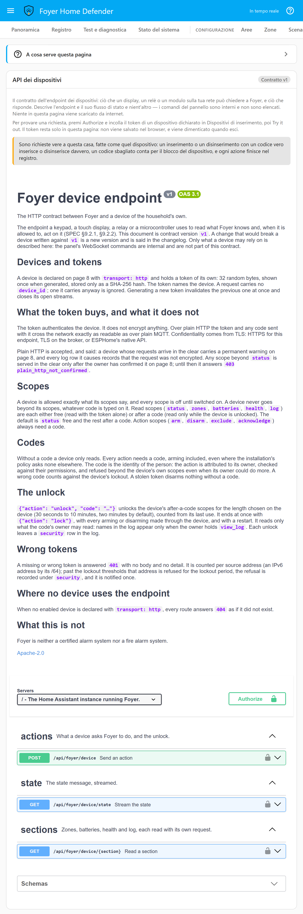
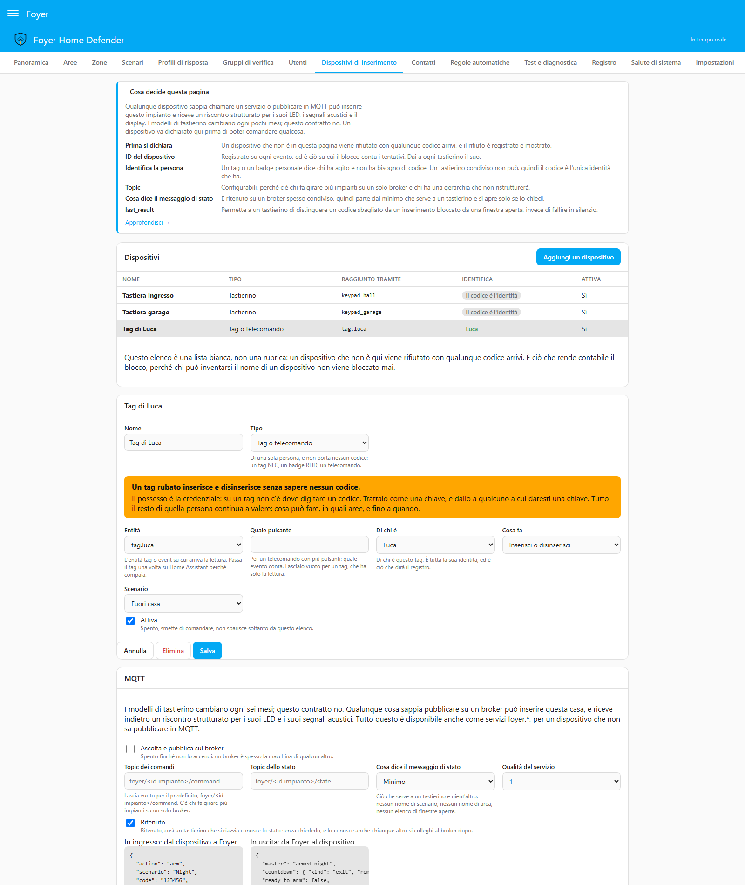

# Tastierini, tag e telecomandi

[English](keypads.md) · **Italiano**

Come inserire e disinserire Foyer da qualcosa che non sia un telefono, e quanto
vale davvero ciascun pezzo di hardware.

Tre cose vanno lette prima di comprare qualunque cosa:

- **Foyer non parla con i tastierini. Offre un contratto.** I modelli di
  tastierino cambiano ogni sei mesi; il contratto no. Qualunque cosa sappia
  chiamare un servizio di Home Assistant, pubblicare su un broker MQTT o fare
  una richiesta HTTP all'endpoint di Foyer può inserire questa casa.
- **Un dispositivo si dichiara prima di poter comandare qualcosa.** Aggiungilo
  prima in *Dispositivi di inserimento*. Un dispositivo che l'impianto non
  conosce viene rifiutato qualunque codice porti, e il rifiuto viene registrato
  e mostrato. Non è ordine per il gusto dell'ordine: il blocco conta i codici
  sbagliati per canale *e per dispositivo*, quindi chi è libero di inventarsi il
  nome di un dispositivo è qualcuno che non viene mai bloccato.
- **Un tastierino condiviso non può sapere chi sta digitando.** Il codice è
  l'unica identità che ha, ed è per questo che ogni persona ha il suo codice. Un
  tag o un badge è l'opposto: identifica una persona e non porta nessun codice.

---

<a id="choosing-the-hardware"></a>

## Scegliere l'hardware

| | Ring Alarm Keypad v2 | Tastierino Zigbee con RFID | Frient / Develco | Tablet a muro | Tag NFC | Costruito con ESPHome |
|---|---|---|---|---|---|---|
| **Radio** | Z-Wave | Zigbee | Zigbee | Wi-Fi | — | Wi-Fi / ESP-NOW |
| **Costo** | 60–90 € | 20–40 € | 70–100 € | 80–200 € | ≈ 1 € | 20–50 € |
| **Riscontro** | Anello di LED, bip, conto alla rovescia | Molto variabile | Bip, pochi LED | Qualunque | Nessuno | Qualunque |
| **Identifica la persona** | No — lo fa il codice | No — lo fa il codice | No | Sì, se c'è un accesso | **Sì** | Dipende |
| **Tasti di panico** | Polizia, incendio, soccorso | Di solito uno | Di solito uno | Sullo schermo | No | A tua scelta |
| **Batteria** | Ricaricabile, mesi | AA/AAA, mesi–anni | Anni | Rete elettrica | — | Rete elettrica |
| **Il rovescio** | Scritte in inglese, reperibilità a macchia in Europa, serve una chiavetta Z-Wave | La qualità del firmware varia fra cloni venduti con la stessa foto | Meno tasti, niente RFID | Costo di un apparecchio sempre acceso, ritardo nel risveglio dello schermo | Niente da digitare: il possesso è la credenziale | Da mantenere tu |

**Il riassunto onesto.** Il Ring Keypad v2 è la cosa più completa che si possa
comprare: è l'unico in questa tabella che sa mostrare da solo un conto alla
rovescia d'uscita, tre stati d'inserimento distinti e una serie di tasti di
panico. I tastierini Zigbee costano un quarto e il firmware è un terno al lotto.
Un tablet a muro è l'opzione più ricca e quella che la gente usa davvero,
perché è la stessa superficie del resto della casa. E un tag NFC costa un euro,
non ha batteria, ed è l'unico canale economico che dice *chi*.

I tastierini fatti in casa con ESPHome sono un tema vivo nella community e in
v1 questo progetto non ne mantiene nessuno. Rispettano il contratto come
qualunque altra cosa: pubblicano sul topic, chiamano il servizio, o parlano con
[l'endpoint dei dispositivi](#the-device-endpoint).

---

<a id="the-service-contract"></a>

## Il contratto dei servizi

Ogni servizio che cambia lo stato prende gli stessi quattro campi d'identità e
risponde con lo stesso risultato strutturato.

```yaml
action: foyer.arm
data:
  scenario_name: Night        # oppure scenario_id, area_id o mode
  code: "123456"
  device_id: keypad_hall      # il nome con cui è dichiarato, non un id di dispositivo di HA
response_variable: answer
```

```jsonc
// answer
{
  "success": false,
  "reason": "zone_open",
  "blocking_zones": [{ "id": "…", "name": "Kitchen window" }],
  "bypassed_zones": [],
  "low_battery_zones": [{ "id": "…", "name": "Garage shutter" }],
  "state": { /* tutto lo stato attuale, come lo vede il pannello */ }
}
```

`low_battery_zones` non è un rifiuto e non blocca mai: nomina le zone che
questo inserimento metterebbe sotto guardia con una batteria che si sta
esaurendo, e c'è a *ogni* tentativo d'inserimento invece che una volta sola,
così un adattatore con un display o un secondo bip può riferire l'avviso.
Escluderne una è un normale `foyer.bypass_zone`. Un adattatore che ignora il
campo si comporta esattamente come prima che il campo esistesse.

`reason` è un identificatore stabile, mai una frase: `bad_code`,
`code_required`, `locked_out`, `zone_open`, `zone_fault`, `not_permitted`,
`user_not_valid`, `device_not_registered`, `invalid_state`, `unknown_scenario`.
Un adattatore li traduce nei suoi bip; il pannello e la card li traducono per
le persone.

I servizi: `foyer.arm`, `foyer.disarm`, `foyer.bypass_zone`,
`foyer.unbypass_zone`, `foyer.acknowledge`, `foyer.export_log`,
`foyer.export_config`, `foyer.import_config`.

Tre campi meritano una frase ciascuno.

**`channel`** può dire solo `api` o `automation`. Tutto ciò che è fisico —
`keypad`, `nfc` — è una proprietà di un *dispositivo dichiarato*, mai
un'affermazione fatta da un messaggio. Altrimenti un'automazione potrebbe
comprarsi l'esenzione dal codice di una persona scrivendo una parola.

**`user_id`** è attribuzione, e non concede niente. Dichiararsi qualcuno porta
le sue restrizioni, mai le sue esenzioni: i suoi permessi valgono comunque, e
un codice serve comunque dovunque la politica lo chieda.

**`skip_exit_delay`** inserisce senza tempo per uscire. Non richiede un
permesso a sé — chi può inserire può inserire subito — ma ogni zona è
sorvegliata da quell'istante: la porta d'ingresso aperta uscendo avvia il
ritardo d'ingresso, e un sensore di movimento nel corridoio fa scattare
l'allarme subito. Per questo la riga *Inserita* registra che è successo, e
«perché ha suonato mentre ero ancora nel corridoio?» ha una risposta.

---

<a id="the-mqtt-contract"></a>

## Il contratto MQTT

<p align="center"></p>

Spento finché non lo accendi, in *Dispositivi di inserimento*. Un broker è
spesso la macchina di qualcun altro.

### In entrata — dal dispositivo a Foyer

Topic predefinito `foyer/<install id>/command`, configurabile.

```json
{
  "action": "arm",
  "scenario": "Night",
  "code": "123456",
  "device_id": "keypad_hall"
}
```

`action` è `arm`, `disarm`, `acknowledge` o `status`. `status` non comanda
niente; chiede a Foyer di pubblicare di nuovo lo stato, che è quello che vuole
un tastierino dopo un riavvio. `arm` accetta anche `force` e
`skip_exit_delay`; `disarm` accetta `area_ids`.

**Su MQTT `device_id` non è facoltativo.** Chiunque possa pubblicare sul topic
può pubblicare un comando, quindi il nome dato da un messaggio è l'unica cosa
che separa il tastierino dell'ingresso da un estraneo. Un messaggio senza
nome, o con un nome che l'impianto non conosce, viene rifiutato, registrato e
segnalato con una notifica di Home Assistant — una volta per dispositivo, così
un tastierino configurato male che ci riprova ogni trenta secondi non seppellisce
la notifica che conta.

### In uscita — da Foyer al dispositivo

Topic predefinito `foyer/<install id>/state`, pubblicato **retained** a ogni
cambiamento e su richiesta.

Al livello predefinito, `minimal`:

```json
{
  "master": "armed_night",
  "countdown": { "kind": "exit", "remaining": 22 },
  "ready_to_arm": false,
  "blocking_zones": 1,
  "fault": false,
  "last_result": "blocked",
  "last_reason": "zone_open"
}
```

`standard` aggiunge `scenario` e `areas`, per nome. `full` aggiunge
`open_zones`, per nome — il contratto come lo scrive il §9.2.

**Perché il predefinito è il minimo.** Il messaggio è retained, su un broker
spesso condiviso con altre integrazioni, altre famiglie o un ponte verso il
cloud. Qualunque cosa contenga viene detta a chi si collega dopo, compreso «la
casa è inserita e non c'è nessuno» e — a `full` — quale finestra è aperta. È
lo stesso ragionamento che fa il watchdog esterno con il suo battito vuoto.
Alza il livello sapendo quello che fai.

**Due campi, e il primo non cresce mai.** `last_result` è uno fra `ok`,
`blocked`, `bad_code`, `locked_out` — questo insieme, per sempre, così un
adattatore scritto oggi non incontra mai una parola che non conosce.
`last_reason` accanto porta il motivo preciso, dallo stesso insieme stabile che
restituiscono i servizi (`zone_open`, `device_not_registered`,
`user_not_valid`, …) ed è `null` quando il comando è riuscito.

Collega `last_result` ai tuoi bip e al tuo LED; leggi `last_reason` solo se
vuoi distinguere *una finestra è aperta* da *non sono un dispositivo
dichiarato*. Tutti e due sono quelli dell'ultimo comando, qualunque tastierino
l'abbia mandato: con due tastierini in casa, leggili come risposta al tuo
comando e non come un fatto permanente.

---

<a id="the-device-endpoint"></a>

## L'endpoint dei dispositivi

Un endpoint HTTP tutto di Foyer, per un dispositivo che preferisce non essere un
nome su un broker: ogni dispositivo che lo usa ha un **token tutto suo**. Lo
usano i tastierini, e i display, i relè e i moduli descritti nella prossima
sezione. Dichiara il dispositivo in *Dispositivi di inserimento*, scegli
l'endpoint come trasporto, salvalo, poi genera il suo token.

**Il token autentica il dispositivo; non cifra niente.** Su HTTP in chiaro il
token e ogni codice digitato sul dispositivo attraversano la rete leggibili
come su MQTT in chiaro. Se vuoi che i codici restino riservati, in ordine di
semplicità: servi Home Assistant in HTTPS (o dietro un reverse proxy di cui si
fida); usa TLS con credenziali per client sul broker; oppure usa l'API nativa
di ESPHome, che è cifrata e sa già chiamare `foyer.arm` e `foyer.disarm`.

- **Il token nomina il dispositivo.** Una richiesta non porta un `device_id`, e
  uno portato comunque viene ignorato. Il token viene mostrato una volta sola,
  quando viene generato; Foyer ne tiene solo un'impronta e non può mostrarlo di
  nuovo. Generarne uno nuovo invalida subito il vecchio e chiude le sue
  connessioni aperte. Generare e revocare chiedono un codice, come salvare il
  dispositivo.
- **Un trasporto per dispositivo.** Un dispositivo sull'endpoint viene
  rifiutato su MQTT e nelle chiamate di servizio, registrato e notificato come
  un dispositivo sconosciuto — altrimenti chi conosce il suo nome raggiunge la
  casa senza il token.
- **Un token sbagliato o mancante** riceve `401`, senza dettagli, e viene
  contato per indirizzo di origine: oltre le soglie di blocco, un token
  sbagliato o mancante da quell'indirizzo viene rifiutato per la durata del
  blocco senza essere contato di nuovo, il blocco viene registrato sotto
  `security`, e viene notificato una volta.
- **Un token giusto non viene mai rifiutato per il suo indirizzo.** Dietro lo
  stesso router, reverse proxy o /64 IPv6 di qualcuno che tenta a caso, un
  dispositivo con il suo token giusto continua a funzionare mentre
  quell'indirizzo è bloccato: un token è fatto di 32 byte casuali, e nessuno lo
  indovina. Le righe che registrano le sue richieste — l'inserimento, il
  disinserimento, il rifiuto — portano l'indirizzo e dicono che era bloccato,
  così un dispositivo che condivide l'indirizzo con chi tenta si vede lì, e si
  vede nelle righe delle azioni che quelle richieste mettono in moto, sotto
  `action`. Le sue richieste non aumentano il conteggio dell'indirizzo e non
  lo azzerano.
- **HTTP in chiaro è accettato, e detto.** Un dispositivo la cui ultima
  richiesta è arrivata non cifrata porta l'avviso *Non cifrato* in
  *Dispositivi di inserimento*, finché non arriva una sua richiesta cifrata, e
  le righe che registrano le sue richieste dicono che la richiesta non era
  cifrata, come le righe delle azioni che mettono in moto, sotto `action`.
  Molti dispositivi fatti in casa non sanno fare TLS; rifiutarli toglierebbe la
  funzione proprio a chi l'aveva chiesta.
- **I tag non sono ammessi.** Un tag non porta nessun codice, quindi
  sull'endpoint il token da solo sarebbe la chiave di casa. I tag restano entità
  `tag.*` ed `event.*`.
- Dove nessun dispositivo attivo usa l'endpoint, ogni percorso risponde `404`,
  come se non esistesse.

<a id="api-devices-displays-relays-and-modules-of-your-own"></a>

## Dispositivi API: display, relè e moduli tuoi

<p align="center"></p>

Ogni dispositivo sull'endpoint è un **dispositivo API**, e può fare esattamente
quello che dicono i suoi **permessi** — un display touch nell'ingresso, un relè
che accende una spia «inserito», un modulo ESP32 o Arduino, e i tastierini che
già ci sono. I permessi si impostano per dispositivo in *Dispositivi di
inserimento*, **ognuno spento finché non lo accendi**, e il dispositivo non va
mai oltre, qualunque codice venga digitato.

| Permesso | Tipo | Cosa dà |
|---|---|---|
| `status` | lettura | il messaggio di stato: inserito o no, quale scenario, conti alla rovescia, pronto all'inserimento, allarme |
| `zones` | lettura | ogni zona con il suo stato: aperta, chiusa, in guasto, esclusa |
| `batteries` | lettura | livelli delle batterie e manomissione, per zona e per dispositivo |
| `health` | lettura | lo stato del sistema: rete elettrica, canali di notifica, watchdog, radio |
| `log` | lettura | il registro, una pagina alla volta, dal più recente |
| `arm` | azione | inserire, solo gli scenari e le aree scelti per il dispositivo (*Tutta la casa* di serie, fin dove il codice lo permette) |
| `disarm` | azione | disinserire, solo le aree scelte per il dispositivo |
| `exclude` | azione | *Escludi* una zona dal prossimo inserimento, e *Includi di nuovo* |
| `acknowledge` | azione | prendere atto di un allarme o di un allarme tecnico |

Un relè che accende solo una spia ha `status` e nient'altro. Un tastierino
dichiarato sull'endpoint prima che esistessero i permessi ha `status`, `arm` e
`disarm`.

**Ogni azione richiede un codice**, l'inserimento compreso, anche dove la casa
si inserirebbe senza dal pannello o da un servizio: il token attraversa la rete
leggibile ogni volta che la richiesta non è cifrata, e non deve mai essere lui
a inserire o disinserire la casa. Vale anche per i tastierini sull'endpoint —
chiedono sempre un codice. Il codice è l'identità, come su qualunque
tastierino: l'azione è fatta a nome di chi possiede il codice, dentro i
permessi di quella persona, mai oltre i permessi del dispositivo anche quando
quella persona potrebbe fare di più, e un codice sbagliato conta per il blocco
del dispositivo.

**Leggere è libero o dopo un codice, per permesso e per dispositivo.** Un
permesso libero si legge con il solo token. Un permesso dopo un codice si legge
solo mentre il dispositivo è **sbloccato**. Di serie `status` è libero e tutto
il resto è dopo un codice, perché un display nell'ingresso lo legge chiunque ci
passi davanti, e *la finestra sul retro è aperta* è la frase che un ladro
vuole sentire.

**Lo sblocco:**

- comincia con `{"action": "unlock", "code": "…"}`; un codice sbagliato conta
  per il blocco come qualunque altro;
- dura quanto dice il dispositivo — da 30 secondi a 10 minuti, due minuti di
  serie — contati dall'ultima volta che il dispositivo è stato usato;
- finisce subito con `{"action": "lock"}`, con ogni inserimento o
  disinserimento fatto dal dispositivo, e con un riavvio di Home Assistant;
- mostra solo quello che può vedere la persona a cui appartiene il codice: il
  registro dopo un codice richiede il permesso di quella persona di vedere il
  registro, e solo allora porta i nomi. Un permesso `log` libero mostra cosa è
  successo e mai chi. Zone, batterie e registro letti dopo un codice coprono
  solo le aree che quella persona può raggiungere;
- finisce anche quando quella persona viene disattivata o esce dal suo periodo
  di validità, e quando il dispositivo viene disattivato o riceve un token
  nuovo;
- lascia una riga nel registro sotto `security`: quale dispositivo, il codice di
  chi, per quanto tempo.

**Su HTTP in chiaro un dispositivo non legge niente oltre a `status`** finché
non spunti *So che queste letture attraversano la rete senza cifratura* su quel
dispositivo. Fino ad allora una sezione risponde `403
plain_http_not_confirmed`; in HTTPS la casella non cambia niente. Spuntarla
lascia una riga nel registro.

### Come viaggiano i dati

Un microcontrollore ha poca memoria, quindi non si spinge niente di grosso. Lo
stato arriva su un flusso, così una spia si accende nell'istante in cui la casa
si inserisce; ogni sezione è una piccola richiesta a sé, e il flusso dice
quando una è cambiata.

```
GET  /api/foyer/device/state      il flusso (Server-Sent Events)
POST /api/foyer/device            un'azione per richiesta, JSON, al massimo 4 KB
GET  /api/foyer/device/zones
GET  /api/foyer/device/batteries
GET  /api/foyer/device/health
GET  /api/foyer/device/log?before=<cursor>&limit=<1–50>
```

Ogni richiesta porta `Authorization: Bearer <token>`.

Sul flusso, un dispositivo con `status` riceve il messaggio di stato alla
connessione e a ogni cambiamento — il messaggio di stato MQTT, allo stesso
livello di dettaglio (`minimal` di serie), con il `last_result` e il
`last_reason` di questo dispositivo. Per ogni sezione per cui ha un permesso
riceve un avviso di una riga quando quella sezione cambia; un dispositivo che
non mostra la sezione lo ignora. Una riga di commento ogni trenta secondi tiene
aperta la connessione attraverso i proxy.

Un relè che accende una spia mentre la casa è inserita si limita ad ascoltare:

```
GET /api/foyer/device/state
Authorization: Bearer <token>

data: {"master": "arming", "countdown": {"kind": "exit", "remaining": 30}, "ready_to_arm": true, "blocking_zones": 0, "fault": false, "last_result": null, "last_reason": null}

data: {"master": "armed_away", "countdown": null, "ready_to_arm": true, "blocking_zones": 0, "fault": false, "last_result": null, "last_reason": null}

event: changed
data: zones

: keepalive
```

Un display che mostra le zone dopo che qualcuno ha digitato un codice:

```
GET /api/foyer/device/zones
→ 403 {"success": false, "reason": "unlock_required"}

POST /api/foyer/device
{"action": "unlock", "code": "123456"}
→ 200 {"success": true, "reason": null, "until": "2026-09-23T10:02:00+00:00"}

GET /api/foyer/device/zones
→ 200 {"success": true, "reason": null, "zones": [
        {"id": "z_kitchen_window", "name": "Kitchen window", "area_id": "ground",
         "type": "instant", "enabled": true, "open": true, "fault": null, "excluded": false}, …]}
```

Le azioni sono `status`, `arm` (con `scenario` o `area`), `disarm`
(facoltativamente con `areas`), `exclude` e `include` (con `zone`),
`acknowledge` (con `target`: `incident` o `technical`), `unlock` e `lock`.
Ogni azione tranne `unlock` e `lock` risponde con il risultato strutturato dei
servizi, con `last_result` e `last_reason` come su MQTT; un rifiuto è comunque
un `200`, e la risposta sta in `success` e `reason`. Un'azione fuori dai
permessi del dispositivo viene rifiutata con `scope_not_granted`, una senza
codice con `code_required`.

Una sezione che il dispositivo non può leggere risponde `403` con uno di
quattro motivi:

- `scope_not_granted` — il dispositivo non ha quel permesso;
- `unlock_required` — il permesso è dopo un codice e il dispositivo non è
  sbloccato, oppure la persona il cui codice l'ha sbloccato è stata poi
  disattivata o è fuori dalle sue date di validità;
- `plain_http_not_confirmed` — la richiesta è arrivata non cifrata e la
  casella qui sopra non è spuntata;
- `not_permitted` — il registro, dopo un codice, e chi possiede il codice non
  può leggere il registro.

Passare a uno scenario mentre ne è inserito un altro disinserisce le aree che
il nuovo lascia fuori, quindi richiede al dispositivo anche il permesso
`disarm` per quelle aree, oltre ad `arm`.

Il registro si sfoglia con un cursore opaco: manda il `next` di una risposta
come `before` nella richiesta successiva, al massimo cinquanta righe alla
volta.

### Il contratto completo

<p align="center"></p>

L'endpoint e il suo flusso sono descritti in
[`docs/api/openapi.yaml`](api/openapi.yaml), e il contratto MQTT in
[`docs/api/asyncapi.yaml`](api/asyncapi.yaml), tutti e due alla versione del
contratto **v1**. Una modifica che romperebbe un dispositivo scritto per la v1
è una versione nuova, e il changelog lo dice; un test confronta i due documenti
con il codice a ogni modifica. I comandi WebSocket del pannello sono interni e
non fanno parte del contratto: un dispositivo non deve contarci.

Gli amministratori di Home Assistant hanno anche una pagina **API** nel
pannello, che mostra lo stesso documento con Swagger UI. Premi *Authorize*,
incolla il token di un dispositivo dichiarato in *Dispositivi di inserimento*,
poi *Try it out*. Sono richieste vere alla tua casa, fatte come quel
dispositivo: un inserimento con un codice vero la inserisce, un codice
sbagliato conta per il blocco, e ogni azione finisce nel registro. La pagina è
servita solo dentro il pannello, e non scarica niente da internet.

---

<a id="the-shipped-adapters"></a>

## Gli adattatori inclusi

Tre blueprint stanno in `blueprints/automation/foyer/`. **HACS installa
l'integrazione, non i blueprint**, quindi ognuno ha qui sotto il suo pulsante
di importazione: apre la finestra d'importazione dei blueprint sul tuo Home
Assistant, dove premi l'anteprima e poi l'importazione. (Il pulsante è il
reindirizzamento ufficiale `my.home-assistant.io`: ti porta alla tua
installazione e da nessun'altra parte. Se preferisci non usarlo, copia il file
in `config/blueprints/automation/foyer/` e ricarica le automazioni.)

### Ring Alarm Keypad v2 su Z-Wave JS

[](https://my.home-assistant.io/redirect/blueprint_import/?blueprint_url=https%3A%2F%2Fgithub.com%2Ffoyer-labs%2FFoyer-Home-Defender%2Fblob%2Fmaster%2Fblueprints%2Fautomation%2Ffoyer%2Fring_keypad_v2_zwave_js.yaml)

`ring_keypad_v2_zwave_js.yaml`. Legge la notifica Entry Control del tastierino
— quale tasto, e le cifre digitate prima — chiama `foyer.arm` o `foyer.disarm`
e risponde con l'anello di LED, compresi i conti alla rovescia d'uscita e
d'ingresso, guidati dal `sensor.foyer_countdown_*` dell'area.

**Verifica i numeri degli indicatori sul tuo firmware.** Ring non ha
pubblicato nessuna tabella; i valori nel blocco `variables` del blueprint sono
un lavoro della community, raccolti in un posto solo così li puoi correggere in
un posto solo. Provane uno da Strumenti per sviluppatori → Azioni →
`zwave_js.set_value` prima di fidarti del riscontro. Tutto quello che il
blueprint fa con Foyer funziona che siano giusti o no; con un numero sbagliato
si rompe solo quello che il tastierino ti mostra.

### Tastierino Zigbee generico su Zigbee2MQTT

[](https://my.home-assistant.io/redirect/blueprint_import/?blueprint_url=https%3A%2F%2Fgithub.com%2Ffoyer-labs%2FFoyer-Home-Defender%2Fblob%2Fmaster%2Fblueprints%2Fautomation%2Ffoyer%2Fzigbee_keypad_z2m.yaml)

`zigbee_keypad_z2m.yaml`. Legge il messaggio Zigbee2MQTT del tastierino
(`action` più `action_code`) e ripubblica `arm_mode`, così il display segue la
casa.

**I cloni della famiglia Tuya cambiano da una revisione di firmware all'altra e
vanno verificati uno per uno.** Due tastierini venduti con la stessa fotografia
possono mandare nomi d'azione diversi, mettere il codice in un campo diverso, o
non mandare niente finché non vengono associati in un certo ordine. Guarda
prima il topic del tuo tastierino in Zigbee2MQTT, poi correggi i nomi delle
azioni nel blocco `variables` del blueprint. Non è un difetto del blueprint; è
com'è fatto quel mercato.

### Tag NFC e telecomandi

<p align="center"></p>

[](https://my.home-assistant.io/redirect/blueprint_import/?blueprint_url=https%3A%2F%2Fgithub.com%2Ffoyer-labs%2FFoyer-Home-Defender%2Fblob%2Fmaster%2Fblueprints%2Fautomation%2Ffoyer%2Fnfc_tag_and_remote.yaml)

`nfc_tag_and_remote.yaml` — **e probabilmente non ti serve.** Foyer legge tag e
telecomandi da solo: aggiungine uno in *Dispositivi di inserimento*, scegli la
sua entità `tag.*` o `event.*`, di' di chi è e cosa fa. Foyer gestisce poi da
solo la lettura, con i permessi di quella persona, il suo periodo di validità e
una riga di registro che la nomina.

Il blueprint serve per quello che la configurazione di proposito non fa: un tag
che funziona solo in certe ore, uno che agisce solo se c'è qualcuno in casa, un
pulsante che forza l'inserimento con una finestra aperta.

---

<a id="writing-your-own-adapter"></a>

## Scrivere un adattatore tuo

1. Dichiara il dispositivo in *Dispositivi di inserimento* e annota
   l'identificatore.
2. Usa come trigger quello che produce il tuo hardware.
3. Chiama `foyer.arm` / `foyer.disarm` con `code` e `device_id`, e prendi la
   `response_variable`.
4. Traduci `success` e `reason` nel vocabolario del tuo hardware. Dai ai rifiuti
   almeno due suoni: «non è giusto» e «non adesso» sono problemi diversi, e una
   famiglia che sente lo stesso suono per tutti e due ridigiterà un codice che
   non era mai il problema.
5. Segui lo stato dell'entità della centrale (o il topic di stato MQTT, o il
   flusso di stato dell'endpoint) per tutto quello che il dispositivo mostra
   quando nessuno l'ha toccato — la casa si può inserire da un telefono, e un
   tastierino che sa solo quello che gli è stato detto direttamente sbaglierà
   entro un giorno.

---

<a id="what-a-keypad-cannot-do"></a>

## Cosa un tastierino non può fare

- **Non può verificare un codice.** Nessun adattatore, blueprint o card decide
  qualcosa; trasmettono e mostrano. Una verifica altrove è decorazione, perché
  chiunque abbia accesso a Home Assistant può chiamare direttamente il
  servizio.
- **Non ci si può fidare di lui su chi lo sta premendo.** Su un tastierino
  condiviso il codice è l'identità. L'esenzione dal codice per persona non può
  mai valere lì, e la configurazione lo dice dove c'è l'impostazione.
- **Non può essere la tua unica via d'accesso.** Le batterie si scaricano, le
  radio vengono disturbate, i broker si fermano, e ognuna di queste cose fallisce
  in silenzio fino al momento in cui sei sotto la pioggia. Tieni raggiungibili
  anche il pannello e la card, e non lasciare che il tastierino accanto alla
  porta sia tutto il piano.
