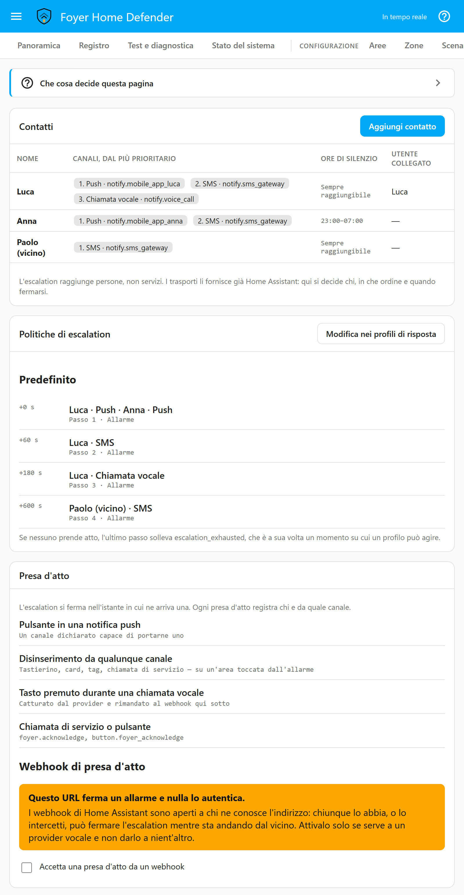

# Profili di risposta

[English](response-profiles.md) · **Italiano**

Un profilo di risposta dice cosa fa la casa quando succede qualcosa: quale
sirena suona, chi viene avvisato, quale luce si accende, e a quali
condizioni. Questa pagina spiega la pagina *Profili di risposta* un'impostazione
alla volta, e le regole intorno che decidono quale profilo risponde:
ereditarietà, incidenti, escalation e le telecamere che una notifica porta
con sé. È per chi configura la casa, e per chi più avanti chiede «perché ha
suonato?» e vuole una risposta che non sia un'ipotesi.

Tre cose conviene saperle prima dei dettagli:

- **L'unità della risposta è l'area.** Il profilo di una zona risponde
  all'allarme di quella zona e a nient'altro. Tutto il resto che succede in
  un'area risponde con il profilo dell'area.
- **Un'intrusione è un incidente solo, non un allarme per zona.** La
  finestra, il corridoio e le scale che scattano uno dopo l'altro sono un
  evento solo, con una sola escalation e una sola presa d'atto.
- **Puoi controllare un profilo prima di fidartene.** Il
  [simulatore](simulator.it.md) mostra quale profilo ha risposto a
  ogni passo e perché ogni azione è partita o no, e il pulsante di prova
  accanto a ogni azione la esegue per davvero.

---

## Quale profilo risponde

I profili si ereditano, con la possibilità di sovrascriverli, lungo una sola
catena:

```
zona → area → scenario → predefinito globale
```

Risponde il primo anello che indica un profilo. *Eredita* su una zona,
un'area, uno scenario o un gruppo di verifica vuol dire «chiedi all'anello
successivo». Il predefinito globale si sceglie nella pagina *Impostazioni*,
alla voce *Profilo predefinito*; una nuova installazione parte con un solo
profilo, *Default*, che contiene una sola notifica di Home Assistant, e tutto
lo eredita finché non scegli diversamente.

**L'anello della zona si legge per una cosa sola: l'allarme di quella zona**
— lo scatto, il ritardo d'ingresso che apre, e la conferma di una coppia a
verifica incrociata o di un conteggio di *Attivazioni necessarie* che
completa. Un gruppo di verifica risponde con il suo profilo, poi con la
catena della sua area. Un inserimento, un disinserimento, un guasto, un'esclusione, *Fine
dell'allarme*, *Incidente aperto* — tutto il resto che succede in un'area
risponde con la catena dell'area, area → scenario → predefinito. È una
regola sola da tenere a mente quando ti chiedi perché qualcosa ha suonato, e
lascia il profilo di zona esattamente dove serve alla risposta graduata (più
sotto).

L'anello dello scenario è lo scenario con cui l'area è stata inserita.
Un'area inserita da sola, fuori da qualunque scenario, passa dal proprio
profilo direttamente al predefinito.

Esistono altre due catene, ciascuna per un motivo:

| Cosa è successo | Chi risponde |
|---|---|
| Un **gruppo di verifica** è soddisfatto | Il profilo del gruppo, poi la catena dell'area del gruppo |
| Il **canale tecnico** (fumo, gas, allagamento) | Il profilo della zona, poi il *Profilo tecnico* scelto in *Impostazioni*, poi il predefinito. Un rilevatore di fumo non deve rispondere in modo diverso a seconda di come è inserita la casa, e uno scenario non vuol dire nulla per un canale che è sempre attivo |
| Viene usato un **codice di coercizione** | Solo il predefinito globale ([più sotto](#codice-di-coercizione-usato)) |

Dove vedi la risposta: l'editor delle *Aree* mostra il profilo con cui
un'area risponderebbe e da dove arriva («Profilo in uso: Full — ereditato
dallo scenario») — per un'area inserita, dallo scenario con cui è stata
inserita; per una disinserita, dal primo scenario che la inserisce con un
profilo proprio; l'elenco in questa pagina dice, sotto *Usato da*, quali
aree, zone, scenari e gruppi indicano ciascun profilo, e se è il predefinito
o quello tecnico; e la traccia del simulatore indica il profilo e la sua
provenienza a ogni passo, letti dalla stessa funzione che usa il motore.

## La pagina

Un profilo ha un **nome**, una **gravità** e un elenco di **azioni**. Ogni
azione ha un tipo, i suoi parametri, i **momenti** a cui risponde, fino a due
**condizioni** e — per una notifica — un ritardo facoltativo che la trasforma
in un passo di escalation. Le azioni girano nell'ordine in cui compaiono
nell'elenco; le frecce le spostano su o giù di una posizione.

| Impostazione | Cosa cambia |
|---|---|
| *Nome* | Solo il nome. Aree, zone, scenari e gruppi puntano al profilo, non al suo nome |
| *Gravità* | Da 1 a 10. Serve a una cosa sola: scegliere quale escalation segue un incidente quando vi contribuiscono profili di forza diversa ([incidenti](#un-incidente-non-un-allarme-per-zona)). Non cambia nulla quando il profilo gira da solo |
| *Aggiungi azione* | Aggiunge uno dei dieci tipi qui sotto, già aperto per la modifica |
| I momenti | Quando l'azione gira. Un'azione deve rispondere ad almeno uno |
| *Condizioni* | Quando le è permesso girare. Nessuna vuol dire sempre |
| *Ritardo dall'inizio dell'allarme* | Proposto solo su una notifica che risponde ad *Allarme* o ad *Allarme tecnico*. Con un numero, l'azione diventa un passo di escalation |
| *Prova* | Esegue per davvero l'azione salvata ([più sotto](#il-pulsante-prova)) |

Eliminare un profilo che qualcosa usa ancora viene rifiutato, e la colonna
*Usato da* c'è apposta perché non sia mai una sorpresa.

**Una casa inserita tiene la risposta con cui è stata inserita.** Finché
un'area è inserita, un profilo con cui la casa potrebbe rispondere — la
catena di un'area inserita, quelli delle sue zone e dei suoi gruppi, il
predefinito, quello del canale tecnico e quello su cui sta girando
un'escalation — non si può modificare, e nemmeno un contatto indicato da un
profilo del genere. Prima disinserisci. Il ragionamento è nel
[modello di sicurezza](security-model.it.md).

---

## Momenti

Un profilo può rispondere a molto più che a un allarme. L'editor raggruppa i
momenti come li mostra il pannello; un'azione può spuntarne quanti vuole.

**All'allarme**

| Momento | Id | Quando scatta |
|---|---|---|
| *Ritardo d'ingresso avviato* | `entry_started` | Si è aperta una zona ritardata in un'area inserita. Di solito è qualcuno che torna a casa |
| *Allarme* | `triggered` | Una zona ha mandato in allarme un'area, oppure un ritardo d'ingresso è scaduto |
| *Fine della sirena* | `siren_cutoff` | Il tempo di sirena dell'area è finito; l'area torna dov'era e la memoria d'allarme resta |
| *Fine dell'allarme* | `alarm_ended` | Una volta per ogni area toccata da un allarme: quando scatta la sua fine della sirena, o quando viene disinserita mentre è ancora in allarme. Mai su un disinserimento normale. È il momento per «spegni la luce quando l'allarme è finito» |
| *Memoria d'allarme azzerata* | `alarm_cleared` | Una volta per area, quando la sua memoria d'allarme viene azzerata: da un disinserimento, anche ore dopo che la sirena ha smesso, o dal successivo inserimento accettato di quell'area. È il momento per «spegni la lampada che dice che è successo qualcosa mentre eri fuori» |
| *Incidente aperto* | `incident_opened` | Il primo allarme di un incidente |
| *Zona aggiunta all'incidente* | `incident_joined` | Un'altra zona si è aggiunta a un incidente già aperto |
| *Presa d'atto dell'incidente* | `incident_acknowledged` | Qualcuno ne ha preso atto, o ha disinserito un'area che l'incidente ha toccato |
| *Incidente chiuso* | `incident_closed` | Ne è stato preso atto, e ogni area che ha toccato è disinserita o di nuovo inserita |
| *In attesa di conferma* | `verification_pending` | Un gruppo di verifica ha contato un'attivazione e aspetta la successiva |
| *Rilevamento confermato* | `verification_satisfied` | Un gruppo ha raggiunto il suo N su M; risponde il profilo del gruppo |
| *Non confermato in tempo* | `verification_expired` | La finestra di un gruppo è scaduta senza che fosse soddisfatto |
| *Allarme tecnico* | `technical_raised` | Una zona tecnica ha rilevato qualcosa |
| *Presa d'atto dell'allarme tecnico* | `technical_acknowledged` | Qualcuno ha preso atto del canale tecnico |
| *Allarme tecnico rientrato* | `technical_cleared` | Ne è stato preso atto ed è tornato normale |

*Fine dell'allarme* e *Memoria d'allarme azzerata* sono due momenti perché
sono due cose diverse: l'allarme può essere finito molto prima che qualcuno
torni a casa e lo azzeri. E inserire di nuovo non è prendere atto
dell'allarme: un inserimento azzera la memoria e fa scattare *Memoria
d'allarme azzerata*, ma un incidente di cui nessuno ha preso atto resta
aperto, e la sua escalation va avanti, finché qualcuno non ne prende atto o
disinserisce. Di norma inserire non chiede un codice, e una lampada spenta
non è qualcuno che ha visto l'allarme.

**Al cambio di stato**

| Momento | Id |
|---|---|
| *Inserito* | `armed` |
| *Disinserito* | `disarmed` |
| *Inserimento fallito* | `arm_failed` |
| *Inserimento forzato* | `forced_arm` |
| *Zona esclusa* | `zone_bypassed` |
| *Zona inclusa di nuovo* | `zone_rejoined` |
| *Codice rifiutato* | `code_rejected` |
| *Codici bloccati* | `lockout` |
| *Campanello attivato o disattivato* | `chime_switched` |
| *Codice di coercizione usato* | `duress` |

**Su evento di sistema**

| Momento | Id |
|---|---|
| *Guasto di zona* | `zone_fault` |
| *Batteria scarica* | `low_battery` |
| *Home Assistant riavviato* | `ha_restarted` |
| *Walk test avviato*, *Walk test concluso* | `walk_test_started`, `walk_test_ended` |
| *Escalation esaurita* | `escalation_exhausted` — è partito l'ultimo passo e nessuno ha preso atto |
| *Campanello* | `chime` |

**Sullo stato del sistema** — l'alimentazione, i canali di notifica, il
watchdog e le radio, ciascuno con il momento che dice che è finita. Sono
elencati, con ciò che li fa scattare, in
[stato del sistema](system-health.it.md#the-moments-a-profile-can-answer).

### Codice di coercizione usato

`duress` scatta una volta per ogni richiesta fatta con un codice di
coercizione, qualunque cosa chiedesse e che sia stata permessa o no. Non
appartiene a nessuna area e a nessun incidente, quindi **risponde solo il
profilo predefinito globale**: un'azione su qualsiasi altro profilo non gira
mai per questo momento, e l'editor lo dice accanto alla spunta. **Gira sempre
in silenzio** — i tipi nella lista del silenzio vengono lasciati fuori
qualunque cosa dica il profilo, perché una sirena che risponde a un codice
che nessuno deve sapere usato lo direbbe esattamente a chi è nella stanza — e
anche una notifica di Home Assistant è la risposta sbagliata, perché compare
su ogni schermo di Home Assistant, tablet a muro compreso. L'editor avvisa di
entrambe le cose. **Non va mai in escalation**, e un walk test non lo
trattiene mai. Non gli risponde niente finché non aggiungi un'azione:
mandalo a qualcuno fuori casa, con `{{ operation }}` nel messaggio. La
ricetta è in
[canali di notifica](notification-channels.it.md#answering-a-duress-code), e a cosa serve un codice di coercizione è nel
[modello di sicurezza](security-model.it.md).

### Durante un walk test

Un walk test trattiene la risposta della casa: le azioni vengono costruite e
registrate, e nessuna parte. Quattro cose non vengono mai trattenute: le zone
24h, manomissione, tecniche e panico, che restano completamente attive; un
incidente che era già aperto; i momenti *Walk test avviato* e *Walk test
concluso* del walk test stesso, perché il test deve annunciarsi; e *Codice di
coercizione usato*. Se nessuna azione di nessun profilo risponde a *Walk test
avviato* o *Walk test concluso* con una notifica, Foyer mostra da sé una
notifica di Home Assistant, così togliere la spunta non rende silenzioso un
walk test.

---

## Un incidente, non un allarme per zona

Una vera intrusione fa scattare la finestra, poi il corridoio, poi le scale.
Con una risposta zona per zona sono tre escalation — tre push, tre SMS, tre
chiamate — proprio nel momento in cui chi è in casa ha bisogno di capire cosa
sta succedendo. Quindi l'unità è l'incidente:

- **Lo apre il primo allarme.** Il passaggio ad *Allarme*, non l'inizio di un
  ritardo d'ingresso, che è il modo normale di tornare a casa. Quando un
  ritardo d'ingresso scade, contribuisce la zona che l'ha aperto.
- **Ogni allarme successivo vi si aggiunge**, portando la sua zona. Scatta
  *Zona aggiunta all'incidente*, e non parte niente di nuovo.
- **Le azioni sono l'unione, senza doppioni.** Una sirena che suona già non
  riparte; una luce non ancora accesa si accende. Un messaggio non è una
  sirena: una notifica (o una notifica di Home Assistant) che risponde a
  *Zona aggiunta all'incidente* riparte per ogni zona che si aggiunge, perché
  dire che è scattata una seconda zona è proprio lo scopo dell'aggiunta.
- **L'escalation è quella del contributo più grave.** Ogni zona registra il
  profilo con cui ha risposto quando si aggiunge; l'incidente segue i passi
  di quello con la gravità più alta fra quelli che hanno dei passi, e a
  parità vince la zona che si è aggiunta per prima. Una zona più rumorosa che
  si aggiunge cambia l'elenco delle persone e tiene l'orologio
  dell'incidente: i passi già dovuti partono subito invece di ricominciare
  da capo. Se non c'era ancora nessuna escalation in corso, l'orologio parte
  quando quella zona si aggiunge. È l'unico uso di *Gravità*.
- **Una sola presa d'atto chiude l'intero incidente**, e ne ferma subito
  l'escalation. Disinserire un'area toccata dall'incidente è una presa
  d'atto; disinserire un'area che non ha toccato no — chi la mattina
  disinserisce le camere non ha visto l'allarme sul perimetro. Inserire non
  lo è mai, nemmeno quando azzera la memoria.
- **Una zona che si aggiunge dopo la presa d'atto la annulla.** Chi ha preso
  atto di quello che sembrava il gatto deve sapere che è scattata una seconda
  zona: l'escalation riparte dal primo passo, a meno che non fosse già
  arrivata in fondo per questo incidente. La storia delle prese d'atto resta.
- **Si chiude** quando ne è stato preso atto *e* ogni area che ha toccato è
  disinserita o di nuovo inserita. Un allarme dopo di allora apre un nuovo
  incidente.

Ogni incidente ha un id, che compare su ogni riga collegata del registro,
così il registro si legge come «cosa è successo quella notte» e non come
righe sparse. Il canale tecnico non entra mai in un incidente di intrusione:
canale diverso, presa d'atto diversa, per definizione un evento diverso.

---

## Azioni

Dieci tipi. Ogni campo di testo che è un titolo o un messaggio accetta le
[variabili dei template](#template).

| Tipo | Parametri |
|---|---|
| *Notifica* (`notify`) | *Contatti* — ciascuno con un canale o con *Canale più prioritario* — **oppure** un *Servizio* (un servizio `notify.*` o un'entità notify), mai entrambi; *Titolo*; *Messaggio*; *Immagini*; *Come allegarla* |
| *Notifica di Home Assistant* (`persistent_notification`) | *Titolo*, *Messaggio*. Se li lasci vuoti usa il testo di Foyer per quel momento, nella lingua della casa |
| *Sirena* (`siren`) | *Entità* (sirene, o interruttori che ne comandano una); *Durata*, da 1 a 900 secondi, vuota vuol dire il tempo massimo di sirena; *Tono*, proposto solo quando le sirene scelte dichiarano dei toni |
| *Luce* (`light`) | *Entità*; *Luminosità*, da 0 a 255; *Lampeggio* — nessuno, breve o lungo |
| *Telecamera* (`camera`) | *Entità*; *Modalità* — *Scatto* o *Registrazione*; *Durata* di una registrazione, da 1 a 300 secondi. Scrive un file nella cartella telecamere |
| *Scena* (`scene`) | *Entità*: la scena da attivare |
| *Interruttore* (`switch`) | *Entità* (interruttori, input boolean, luci); acceso o spento; *Ripristina dopo*, da 1 a 3600 secondi, vuoto vuol dire lascialo com'è |
| *Messaggio parlato* (`tts`) | *Entità* (un motore `tts.*`), *Altoparlanti*, *Messaggio* |
| *Chiama un servizio* (`call_service`) | *Dominio*, *Servizio*, *Dati* in JSON — qualsiasi servizio di Home Assistant, per ciò che Foyer non modella |
| *Attendi* (`delay`) | *Secondi*, da 1 a 3600 |

Un bersaglio del dominio sbagliato viene rifiutato quando salvi il profilo,
non scoperto nel momento in cui serve.

Cinque regole su cui il catalogo si regge:

- **Un'azione *Attendi* trattiene il resto della sequenza di quel momento** —
  le azioni che la seguono nell'elenco, per il momento a cui si sta
  rispondendo — e nient'altro. È stato, non un task: un riavvio a metà
  sequenza la riprende, e un interruttore in attesa di essere ripristinato
  viene ripristinato anche se nel frattempo Home Assistant si è riavviato.
  Senza questo, un riavvio durante un allarme potrebbe lasciare una sirena a
  suonare per sempre. Un disinserimento o la fine della sirena abbandonano ciò
  che un *Attendi* stava ancora trattenendo per quell'allarme.
- **Una sirena non suona mai oltre il tempo massimo di sirena.** La sua
  durata è limitata al tempo massimo dello scenario con cui è stata inserita
  l'area, o a quello globale, e un disinserimento o la fine della sirena
  spengono ciò che l'allarme ha avviato — sirene, e interruttori ancora in
  attesa di essere ripristinati. Il canale tecnico tiene i suoi: un
  disinserimento è un comando di intrusione, e non zittisce mai una sirena
  antifumo.
- **La cartella telecamere è `media/foyer` per impostazione predefinita, e
  mai `www`**, che Home Assistant serve senza autenticazione. Si imposta in
  *Impostazioni* (*Cartella telecamere*), dentro la cartella di
  configurazione, e deve stare in `allowlist_external_dirs` di Home
  Assistant: Home Assistant si rifiuta di scrivere fuori da lì, e così ogni
  trasporto che spedisce un file. Foyer controlla prima di scrivere e, se il
  controllo fallisce, ti dice quale impostazione guardare.
- **Una notifica di Home Assistant non ha bisogno di una rubrica di
  contatti**, e compare su ogni schermo di Home Assistant. Per questo è una
  buona risposta a un guasto e quella sbagliata a un codice di coercizione.
- ***Chiama un servizio* è la via d'uscita.** Tutto ciò che Foyer non modella
  nativamente — un relè per il combinatore telefonico, uno script, una scena
  con una transizione — senza dover passare all'editor delle automazioni.

### Zone silenziose

Una zona segnata come *Zona silenziosa* esegue la sua risposta senza i tipi
di azione indicati da una **lista globale**: *Una zona silenziosa sopprime*
nella pagina *Impostazioni*, di norma la sirena, il messaggio parlato e il
campanello. Quali azioni fanno rumore è affare di ogni installazione, per
questo è una lista e non una regola scritta nel codice.

Il silenzio appartiene alla zona. Sull'allarme della zona stessa decide la
zona. Su *Incidente aperto* e *Zona aggiunta all'incidente*, l'incidente è
silenzioso solo finché lo sono tutte le sue zone: **una zona non silenziosa
che contribuisce allo stesso incidente suona comunque.** Un pulsante
antipanico segnato come silenzioso manda il suo messaggio in silenzio; la
finestra della cucina che scatta un minuto dopo fa suonare la sirena —
attraverso il profilo dell'area, quindi spunta la sirena per *Zona aggiunta
all'incidente* oltre che per *Allarme*: una seconda zona in un'area già in
allarme genera solo quel momento.

### Il pulsante Prova

Accanto a ogni azione salvata, *Prova* la esegue per davvero: la sirena
suona per davvero — per tre secondi, dopo i quali Foyer la spegne, che accetti
una durata o sia comandata da un interruttore — la notifica arriva per davvero, la luce si accende per davvero. Prima chiede
conferma, richiede il permesso *Provare le azioni* e un codice, e lascia nel
registro una riga segnata come prova. Condizioni e ore di silenzio non
vengono considerate, perché sono regole sugli allarmi, non sul fatto che il
telefono squilli. Prova la versione salvata dell'azione, quindi salva prima;
un *Attendi* non ha niente da provare. Lo stesso pulsante è in *Test e
diagnostica* —
[la prova delle azioni](simulator.it.md#action-test--press-the-button-before-the-night-you-need-it).

---

## Condizioni

Ogni azione può avere **al massimo due** condizioni. Il limite è voluto: è la
linea di confine fra un motore di risposta e un secondo motore di
automazioni. Tutto ciò che va oltre appartiene a un'automazione di Home
Assistant iscritta a `foyer_event`.

| Condizione | Forma |
|---|---|
| *Finestra oraria* | *Dalle* e *Alle*, in formato HH:MM. Una finestra può attraversare la mezzanotte: dalle 22:00 alle 07:00 è la notte. Una finestra con inizio uguale alla fine viene rifiutata, perché zittirebbe l'azione per sempre |
| *Stato di un'entità* | Un'entità, *è* o *non è*, e uno stato |

Con due condizioni, *Le due condizioni* sceglie fra *Devono valere entrambe*
e *Ne basta una*. «Solo di notte *e* solo se non c'è nessuno in casa» è il
caso comune; «una delle due» vale il singolo selettore.

**Un'entità che non si può leggere non soddisfa nulla.** Una condizione su
un'entità `unavailable`, `unknown` o mancante non è soddisfatta — né con *è*
né con *non è* — così un'azione non parte mai su un'ipotesi. È lo stesso
ragionamento di una zona: sconosciuto non è mai tranquillo, e nemmeno
«nessuno in casa».

Le condizioni vengono valutate sulla stessa istantanea su cui decide il
motore, quindi il simulatore le valuta esattamente come farebbe la casa, e
la sua traccia dice quale condizione non è stata soddisfatta.

## Template

Un titolo o un messaggio accetta un insieme fisso di variabili — non Jinja
arbitrario su tutto lo stato della casa. Un nome fuori dall'insieme viene
rifiutato quando salvi il profilo, così un errore di battitura lo trovi
allora invece di vederlo arrivare vuoto.

| Variabile | Cosa contiene |
|---|---|
| `{{ zone }}` | La zona o le zone dietro questo momento |
| `{{ area }}` | L'area o le aree |
| `{{ scenario }}` | Lo scenario |
| `{{ user }}` | La persona che ha agito, come stabilito da un codice, un token o un account collegato — mai un nome che una richiesta si è solo attribuita |
| `{{ channel }}` | Attraverso quale canale: il pannello, un tastierino, un tag, una regola automatica… |
| `{{ time }}`, `{{ date }}` | Ora locale come HH:MM, data come YYYY-MM-DD |
| `{{ state }}` | Lo stato dell'area |
| `{{ open_zones }}` | Le zone aperte in questo momento |
| `{{ reason }}` | Il perché: un inserimento rifiutato, un guasto, cosa ha causato il momento |
| `{{ incident_zones }}` | Ogni zona che si è aggiunta all'incidente in corso, nell'ordine in cui si sono aggiunte |
| `{{ operation }}` | Cosa chiedeva una richiesta fatta con un codice di coercizione: `disarm`, `arm`, `bypass_zone`, `export_log`, `unlock`… L'elenco completo è in [canali di notifica](notification-channels.it.md#answering-a-duress-code) |

Una variabile che il momento non porta con sé resta vuota.

---

## Immagini in una notifica

**Un'immagine insieme all'allarme, e dici tu per quale app è.** Si apre la
finestra della cucina: chi è in casa vuole la telecamera della cucina e
quella della stanza accanto, così l'immagine dice *dove* è il problema.
Quindi le telecamere appartengono alla zona — un elenco ordinato, scelto
nell'editor della zona ([zone](zones.it.md)) — e una notifica può chiedere
«le telecamere delle zone che hanno fatto scattare questo».

*Immagini* su una notifica ha tre valori:

| *Immagini* | Cosa viene allegato |
|---|---|
| *Le telecamere delle zone che hanno dato l'allarme* | Ogni zona che si è aggiunta all'incidente porta le sue telecamere, nell'ordine in cui le zone si sono aggiunte e poi nell'ordine in cui ciascuna zona le elenca, ogni telecamera una volta sola. Un ladro passa dalla finestra al corridoio, e la notifica li mostra entrambi. Una nuova notifica parte da qui |
| *Sempre la stessa telecamera* | L'unica telecamera scelta in *Allega una telecamera*, allegata alla notifica stessa, qualunque cosa l'abbia fatta scattare |
| *Nessuna immagine* | Solo il testo |

*Come allegarla* indica il trasporto, perché non esiste una chiave comune e
un trasporto scarta in silenzio una chiave che non riconosce:

- ***App Companion — immagine dal vivo, nessun file.*** L'app ha fatto
  l'accesso, quindi riceve un link alla telecamera dal vivo attraverso il
  proxy autenticato di Home Assistant (`/api/camera_proxy/<entity>`), e non
  viene scritto nulla su disco.
- ***Telegram — foto come file.*** A scaricare è il server di Telegram, da
  fuori casa e senza sessione, quindi quel link non può seguirlo. Foyer
  scatta un'immagine fissa nel momento della notifica, la scrive nella
  cartella telecamere — che deve essere in `allowlist_external_dirs` — e
  spedisce il file.

Foyer te lo chiede invece di indovinarlo dal nome del servizio, perché
altrimenti lo scopri così, mesi dopo: «ho allegato una telecamera e non è
arrivato niente».

Con le telecamere delle zone:

- **Al massimo quattro per notifica.** Oltre le quattro, il messaggio dice
  quante ne sono rimaste fuori.
- **Una notifica per telecamera.** L'app Companion mostra un'immagine per
  notifica, quindi il primo messaggio porta il testo e il pulsante per
  prendere atto esattamente come farebbe senza telecamere, e ogni telecamera
  segue come notifica a sé, con solo la sua immagine e il nome della
  telecamera.
- **Fresche ogni volta.** Il primo messaggio, ogni zona che si aggiunge, ogni
  passo di escalation: ogni notifica le ripete tutte, scattate adesso, perché
  com'è la casa *adesso* è lo scopo di un'immagine.
- **Solo nei momenti che sono un allarme**: *Allarme*, *Incidente aperto*,
  *Zona aggiunta all'incidente*, *Rilevamento confermato*, un passo di
  escalation e *Allarme tecnico* — con le telecamere delle zone tecniche di
  cui non si è ancora preso atto. **Mai a *Ritardo d'ingresso avviato***: un
  ritardo d'ingresso è chi abita la casa che rientra, e fotografare ogni
  rientro e mandarlo fuori casa è esattamente ciò che la regola di Foyer sui
  messaggi in uscita esiste per impedire. In qualsiasi altro momento la
  notifica manda solo il testo, e l'editor indica i momenti in cui le
  immagini partono.
- **Solo ai canali che mostrano immagini.** Mandate ai contatti, le immagini
  vanno ai loro canali push e chat; un SMS, una chiamata vocale o un canale
  *altro* riceve solo il testo, invece di un messaggio in più per ogni
  telecamera. Nemmeno un'entità notify riceve immagini: porta un titolo e un
  messaggio e nient'altro.
- **Una telecamera non costa mai il messaggio.** Il testo parte per primo, ed
  è su quello che si contano la presa d'atto e lo stato del canale. Una
  telecamera che non risponde entro dieci secondi costa la propria immagine e
  nient'altro.

La traccia del simulatore elenca quali telecamere porterebbe ogni notifica,
senza scattare nessuna immagine.

---

## Escalation: una notifica che continua a cercare qualcuno

Un'escalation è un elenco di persone e di tempi — push subito, SMS fra un
minuto, una seconda persona due minuti dopo — che si ferma nell'istante in
cui qualcuno prende atto. Non è un oggetto a parte: **un passo è una notifica
con un tempo sopra**, sul profilo che risponde all'allarme.

Per crearne una, dai a una notifica un *Ritardo dall'inizio dell'allarme*,
da 0 a 3600 secondi. A quel punto esce dalla sequenza normale e aspetta il
suo momento invece di partire subito. Solo una notifica o una notifica di
Home Assistant possono essere un passo, e solo su *Allarme* o *Allarme
tecnico*, perché sono le due cose di cui si può prendere atto: un passo su
*Inserito* sarebbe un'escalation che nessuno potrebbe fermare. I contatti e
i canali del passo si scelgono sull'azione stessa; le persone e i loro
canali, in ordine di priorità, stanno nella pagina *Contatti*, che mostra
anche ogni policy come una linea del tempo e rimanda qui per modificarla.

<p align="center"></p>

Due cose vanno in escalation, e non si fondono mai: un **incidente di
intrusione**, con i passi del profilo contribuente di gravità più alta, e il
**canale tecnico**, con i passi del primo allarme tecnico il cui profilo ne
abbia — una sola escalation per tutto il canale, perché una sola presa
d'atto vale per ogni allarme tecnico in sospeso.

**Si ferma nell'istante in cui qualcuno prende atto**, per una qualsiasi di
quattro strade: il pulsante in una notifica push con azioni, il
disinserimento di un'area toccata dall'allarme, un tasto premuto durante una
chiamata vocale e riportato attraverso il webhook di presa d'atto, oppure
`foyer.acknowledge` (e `button.foyer_acknowledge`). Ogni presa d'atto
registra chi e attraverso quale canale. I trasporti, il pulsante e il
webhook — che è una credenziale — sono in
[canali di notifica](notification-channels.it.md).

**Se nessuno prende atto**, l'uscita dell'ultimo passo fa scattare
*Escalation esaurita*, un momento a cui un profilo può rispondere come a
qualsiasi altro: un messaggio più forte, un'altra persona, una sirena
esterna. Una zona che si aggiunge dopo aggiorna il testo, come fa ogni
aggiunta, e non fa ripartire l'elenco.

**Un passo che non raggiunge nessuno viene detto, non inghiottito.** Un passo
le cui condizioni non sono soddisfatte, o i cui contatti sono tutti nelle
loro ore di silenzio, viene consumato e annotato nel registro con il motivo.
Un passo che era dovuto mentre Home Assistant era spento non viene mandato in
ritardo — una notifica con quattro ore di ritardo è peggio di nessuna — e
viene registrato come *Passi di escalation non inviati*; i passi ancora da
fare mantengono i loro tempi.

### Ore di silenzio

Le ore di silenzio appartengono al contatto, nella pagina *Contatti*: una
fascia oraria, che può attraversare la mezzanotte, e una *Gravità minima per
passare* sulla scala del registro — *Informazione*, *Avviso*, *Allarme*.
Dentro la fascia, a quella persona arriva solo ciò che è almeno così grave.
Lasciata su *Allarme*, il valore predefinito, alle quattro del mattino
passano un'intrusione, un allarme tecnico, un rilevamento confermato, un
codice di coercizione, un'interruzione di corrente ed *Escalation esaurita*,
mentre un inserimento riuscito no. Le ore di silenzio non zittiscono mai
l'allarme per il resto della casa, valgono solo per le notifiche mandate ai
contatti — non per una notifica che indica direttamente un servizio — e una
notifica i cui contatti sono tutti trattenuti non viene mandata affatto, e
la traccia del simulatore lo dice.

---

## Un esempio completo: risposta graduata

Un soggiorno open space con due sensori di movimento, e il desiderio che uno
solo dei due mandi un messaggio mentre entrambi entro un minuto facciano
suonare la sirena.

1. Crea un profilo **Quiet**: una *Notifica* a Luca, spuntata per *Allarme*.
2. Crea un profilo **Loud**: una *Sirena* spuntata per *Rilevamento
   confermato*, e tre notifiche spuntate per *Allarme* con *Ritardo
   dall'inizio dell'allarme* 0, 60 e 120 — il push di Luca, l'SMS di Luca, il
   push di Anna. Dagli una *Gravità* più alta di Quiet.
3. Su ciascuna zona di movimento, scegli **Quiet** come *Profilo di
   risposta*.
4. Crea un [gruppo di verifica](zones.it.md#gruppi-di-verifica) con le due
   zone, 2 su 2 entro 60 secondi, e dagli **Loud**.

Un sensore da solo manda in allarme la sua area e apre un incidente, a cui
risponde il profilo Quiet della zona: una notifica, niente sirena. Il
secondo entro il minuto soddisfa il gruppo, che risponde con Loud: la sirena
suona e, poiché il gruppo si aggiunge all'incidente con la gravità più alta,
l'incidente adotta l'escalation di Loud. Con novanta secondi di distanza, la
finestra è scaduta e il secondo sensore è solo un'altra zona che si aggiunge
a un incidente silenzioso.

La sirena è spuntata per *Rilevamento confermato* perché è il momento a cui
risponde il gruppo; i passi sono spuntati per *Allarme* perché è il momento
su cui un incidente va in escalation. Provalo nel
[simulatore](simulator.it.md): forza un sensore, poi l'altro trenta
secondi dopo, poi di nuovo a novanta secondi di distanza, e leggi quale
profilo ha risposto a ogni passo.
