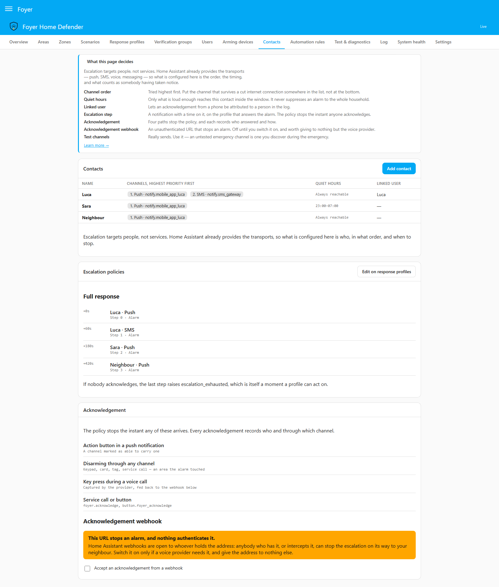

# Response profiles

**English** · [Italiano](response-profiles.it.md)

A response profile says what the house does when something happens: which
siren sounds, who is told, which light comes on, and under which conditions.
This page explains the *Response profiles* page setting by setting, and the
rules around it that decide which profile answers: inheritance, incidents,
escalation and the cameras a notification carries. It is for whoever sets
the house up, and for whoever later asks "why did it sound?" and wants an
answer that is not a guess.

Three things are worth knowing before the detail:

- **The area is the unit of response.** A zone's own profile answers that
  zone's alarm and nothing else. Everything else that happens in an area
  answers with the area's profile.
- **A break-in is one incident, not one alarm per zone.** The window, the
  hall and the stairs going one after another are one event, with one
  escalation and one acknowledgement.
- **You can check a profile before you trust it.** The
  [simulator](simulator.md) shows which profile answered each step and why
  each action did or did not run, and the test button beside every action
  really runs it.

---

## Which profile answers

Profiles are inherited, with override, along one chain:

```
zone → area → scenario → global default
```

The first link that names a profile answers. *Inherit* on a zone, an area, a
scenario or a verification group means "ask the next link". The global
default is chosen on the *Settings* page, under *Default profile*; a new
installation starts with one profile, *Default*, holding a single Home
Assistant notification, and everything inherits it until you choose
otherwise.

**The zone link is read for one thing only: that zone's own alarm** —
the trigger, the entry delay it opens, and the confirmation of a cross-zone
pair or an *Activations needed* count it completes. A verification group
answers with its own profile, then its area's chain.
An arming, a disarm, a fault, an exclusion, *Alarm over*, *Incident opened* —
everything else that happens in an area answers with the area's chain,
area → scenario → default. It is one rule to hold in mind when asking why
something sounded, and it keeps the zone profile exactly where graduated
response needs it (below).

The scenario link is the scenario the area was armed with. An area armed on
its own, outside any scenario, goes from its own profile straight to the
default.

Two other chains exist, each for a reason:

| What happened | Who answers |
|---|---|
| A **verification group** is satisfied | The group's own profile, then the chain of the group's area |
| The **technical channel** (smoke, gas, flood) | The zone's own profile, then the *Technical profile* chosen on *Settings*, then the default. A smoke detector must not answer differently depending on how the house is armed, and a scenario means nothing to a channel that is always live |
| A **duress code** is used | Only the global default ([below](#duress-code-used)) |

Where you can see the answer: the *Areas* editor shows the profile an area
would answer with and where it comes from ("Effective profile: Full —
inherited from the scenario") — for an armed area, from the scenario it was
armed with; for a disarmed one, from the first scenario that arms it with a
profile of its own; the list on this page says, under *Used by*,
which areas, zones, scenarios and groups name each profile, and whether it is
the default or the technical one; and the simulator's trace names the profile
and its source on every step it takes, read off the same function the engine
uses.

## The page

A profile has a **name**, a **severity** and a list of **actions**. Each
action has a kind, its parameters, the **moments** it answers, up to two
**conditions**, and — for a notification — an optional delay that turns it
into an escalation step. Actions run in the order the list shows; the arrows
move one up or down.

| Setting | What changing it does |
|---|---|
| *Name* | Nothing but the name. Areas, zones, scenarios and groups point at the profile, not at its name |
| *Severity* | 1 to 10. Used for one thing only: choosing which escalation an incident follows when profiles of different strength contribute to it ([incidents](#one-incident-not-one-alarm-per-zone)). It changes nothing when the profile runs alone |
| *Add action* | Adds one of the ten kinds below, opened for editing |
| The moments | When the action runs. An action must answer at least one |
| *Conditions* | When it is allowed to run. None means always |
| *Delay from alarm start* | Offered on a notification answering *Alarm* or *Technical alarm* only. With a number, the action becomes an escalation step |
| *Test* | Really runs the saved action ([below](#the-test-button)) |

Deleting a profile something still uses is refused, and the *Used by* column
is there so that this is never a surprise.

**An armed house keeps the answer it was armed with.** While any area is
armed, a profile the house could answer with — an armed area's own chain,
its zones' and groups', the default, the technical channel's, and one an
escalation is running on — cannot be changed, and neither can a contact such
a profile names. Disarm first. The reasoning is in
[the security model](security-model.md).

---

## Moments

A profile can answer much more than an alarm. The editor groups the moments
the way the panel shows them; one action may tick as many as it likes.

**On alarm**

| Moment | Id | Raised when |
|---|---|---|
| *Entry delay started* | `entry_started` | A delayed zone opened in an armed area. Somebody is usually coming home |
| *Alarm* | `triggered` | A zone alarmed an area, or an entry delay ran out |
| *Siren cutoff* | `siren_cutoff` | The area's siren time ran out; the area returns to where it was, alarm memory kept |
| *Alarm over* | `alarm_ended` | Once per area an alarm touched: when its siren cutoff runs, or when it is disarmed while still in alarm. Never on an ordinary disarm. The moment for "switch the light off when the alarm is over" |
| *Alarm memory cleared* | `alarm_cleared` | Once per area, when its alarm memory is cleared: by a disarm, even hours after the siren stopped, or by the next accepted arming of that area. The moment for "switch off the lamp that says something happened while you were out" |
| *Incident opened* | `incident_opened` | The first alarm of an incident |
| *Zone joined the incident* | `incident_joined` | Another zone joined an incident already open |
| *Incident acknowledged* | `incident_acknowledged` | Somebody acknowledged it, or disarmed an area it touched |
| *Incident closed* | `incident_closed` | Acknowledged, and every area it touched disarmed or armed again |
| *Waiting for confirmation* | `verification_pending` | A verification group has counted an activation and is waiting for the next |
| *Detection confirmed* | `verification_satisfied` | A group reached its N of M; answered by the group's profile |
| *Not confirmed in time* | `verification_expired` | A group's window ran out unsatisfied |
| *Technical alarm* | `technical_raised` | A technical zone detected |
| *Technical alarm acknowledged* | `technical_acknowledged` | Somebody acknowledged the technical channel |
| *Technical alarm cleared* | `technical_cleared` | Acknowledged and back to normal |

*Alarm over* and *Alarm memory cleared* are two moments because they are two
different things: the alarm can be over long before anybody comes home and
clears it. And arming again is not taking note of the alarm — an arming
clears the memory and raises *Alarm memory cleared*, but an incident nobody
has acknowledged stays open, and its escalation carries on, until somebody
acknowledges it or disarms. Arming asks for no code by default, and a lamp
switched off is not somebody who has seen the alarm.

**On state change**

| Moment | Id |
|---|---|
| *Armed* | `armed` |
| *Disarmed* | `disarmed` |
| *Arming failed* | `arm_failed` |
| *Forced arming* | `forced_arm` |
| *Zone excluded* | `zone_bypassed` |
| *Zone included again* | `zone_rejoined` |
| *Code rejected* | `code_rejected` |
| *Code entry locked* | `lockout` |
| *Chime switched on or off* | `chime_switched` |
| *Duress code used* | `duress` |

**On system event**

| Moment | Id |
|---|---|
| *Zone fault* | `zone_fault` |
| *Low battery* | `low_battery` |
| *Home Assistant restarted* | `ha_restarted` |
| *Walk test started*, *Walk test ended* | `walk_test_started`, `walk_test_ended` |
| *Escalation exhausted* | `escalation_exhausted` — the last step went out and nobody acknowledged |
| *Chime* | `chime` |

**On system health** — the power, the notification channels, the watchdog
and the radios, each with the moment that says it is over. They are listed,
with what raises them, in
[system health](system-health.md#the-moments-a-profile-can-answer).

### Duress code used

`duress` is raised once for every request made with a duress code, whatever
it asked for and whether or not it was allowed. It belongs to no area and no
incident, so **only the global default profile answers it**: an action on
any other profile never runs for it, and the editor says so beside the tick.
It **always runs silent** — the kinds on the silent list are left out
whatever the profile says, because a siren answering a code nobody may know
was used would tell the room exactly that — and a Home Assistant
notification is the wrong answer too, because it shows on every Home
Assistant screen, the wall tablet included. The editor warns about both. It
**never escalates**, and a walk test never holds it back. Nothing answers it
until you add an action: send it to somebody outside the house, with
`{{ operation }}` in the message. The recipe is in
[notification channels](notification-channels.md#answering-a-duress-code),
and what a duress code is for in [the security model](security-model.md).

### During a walk test

A walk test holds back the response of the house: the actions are built and
recorded, and none of them runs. Four things are never held back: 24h,
tamper, technical and panic zones, which stay fully live; an incident that
was already open; the walk test's own *Walk test started* and *Walk test
ended*, because the test must announce itself; and *Duress code used*. If
no action of any profile answers *Walk test started* or *Walk test ended*
with a notification, Foyer puts up a Home Assistant notification itself, so
unticking them does not make a walk test silent.

---

## One incident, not one alarm per zone

A real break-in trips the window, then the hall, then the stairs. Answered
zone by zone, that is three escalations — three pushes, three SMS, three
calls — at the one moment the household needs to understand what is
happening. So the incident is the unit:

- **The first alarm opens it.** The transition to *Alarm*, not the start of
  an entry delay, which is the normal way home. When an entry delay runs
  out, the zone that opened it contributes.
- **Every later alarm joins it**, adding its zone. *Zone joined the incident*
  is raised, and nothing new is started.
- **Actions are the union, deduplicated.** A siren already sounding is not
  restarted; a light not yet on comes on. A message is not a siren: a
  notification (or a Home Assistant notification) answering *Zone joined the
  incident* goes out again for every zone that joins, because saying that a
  second zone went is the point of joining.
- **The escalation is the highest-severity contributor's.** Each zone records
  the profile it answered with as it joins; the incident escalates with the
  steps of the highest-severity one among those that have steps at all, and
  ties go to the zone that joined first. A louder zone joining changes the
  list of people, and keeps the incident's clock: steps already due go out at
  once rather than starting again. If nothing was escalating yet, the clock
  starts when that zone joins. This is the only use of *Severity*.
- **One acknowledgement closes the whole incident**, and stops its
  escalation at once. Disarming an area the incident touched is an
  acknowledgement; disarming an area it did not touch is not — whoever
  disarms the bedrooms in the morning has not seen the alarm on the
  perimeter. Arming is never one, even when it clears the memory.
- **A zone joining after the acknowledgement clears it.** Whoever
  acknowledged what looked like the cat must hear that a second zone went:
  the escalation starts again from its first step, unless it had already run
  to its end for this incident. The history of acknowledgements is kept.
- **It closes** once it is acknowledged *and* every area it touched is
  disarmed or back to armed. An alarm after that opens a new incident.

Every incident has an id, and it appears on every related log row, so the log
reads as "what happened that night" rather than as scattered rows. The
technical channel never joins an intrusion incident: different channel,
different acknowledgement, by definition a different event.

---

## Actions

Ten kinds. Every text field that is a title or a message takes the
[template variables](#templates).

| Kind | Parameters |
|---|---|
| *Notification* (`notify`) | *Contacts* — with, for each, a channel or *Highest priority channel* — **or** a *Service* (a `notify.*` service or a notify entity), never both; *Title*; *Message*; *Pictures*; *How to attach it* |
| *Home Assistant notification* (`persistent_notification`) | *Title*, *Message*. Left empty, it uses Foyer's own text for the moment, in the language of the house |
| *Siren* (`siren`) | *Entities* (sirens, or switches driving one); *Duration*, 1 to 900 seconds, empty meaning the siren cutoff; *Tone*, offered only when the chosen sirens declare tones |
| *Light* (`light`) | *Entities*; *Brightness*, 0 to 255; *Flash* — none, short or long |
| *Camera* (`camera`) | *Entity*; *Mode* — *Snapshot* or *Recording*; *Duration* of a recording, 1 to 300 seconds. It writes a file to the camera folder |
| *Scene* (`scene`) | *Entity*: the scene to turn on |
| *Switch* (`switch`) | *Entities* (switches, input booleans, lights); on or off; *Switch back after*, 1 to 3600 seconds, empty meaning leave it |
| *Spoken message* (`tts`) | *Entity* (a `tts.*` engine), *Speakers*, *Message* |
| *Call a service* (`call_service`) | *Domain*, *Service*, *Data* as JSON — any Home Assistant service, for what Foyer does not model |
| *Wait* (`delay`) | *Seconds*, 1 to 3600 |

A target in the wrong domain is refused when the profile is saved, not
discovered at the moment it is used.

Five rules the catalogue depends on:

- **A *Wait* holds the rest of that moment's sequence** — the actions after
  it in the list, for the moment being answered — and nothing else. It is
  state, not a task: a restart in the middle of a sequence resumes it, and a
  switch waiting to be switched back is switched back even if Home Assistant
  restarted meanwhile. Without that, a restart during an alarm could leave a
  siren sounding for ever. A disarm or the siren cutoff abandons what a
  *Wait* was still holding for that alarm.
- **A siren never sounds beyond the siren cutoff.** Its duration is capped at
  the cutoff of the scenario the area was armed with, or the global one, and
  a disarm or the cutoff switches off what the alarm started — sirens, and
  switches still waiting to be switched back. The technical channel keeps its
  own: a disarm is an intrusion command, and never silences a smoke sounder.
- **The camera folder is `media/foyer` by default, and never `www`**, which
  Home Assistant serves without authentication. It is set on *Settings*
  (*Camera folder*). A folder that starts with `media` is inside Home
  Assistant's own media folder (`/media` on Home Assistant OS), which Home
  Assistant allows by default; any other must be in
  `allowlist_external_dirs`: Home Assistant refuses to write outside it, and
  so does every transport that sends a file. Foyer
  checks before writing and names the setting when the check fails.
- **A Home Assistant notification needs no contact book**, and appears on
  every Home Assistant screen. That makes it a good answer to a fault and the
  wrong one to a duress code.
- ***Call a service* is the escape hatch.** Anything Foyer does not model
  natively — a dialler relay, a script, a scene with a transition — without
  leaving for the automation editor.

### Silent zones

A zone marked *Silent zone* runs its response without the action kinds a
**global list** names: *A silent zone suppresses* on the *Settings* page,
the siren, the spoken message and the chime by default. Which actions make a
noise is an installation's business, so it is a list rather than a rule
written into the code.

Silence belongs to the zone. On the zone's own alarm, the zone decides. On
*Incident opened* and *Zone joined the incident*, the incident is silent only
while every zone in it is: **a non-silent zone contributing to the same
incident still sounds.** A panic button marked silent sends its message
quietly; the kitchen window going a minute later sounds the siren — through
the area's profile, so tick the siren for *Zone joined the incident* as well
as *Alarm*: a second zone in an area already in alarm raises only that
moment.

### The test button

Beside every saved action, *Test* really runs it: the siren really sounds —
for three seconds, after which Foyer switches it off, whether it takes a
duration or is driven by a switch — the notification
really arrives, the light really comes on. It asks first, needs the *Test
actions* permission and a code, and leaves a row in the log marked as a test.
Conditions and quiet hours are not asked, because they are rules about
alarms, not about whether the phone rings. It tests the saved version of the
action, so save first; a *Wait* has nothing to test. The same button is on
*Test & diagnostics* —
[the action test](simulator.md#action-test--press-the-button-before-the-night-you-need-it).

---

## Conditions

Each action may carry **at most two** conditions. The bound is deliberate:
it is the line between a response engine and a second automation engine.
Anything more belongs in a Home Assistant automation subscribed to
`foyer_event`.

| Condition | Shape |
|---|---|
| *Time window* | *From* and *Until*, as HH:MM. A window may cross midnight: 22:00 to 07:00 is the night. A window whose start equals its end is refused, because it would silence the action for ever |
| *Entity state* | An entity, *is* or *is not*, and a state |

With two, *Both conditions* chooses between *Both must be met* and *Either
is enough*. "Only at night *and* only if nobody is home" is the common case;
"either" is worth the one selector.

**An entity that cannot be read satisfies nothing.** A condition on an entity
that is `unavailable`, `unknown` or missing is not met — neither *is* nor
*is not* — so an action never runs on a guess. It is the same reasoning as a
zone: unknown is never calm, and never "nobody home" either.

Conditions are evaluated from the same snapshot the engine decides on, so the
simulator evaluates them exactly as the house would, and its trace says which
condition failed.

## Templates

A title or a message takes a fixed set of variables — not arbitrary Jinja
over the whole state of the house. A name outside the set is refused when the
profile is saved, so a typo is found then rather than arriving blank.

| Variable | What it holds |
|---|---|
| `{{ zone }}` | The zone or zones behind this moment |
| `{{ area }}` | The area or areas |
| `{{ scenario }}` | The scenario |
| `{{ user }}` | The person who acted, as established by a code, a token or a linked account — never a name a request only claimed |
| `{{ channel }}` | Through which channel: the panel, a keypad, a tag, an automatic rule… |
| `{{ time }}`, `{{ date }}` | Local time as HH:MM, date as YYYY-MM-DD |
| `{{ state }}` | The area's state |
| `{{ open_zones }}` | The zones open right now |
| `{{ reason }}` | Why: an arming refused, a fault, what caused the moment |
| `{{ incident_zones }}` | Every zone that has joined the current incident, in the order they joined |
| `{{ operation }}` | What a request made with a duress code asked for: `disarm`, `arm`, `bypass_zone`, `export_log`, `unlock`… The full list is in [notification channels](notification-channels.md#answering-a-duress-code) |

A variable the moment does not carry is left empty.

---

## Pictures in a notification

**A picture with the alarm, and you say which app it is for.** The kitchen
window opens: the household wants the kitchen camera and the one in the room
next door, so that the picture says *where* the problem is. So the cameras
belong to the zone — an ordered list, chosen in the zone editor
([zones](zones.md)) — and a notification can ask for "the cameras of the
zones that raised this".

*Pictures* on a notification has three values:

| *Pictures* | What is attached |
|---|---|
| *The cameras of the zones behind the alarm* | Every zone that has joined the incident contributes its cameras, in the order the zones joined and then in the order each zone lists them, each camera once. A burglar goes from the window to the hall, and the notification shows both. A new notification starts here |
| *Always the same camera* | The one camera chosen under *Attach a camera*, attached to the notification itself, whatever raised it |
| *No pictures* | The text alone |

*How to attach it* names the transport, because there is no shared key and a
transport drops a key it does not recognise in silence:

- ***Companion app — live picture, no file.*** The app is signed in, so it
  gets a link to the live camera through Home Assistant's authenticated
  proxy (`/api/camera_proxy/<entity>`), and nothing is written to disk.
- ***Telegram — a photo file.*** Telegram's own server does the fetching,
  from outside the house and with no session, so it cannot follow that link.
  Foyer takes a still at the moment of the notification, writes it to the
  camera folder and sends the
  file. A Telegram chat set up from the UI is a notify entity, which carries
  no picture itself, so Foyer sends it each still through
  `telegram_bot.send_photo`.

Foyer asks rather than guessing from the service name, because "I attached a
camera and nothing arrived" is otherwise how you find out, months later.

With the cameras of the zones:

- **At most four per notification.** Past four, the message says how many
  were left out.
- **One notification per camera.** The Companion app shows one image per
  notification, so the first message carries the text and the acknowledge
  button exactly as it would without cameras, and each camera follows as its
  own notification carrying only its picture and the camera's name.
- **Fresh every time.** The first message, each zone joining, each escalation
  step: every notification repeats all of them, taken now, because what the
  house looks like *now* is the point of a picture.
- **Only at the moments that are an alarm**: *Alarm*, *Incident opened*,
  *Zone joined the incident*, *Detection confirmed*, an escalation step, and
  *Technical alarm* — with the cameras of the technical zones still waiting
  to be acknowledged. **Never at *Entry delay started***: an entry delay is
  the household coming home, and photographing every homecoming and sending
  it out of the house is exactly what Foyer's rule about outgoing messages
  exists to stop. At any other moment the notification sends its text alone,
  and the editor names the moments where it will.
- **Only to channels that show pictures.** Sent to contacts, the pictures go
  to their push and chat channels; an SMS, a voice call or an *other* channel
  gets the text alone rather than one more message per camera. A notify
  entity gets no pictures either: it carries a title and a message and
  nothing else.
- **A camera never costs the message.** The text goes first, and it is the
  one the acknowledgement and channel health are counted on. A camera that
  does not answer within ten seconds costs its own picture and nothing else.

The simulator's trace lists which cameras each notification would carry,
without taking a picture of anything.

---

## Escalation: a notification that keeps looking for somebody

An escalation is a list of people and times — push now, SMS in a minute, a
second person two minutes later — that stops the instant anybody
acknowledges. It is not a separate object: **a step is a notification with a
time on it**, on the profile that answers the alarm.

To make one, give a notification a *Delay from alarm start*, from 0 to 3600
seconds. It then leaves the ordinary sequence and waits for its time instead
of firing at once. Only a notification or a Home Assistant notification can
be a step, and only on *Alarm* or *Technical alarm*, because those are the
two things that can be acknowledged: a step on *Armed* would be an
escalation nobody could stop. The step's contacts and channels are chosen on
the action itself; the people and their channels, in order of priority, live
on the *Contacts* page, which also shows every policy as a timeline and
links back here to edit it.

<p align="center"></p>

Two things escalate, and they never merge: an **intrusion incident**, with
the steps of the highest-severity contributing profile, and the **technical
channel**, with the steps of the first technical alarm whose profile has
any — one escalation for the whole channel, because one acknowledgement acts
on every technical alarm pending.

**It stops the instant somebody acknowledges**, through any of four paths:
the button in an actionable push notification, disarming an area the alarm
touched, a key pressed during a voice call and fed back through the
acknowledgement webhook, or `foyer.acknowledge` (and
`button.foyer_acknowledge`). Every acknowledgement records who and through
which channel. The transports, the button and the webhook — which is a
credential — are in [notification channels](notification-channels.md).

**If nobody acknowledges**, the last step going out raises *Escalation
exhausted*, a moment a profile can answer like any other: a louder message,
a different person, a siren outside. A zone joining after that updates the
text, as every join does, and does not start the list again.

**A step that reaches nobody is said, not swallowed.** A step whose
conditions are not met, or whose contacts are all inside their quiet hours,
is spent and recorded in the log with the reason. A step that fell due while
Home Assistant was down is not sent late — a notification four hours late is
worse than none — and is recorded as *Escalation steps not sent*; the steps
still ahead keep their own times.

### Quiet hours

Quiet hours belong to the contact, on the *Contacts* page: a window, which
may cross midnight, and a *Minimum severity to get through* on the log's
scale — *Info*, *Warning*, *Alarm*. Inside the window, only what is at least
that serious reaches that person. Left at *Alarm*, the default, a break-in,
a technical alarm, a confirmed detection, a duress code, a power cut and
*Escalation exhausted* get through at four in the morning, and a successful
arming does not. Quiet hours never silence the alarm for the rest of the
household, apply only to notifications sent to contacts — not to a
notification naming a service directly — and a notification whose every
contact is held back is not sent at all, which the simulator's trace says.

---

## A worked example: graduated response

An open-plan living room with two motion sensors, and the wish that one of
them alone sends a message while both within a minute sound the siren.

1. Make a profile **Quiet**: one *Notification* to Luca, ticked for *Alarm*.
2. Make a profile **Loud**: a *Siren* ticked for *Detection confirmed*, and
   three notifications ticked for *Alarm* with *Delay from alarm start* 0, 60
   and 120 — Luca's push, Luca's SMS, Anna's push. Give it a higher
   *Severity* than Quiet.
3. On each motion zone, choose **Quiet** as its *Response profile*.
4. Make a [verification group](zones.md#verification-groups) of the two, 2 of
   2 within 60 seconds, and give it **Loud**.

One sensor on its own alarms its area and opens an incident, answered by the
zone's Quiet profile: a notification, no siren. The second within the minute
satisfies the group, which answers with Loud: the siren sounds, and because
the group joins the incident with the higher severity, the incident adopts
Loud's escalation. Ninety seconds apart, the window has expired and the
second sensor is one more zone joining a quiet incident.

The siren is ticked for *Detection confirmed* because that is the moment the
group answers; the steps are ticked for *Alarm* because that is the moment an
incident escalates on. Rehearse it in the [simulator](simulator.md): force
one sensor, then the other thirty seconds later, then again ninety seconds
apart, and read which profile answered each step.
