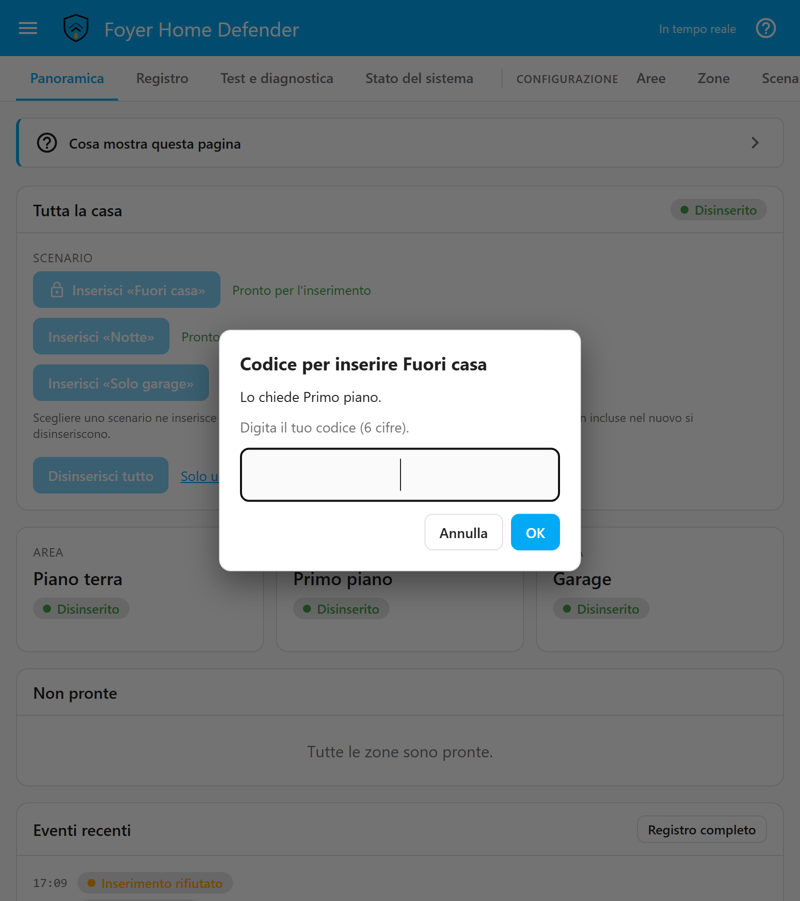
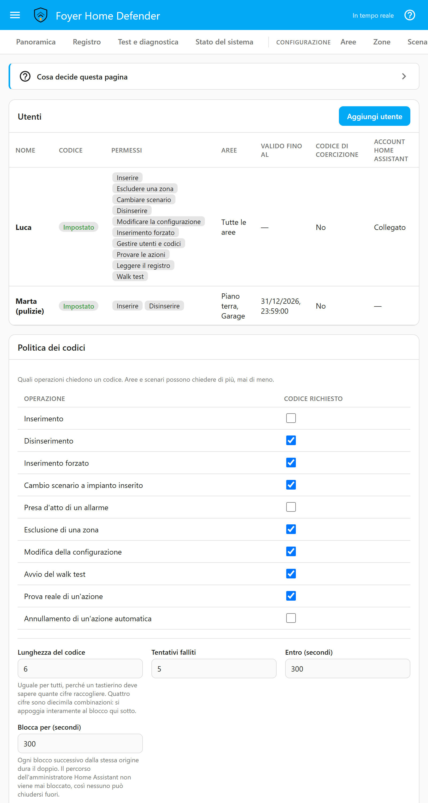
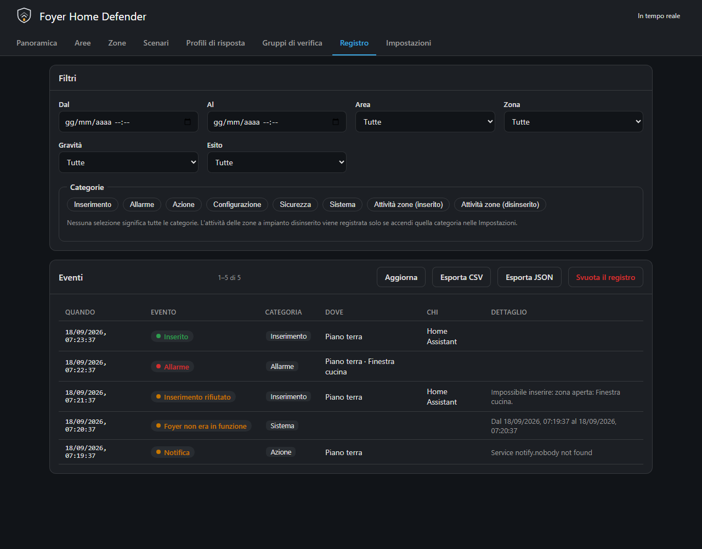

# Modello di sicurezza

[English](security-model.md) · **Italiano**

Questa pagina è per chi sta decidendo se affidare una casa a Foyer, e per chi
sta compilando la pagina *Utenti*. Dice chi fermano i codici di Foyer e chi
no, che cosa può fare un amministratore di Home Assistant qualunque cosa dica
Foyer, che cosa cambia ogni impostazione della pagina *Utenti*, e quali parti
del sistema puoi verificare da te invece di prenderle sulla fiducia. Tutto
quello che trovi qui descrive che cosa fa il software oggi; dove c'è un
limite, è scritto, non lasciato da scoprire.

---

## Il confine

> I codici di Foyer proteggono da familiari, ospiti, personale domestico,
> utenti non amministratori di Home Assistant e chiunque trovi un tablet a muro
> sbloccato. **Non** proteggono da un amministratore di Home Assistant, che può
> leggere `.storage`, disattivare l'integrazione o chiamare direttamente
> qualunque servizio. Foyer non è un impianto d'allarme certificato.

I codici servono a impedire che disinserisca chi è *dentro* casa tua. Non
servono a fermare **te**: per chi amministra Home Assistant nessun codice di
Foyer vuol dire niente, e per lo stesso identico motivo il registro eventi è
*utile* come traccia, non *inalterabile*.

Questo è il confine onesto, e vale la pena conoscerlo prima di appoggiarcisi.
Cos'è Foyer, con le parole che la configurazione ti chiede di accettare:

> Foyer è offerto come software che automatizza azioni su regole, non come
> impianto d'allarme. Non è certificato (EN 50131, CEI 79-3), non è
> sorvegliato, non è un sistema antincendio, ed è fornito senza garanzie né
> impegno di supporto (Apache-2.0, sezioni 7 e 8). Non affidarti solo a lui per
> proteggere persone o beni: tieni rilevatori di fumo certificati, e un
> impianto professionale dove una polizza o un rischio lo richiedono.

## Cosa può fare comunque un amministratore di Home Assistant

Chi amministra Home Assistant, o può raggiungerne la cartella di
configurazione, può:

- **leggere `.storage/foyer.config`**, che contiene ogni codice e ogni codice
  di coercizione come hash bcrypt, ogni token di dispositivo come impronta
  SHA-256, l'id del webhook di presa d'atto e l'URL del watchdog. L'indirizzo
  del webhook, che il pannello mostra una sola volta, lì si legge in qualunque
  momento;
- **cancellare il database del registro**, `foyer-log.db` nella cartella di
  configurazione, senza che resti una riga a dirlo;
- **disattivare o rimuovere l'integrazione**, e con questo fermare l'allarme;
- **chiamare direttamente qualunque servizio**, dagli Strumenti per
  sviluppatori o da un'automazione.

Nessuna di queste è una falla che Foyer potrebbe chiudere: è quello che
significa amministrare Home Assistant. Quello che Foyer decide è come trattare
un amministratore che passa dalle sue stesse interfacce:

- **A un amministratore il codice viene chiesto come a chiunque altro**, ogni
  volta che la politica lo chiede. Essere amministratore non identifica
  nessuno: il tablet a muro sbloccato di cui parla questa pagina è quasi
  sempre collegato con un account amministratore.
- **Un amministratore non viene mai bloccato** fuori dal pannello, dalla card o
  dalle entità del pannello d'allarme. I suoi codici errati vengono contati e
  registrati, ma il contatore non lo chiude mai fuori, perché un
  amministratore che non riuscisse a rientrare disattiverebbe l'integrazione.
- **Sui comandi di configurazione e del registro del pannello, un
  amministratore non viene mai respinto per mancanza di un permesso** —
  respingerlo non otterrebbe niente che il paragrafo sopra non gli dia già. Il
  codice resta.
- **Un amministratore senza più un modo di entrare può recuperare l'accesso,
  e lo fa in modo vistoso** — uno che non ha un codice in una casa dove altri
  ce l'hanno, o il cui utente Foyer è stato disattivato o è uscito dal suo
  periodo di validità. *Impostazioni → Dispositivi e servizi → Foyer →
  Configura*, che Home Assistant apre solo agli amministratori, chiede un
  account amministratore (Home Assistant non dice chi ha aperto il passaggio)
  e un nuovo codice, di nessun altro. L'utente Foyer di quell'account viene
  attivato, il suo periodo di validità tolto e il suo codice sostituito; un
  account che non ne ha uno riceve una nuova persona con tutti i permessi. Una
  volta scritto, viene annunciato con una riga sotto *Sicurezza*, una notifica
  di Home Assistant e un messaggio a ogni contatto attivo, ognuno con il nome
  dell'account; un recupero la cui scrittura è fallita lascia la sua riga,
  segnata come fallita, e uno respinto prima che venga scritto qualcosa — un
  codice non valido o già in uso — riceve la risposta nel modulo stesso. A
  chiunque altro si dà un modo di entrare dalla pagina *Utenti*.

---

## Codici

### Come un codice viene conservato e verificato

Ogni codice, e ogni codice di coercizione, è conservato come hash bcrypt ed è
in sola scrittura: nessun comando, servizio o pagina restituisce un codice o
un hash, e né un backup di Foyer né il download della diagnostica ne contengono uno.
Il pannello dice se qualcuno ha un codice, mai quale sia. Il fattore di lavoro
è tenuto a qualche decina di millisecondi per confronto, perché un codice
errato digitato su un tastierino durante un ritardo d'ingresso viene
confrontato con ogni hash conservato; solo chi può leggere `.storage` potrebbe
tentare offline, e quello che protegge un codice dai tentativi è il blocco,
non l'hash.

Ogni servizio e ogni comando del pannello che cambia lo stato dell'allarme o
la sua configurazione verifica il codice nel backend, e respinge una
richiesta in cui è sbagliato, o in cui manca dove la politica lo chiede. Una card è un tastierino che trasmette
un codice; non decide mai. Un controllo del PIN nel browser sarebbe una
decorazione, perché chiunque abbia accesso a Home Assistant può chiamare
direttamente il servizio.

### Un codice a testa

Ogni persona ha il suo codice, perché con uno condiviso a *chi ha disinserito
alle 03:14?* non si può più rispondere. Quindi un codice non può appartenere
a due persone, e un codice di coercizione conta nello stesso insieme dei
codici normali: salvare un codice che è già di qualcun altro, o l'altro codice
della stessa persona, viene respinto con *quel codice appartiene già a
qualcuno* — senza mai dire di chi. Il tentativo viene anche **contato come
codice errato**, sul blocco di chi sta salvando: altrimenti il controllo di
unicità sarebbe un modo per provare codici contro tutta la famiglia senza
limiti.

Cambiare il codice di qualcuno lascia al loro posto tutte le righe firmate
con quello vecchio.

### Quando nessuno ha un codice

**La politica dei codici resta inerte finché una persona attiva non ha un
codice utilizzabile** — attiva, con un codice, e dentro il suo periodo di
validità. Prima di allora non c'è niente da verificare, quindi applicare la
politica renderebbe l'allarme inutilizzabile anziché più sicuro; il pannello
lo dice chiaramente finché dura, nella Panoramica e con *I codici non sono
attivi* nella pagina *Utenti*, e la card non offre nessun tastierino da aprire
(una card impostata sulla disposizione *Tastierino* ne mostra comunque uno,
anche se nulla chiederà un codice). Dalla prima
persona così in poi, la politica vale per intero. È anche il motivo per cui,
mentre un'area è inserita, una modifica che lascerebbe nessuno con un codice
utilizzabile viene respinta (più sotto).

### Quanto resta un codice su uno schermo

**Il pannello** tiene un codice che ha funzionato, così venti salvataggi non
lo chiedono venti volte, e lo dimentica dopo due minuti senza usarlo, dopo
ogni inserimento o disinserimento qualunque sia stata la risposta, e quando il
pannello viene chiuso. Un codice che è stato respinto, o che ha incontrato un
blocco, viene dimenticato all'istante.

**La card** non tiene nessun codice oltre il comando per cui è stato digitato.
Le cifre digitate partono con il prossimo comando premuto, e quando un comando
è in attesa di un codice, solo con quello, che il tastierino indica sopra di
esse; vengono dimenticate dopo 30 secondi senza toccare un tasto, dopo
l'invio del comando, e quando la card esce dallo schermo. Come la card chiede
il codice è in [card.it.md](card.it.md).

---

## La pagina Utenti, impostazione per impostazione

### Una persona

| Impostazione | Cosa fa |
|---|---|
| *Codice* | Esattamente tante cifre quante dice *Lunghezza del codice*, e di nessun altro. Lasciato vuoto su una persona esistente, il codice attuale resta. |
| *Codice di coercizione* | Facoltativo. Fa tutto quello che fa il codice normale e solleva un `duress` silenzioso ogni volta che viene usato — vedi [più sotto](#il-codice-di-coercizione). |
| *Account Home Assistant* | Collega la persona a un account, così il pannello sa chi sta agendo senza che venga digitato un codice. Un account per persona. Gli account sono elencati solo agli amministratori. |
| *Valido dal* / *Valido fino al* | Un codice per ospiti: fuori da questo intervallo il codice viene respinto, come appartenente a *un utente disattivato o fuori dal suo periodo di validità*. |
| *Permessi* | Che cosa questa persona può chiedere in assoluto — la tabella successiva. |
| *Aree* | *Tutto*, o aree scelte. Ogni operazione che agisce su un'area viene respinta quando ne tocca una fuori dall'elenco: inserire un'area o uno scenario, escludere una zona, disinserire — compreso il disinserimento di ogni area da *Tutta la casa*. Modificare la configurazione, leggere il registro e provare un'azione non sono mai ristretti dalle aree. Il *Walk test* è l'unica operazione su un'area che non restringono. |
| *Scenari* | *Tutto*, o scenari scelti. Fuori dall'elenco la persona non può né inserire lo scenario, né passare a esso, né disinserire le aree che ha inserito. L'elenco *Chi può usarlo* di uno scenario restringe ulteriormente le stesse tre cose. |
| *Non chiedere il codice dove questa persona è identificata* | L'esenzione per persona, spenta di serie — vedi [quali canali identificano](#dove-si-può-fare-a-meno-del-codice). Richiede un account collegato. |
| *Attivo* | Il codice di una persona disattivata viene respinto, e la sua storia resta. |

### Permessi

Verificati nel backend a ogni comando, qualunque cosa la pagina mostri o
nasconda.

| Permesso | Cosa consente |
|---|---|
| *Inserire* | Inserire uno scenario o un'area. |
| *Disinserire* | Disinserire. |
| *Inserimento forzato* | Inserire nonostante una zona che lo blocca — un comando distinto, e registrato. |
| *Escludere una zona* | Escludere una zona a mano, e includerla di nuovo. |
| *Cambiare scenario* | Passare a un altro scenario a impianto inserito. |
| *Modificare la configurazione* | Ogni pagina di configurazione tranne persone, tag e politica dei codici, il ripristino di un backup e lo svuotamento del registro. Serve anche per leggere la configurazione, ma senza codice; scaricare un backup ne chiede uno quando la politica lo dice. |
| *Leggere il registro* | La pagina *Registro* e le sue esportazioni, *Test e diagnostica* (la tabella in tempo reale e il simulatore) e *Stato del sistema*. |
| *Provare le azioni* | La prova delle azioni, che fa suonare davvero la sirena e manda davvero il messaggio. |
| *Walk test* | Avviare e terminare un walk test. Arriva più lontano di quanto dica il nome: [più sotto](#chi-può-avviare-un-walk-test-può-tenere-zitta-la-casa). |
| *Gestire utenti e codici* | Le persone, e tutto quello che decide che cosa una persona può fare o quale chiave apre la casa a nome di chi. Salvare o cancellare una persona, salvare un tag, e le impostazioni della politica dei codici e del blocco richiedono questo permesso. Una modifica fatta con *Modificare la configurazione* che tocca anche delle persone — la persona a nome della quale agisce un interruttore a chiave, il *Chi può usarlo* di uno scenario, la cancellazione di un tag, il ripristino di un backup o un'importazione — li richiede entrambi, altrimenti *Modificare la configurazione* sarebbe un modo per dare a sé stessi, o a qualcun altro, quello che questo permesso nega. Lo richiede anche cancellare dal registro la storia di una persona. |

Una persona aggiunta dalla pagina *Utenti* parte con *Inserire*,
*Disinserire*, *Escludere una zona*, *Cambiare scenario* e *Leggere il
registro*. Solo la prima persona, creata dalla procedura guidata del primo
avvio, e una persona creata dal recupero da *Configura* partono con tutti i
permessi; gli altri si danno di proposito.

### La politica dei codici

La tabella nella pagina *Utenti* dice quali operazioni chiedono un codice,
per tutti. I valori predefiniti sono quelli delle centrali vere — inserire la
casa in cui ti trovi non chiede niente, tutto quello che abbassa la guardia
chiede un codice:

| Operazione | Codice richiesto di serie |
|---|---|
| *Inserimento* | no |
| *Disinserimento* | sì |
| *Inserimento forzato* | sì |
| *Cambio scenario a impianto inserito* | sì |
| *Presa d'atto di un allarme* | no |
| *Esclusione di una zona* | sì |
| *Modifica della configurazione* | sì |
| *Avvio del walk test* | sì |
| *Prova reale di un'azione* | sì |
| *Annullamento di un'azione automatica* | no |

Prendere atto e annullare il conto alla rovescia di una regola non chiedono
un codice di serie perché entrambi arrivano come pulsante in una notifica
push, che non ne porta nessuno. Un'installazione può alzare l'uno o l'altro;
allora `button.foyer_acknowledge` rifiuta dove qualcuno può vederlo
rifiutare, e né il pulsante di una notifica push né il webhook di presa
d'atto possono più rispondere, perché nessuno dei due porta un codice.

**Aree e scenari hanno voce sull'inserimento e sul disinserimento.** Ogni
area e ogni scenario ha *Codice per inserire* e *Codice per disinserire*,
impostati su *Come la politica globale*, *Codice richiesto* o *Senza codice*.
Per una richiesta decidono le impostazioni esplicite di ogni area che tocca e
del suo scenario, e dove non sono d'accordo **vince la più severa**: inserire
uno scenario tocca più aree insieme, e se una qualunque delle aree coinvolte —
o lo scenario stesso — dice *Codice richiesto*, il codice viene chiesto. Solo
quando nessuna di loro è impostata decide la tabella sopra. Quando questa
regola sbaglia, costa un codice di troppo; quando sbaglierebbe la regola
opposta, un'area che il suo proprietario ha protetto di proposito verrebbe
aperta perché uno scenario permissivo la includeva. Quando il pannello chiede
il codice, dice quale area o quale scenario lo sta chiedendo.

Sotto la tabella:

| Impostazione | Predefinito | Limiti | Note |
|---|---|---|---|
| *Lunghezza del codice* | 6 | 4–12 | Uguale per tutti, perché un tastierino deve sapere quante cifre raccogliere. Quattro cifre sono diecimila combinazioni, e si reggono tutte sul blocco. |
| *Tentativi falliti* | 5 | 2–20 | Quanti codici errati chiudono il canale... |
| *Entro (secondi)* | 300 | 10–86 400 | ...all'interno di questo intervallo. |
| *Blocca per (secondi)* | 300 | 10–86 400 | Per quanto resta chiuso, mai più di un'ora qualunque cosa si imposti qui. Ogni blocco successivo dello stesso canale raddoppia, fino a quell'ora; un canale che passa un giorno senza blocchi riparte dal primo gradino. |

### Dove si può fare a meno del codice

**Si può fare a meno del codice solo su un canale che sa già chi sta
chiedendo.** In pratica è l'interfaccia di Home Assistant stessa, collegata
con l'account legato a quella persona, con *Non chiedere il codice dove questa
persona è identificata* spuntato. Anche un tag personale identifica, ma un tag
non porta nessun codice (più sotto).

**Su un canale che non identifica, il codice *è* l'identità**, quindi lì
l'esenzione non vale mai: un tastierino condiviso, un dispositivo
sull'endpoint, un messaggio MQTT, una chiamata di servizio, un'automazione.
Un messaggio non può nemmeno dichiararsi un canale che identifica — una
chiamata di servizio può dire di essere `api` o `automation` e nient'altro, e
un canale fisico appartiene a un dispositivo dichiarato sotto *Dispositivi di
inserimento*.

Quando un codice e un account collegato non sono d'accordo, vince il codice:
chi digita il proprio codice su un tablet collegato come un altro membro della
famiglia è quella persona, e il registro lo dice. L'esenzione non è qualcosa
che un amministratore ha automaticamente; è l'interruttore personale di
ciascuno. E un tablet lasciato collegato come una persona esente è un
disinserimento che chiunque passi può premere.

### Un nome digitato da qualcuno

Una chiamata di servizio può dire chi sta agendo con `user_id`, perché un
adattatore ha bisogno di un modo per dirlo. Quel nome **non concede niente** —
né sull'inserimento, né sui servizi che leggono il registro o la
configurazione: un permesso viene da un codice o da un account collegato, mai
da un id digitato da qualcuno. Dichiararsi qualcuno porta con sé le sue
restrizioni, mai le sue esenzioni. E siccome di serie inserire non chiede un
codice, una riga così potrebbe altrimenti attribuire un'azione a una persona
solo sulla parola di chi chiama, quindi ogni riga la cui persona è stata
nominata anziché accertata è segnata *(non verificato)* accanto al nome. Un
codice o un tag producono una riga senza segno.

### Il blocco

I codici errati vengono contati **per origine**, così che una fonte che
tira a indovinare blocchi sé stessa e non la famiglia:

- **per account di Home Assistant**: un contatore condiviso da pannello, card
  ed entità del pannello d'allarme, e un altro per le chiamate ai servizi
  `foyer.*`; le chiamate senza un utente dietro, come le automazioni,
  condividono un unico contatore;
- **per dispositivo**, per un tastierino o un dispositivo dichiarato sotto
  *Dispositivi di inserimento*;
- **per indirizzo di origine**, all'endpoint dei dispositivi, per un token
  mancante o sbagliato.

Un blocco solleva il momento `lockout`, a cui un profilo di risposta può
rispondere — qualcuno che tira a indovinare su un tastierino è un segnale di
manomissione — e viene registrato sotto *Sicurezza*. I codici errati di un
amministratore sul pannello, sulla card e sulle entità del pannello d'allarme
vengono contati e registrati, e non lo bloccano mai.

---

## Chi può avviare un walk test può tenere zitta la casa

Un walk test si cammina in tutta la casa, quindi inserisce ogni area
disinserita che può — anche quelle che a chi lo avvia non sono permesse, ma
non una che conserva ancora una memoria d'allarme — e finché non finisce
nessuna area risponde a una rilevazione ordinaria, nemmeno una inserita da
qualcun altro. Dura quindici minuti dall'ultima rilevazione per impostazione
predefinita (da 1 a 60 minuti), mai più di tre ore dall'inizio di un test — ma
niente impedisce di riavviarlo appena finisce, ogni volta con la sua notifica
e le sue righe nel registro — e basta il permesso *Walk test*, non serve
*Disinserire*.

È voluto, e non è mai silenzioso su sé stesso: chiede un codice per
impostazione predefinita, mette un banner su ogni schermo, il profilo
predefinito manda una notifica di Home Assistant all'inizio e alla fine (togli
la spunta a quei due momenti e inizia e finisce senza annunci), ed entrambe le
sue righe nel registro, sotto *Sistema*, nominano la persona quando un codice
o un account collegato hanno detto chi era. Restano attivi durante il test: le zone 24h, manomissione, tecniche e
panico, un allarme già in corso e un codice di coercizione. La pagina *Utenti*
avverte quando *Walk test* è spuntato. Dai *Walk test* alle persone a cui
daresti *Disinserire*.

E togliere *Codice richiesto* accanto ad *Avvio del walk test* lo consegna a
qualunque cosa possa avviarlo senza essere identificata — qualunque account
di Home Assistant che chiami `foyer.walk_test`, collegato a una persona o no,
perché una chiamata di servizio identifica una persona solo con un codice; e
un'automazione, uno script o un account non collegato a nessuno attraverso
`switch.foyer_walk_test` o il pannello — perché i permessi si controllano
sulla persona che chiede, e una richiesta che non identifica nessuno non ne ha
da controllare.

A cosa serve il walk test, e come leggerlo, è in
[simulator.md](simulator.md#walk-test--which-zones-never-saw-you) (in
inglese).

---

## Il codice di coercizione

**Un codice di coercizione è il codice del suo titolare, e lo dice solo al
registro.** Ogni persona può averne uno oltre al codice normale. Vale ovunque
vale quello normale — inserire, disinserire, escludere una zona, prendere
atto, un walk test, i comandi di impostazione e del registro del pannello,
sbloccare un dispositivo, una chiamata di servizio, un tastierino, la card — e
fa esattamente quello che farebbe il codice normale, risposta compresa: gli
stessi permessi, lo stesso contatore del blocco, e chi è al tastierino non
vede e non sente nessuna differenza. Il pannello lo tiene per i suoi due
minuti come qualunque altro codice, perché dimenticarlo prima sarebbe una
differenza che qualcuno potrebbe notare.

Quello che cambia è un evento silenzioso, `duress`, sollevato una volta per
ogni richiesta che portava il codice, qualunque cosa chiedesse e che sia
stata permessa o no — compresi un canale bloccato e un dispositivo che
respinge un'azione fuori dai suoi permessi — e dice che cosa è stato chiesto
(`{{ operation }}` in un messaggio). Gli risponde solo il **profilo
predefinito**, e nulla finché non gli dai un'azione: mandalo a qualcuno fuori
casa. È sempre silenzioso — resta fuori quello che nomina l'elenco
silenzioso, di serie la sirena, la voce e il campanello — non va mai in
escalation, e un walk test non lo trattiene mai. Anche una notifica di Home
Assistant è la risposta sbagliata, perché compare su ogni schermo di Home
Assistant, tablet a muro compreso.

La riga sta nella pagina *Registro* e in un'esportazione, mai nella
Panoramica, in `sensor.foyer_last_event` o nel registro di un dispositivo API.
Arriva anche sul bus degli eventi di Home Assistant come `foyer_event`, ed è
così che una tua automazione può risponderle: una che mostra gli eventi di
sicurezza da qualche parte in casa deve lasciare fuori `duress`. Il bus porta
solo quello che il registro scrive, quindi disattivare la categoria
*Sicurezza* in *Impostazioni* ferma anche quell'evento; la risposta del
profilo predefinito non dipende dal registro. Svuotare il registro con un
codice di coercizione non cancella la riga `duress` di quella stessa
richiesta.

[Come rispondere](notification-channels.md#answering-a-duress-code) (in
inglese).

---

## Credenziali: mostrate una volta, mai rilette

Leggere la configurazione richiede *Modificare la configurazione* e nessun
codice, e il pannello viene letto da più persone di chi ha impostato una
credenziale — quindi una credenziale che il pannello potesse rileggere sarebbe
una credenziale che la prossima persona al tablet potrebbe copiare. Per questo
Foyer dice se ognuna esiste, e mai quale sia:

- **Codici e codici di coercizione** — mai mostrati, come sopra.
- **Il token di un dispositivo** — mostrato una volta, nella risposta che lo
  genera. Foyer tiene un'impronta SHA-256 e la confronta in tempo costante.
  Generarne uno nuovo invalida subito il vecchio e ne chiude le connessioni
  aperte; generare e revocare sono modifiche della configurazione, e chiedono
  *Modificare la configurazione* e, di serie, un codice.
- **Il webhook di presa d'atto** — mostrato una volta, più sotto.
- **L'URL del watchdog** — scritto e mai riletto; *Stato del sistema* dice
  solo che ce n'è uno impostato. Chi lo ha potrebbe tenere il controllo verde
  per sempre, e così zittire l'unica cosa che segnala la morte di Foyer stesso.
  [Il dettaglio](system-health.md#the-url-is-a-credential) (in inglese).

Nessuna è in un backup di Foyer, e nessuna è nel download della diagnostica di
Home Assistant, che lascia fuori anche nomi, hash dei codici e id reali delle
entità ([che cosa contiene](system-health.md#the-diagnostics-download)). Un
backup di Home Assistant è un'altra cosa: copia la cartella di configurazione,
`.storage/foyer.config` compreso, quindi contiene tutto quello che l'elenco
sopra dice che un amministratore può leggere.

**Il webhook di presa d'atto, se lo accendi, è un URL non autenticato.**
Esiste perché un provider vocale possa rimandare il tasto premuto durante una
chiamata. I webhook di Home Assistant sono aperti a chi ne conosce
l'indirizzo: chiunque lo abbia, o lo intercetti, può prendere atto di un
allarme in corso, cioè fermare l'escalation mentre sta andando dalla persona
successiva. Non può inserire, disinserire, leggere il registro o cambiare
niente. Non esiste finché non lo accendi, l'id è generato a caso, il pannello
ne mostra l'indirizzo una sola volta — quando viene generato — e spegnendolo
viene dimenticato; per rivederlo se ne genera uno nuovo.
[I dettagli](notification-channels.md#twilio-voice-call) (in inglese).

---

## Dispositivi

- **Dichiarati prima di poter comandare.** Un `device_id` che questa
  installazione non ha viene respinto qualunque codice porti. Sui servizi di
  inserimento e via MQTT il rifiuto viene anche registrato sotto *Sicurezza*,
  al massimo una volta al minuto per nome, e sollevato come notifica di Home
  Assistant. Il blocco conta per
  dispositivo, quindi chi potesse inventarsi il nome di un dispositivo non
  verrebbe mai bloccato.
- **Il token autentica il dispositivo; non cifra niente.** Su HTTP in chiaro
  il token e ogni codice digitato sul dispositivo si possono leggere sulla
  rete. Un dispositivo così viene comunque servito, e porta un avviso *Non
  cifrato* sotto *Dispositivi di inserimento* finché non arriva da lui una
  richiesta cifrata. Un token da solo non inserisce e non disinserisce mai:
  ogni comando attraverso l'endpoint — inserire, disinserire, escludere una
  zona, prendere atto — richiede un codice digitato sul dispositivo, e un
  dispositivo non va mai oltre i permessi spuntati per lui, qualunque codice
  venga digitato.
- **Un token giusto non viene mai respinto per il suo indirizzo.** Dietro lo
  stesso router, reverse proxy o /64 IPv6 di qualcuno che tira a indovinare,
  un dispositivo con il suo token giusto continua a funzionare mentre
  quell'indirizzo è bloccato, e le sue richieste né aumentano il conteggio
  dell'indirizzo né lo azzerano. Le righe che registrano che cosa ha chiesto
  una richiesta così dicono che l'indirizzo era bloccato.
- **Un tag rubato inserisce e disinserisce senza codice.** Un tag non porta
  nessun codice: il possesso è la credenziale, e il tag è l'identità della sua
  persona, quindi la politica dei codici non lo raggiunge. I permessi, le aree
  e il periodo di validità di quella persona valgono comunque. Un tag nomina
  sempre una persona, e non è mai ammesso sull'endpoint, dove il token da solo
  sarebbe la chiave di casa.

Come si configura ogni tipo di dispositivo: [keypads.md](keypads.md) (in
inglese), e [l'endpoint dei dispositivi](keypads.md#the-device-endpoint).

---

## Le card di Home Assistant, e gli assistenti vocali

Le card, le finestre e i riquadri d'allarme di Home Assistant parlano con le
entità `alarm_control_panel` di Foyer, e lì Home Assistant decide prima di
Foyer: a un'entità che dice che l'inserimento richiede un codice, Home
Assistant stesso respinge un inserimento senza codice, per tutti, prima che
Foyer possa vedere che la persona che chiede è esente. Quindi un pannello dice
che l'inserimento richiede un codice solo finché nessuna persona attiva ha
l'esenzione accesa e un inserimento che offre ne chiede uno — per *Tutta la
casa*, appena una modalità che può ancora inserire lo chiede. Finché qualcuno
è esente, Home Assistant lascia passare ogni inserimento, e risponde Foyer: una
persona esente inserisce senza codice, e chiunque altro a cui serve un codice
viene respinto, con una riga nel registro e un messaggio che dice dove si può
digitare un codice. Un'automazione che chiama le stesse azioni non identifica
nessuno, e le viene chiesto il codice ogni volta che la politica lo chiede.
Come appare da ogni card è in [faq.it.md](faq.it.md).

**Fai attenzione all'account a cui è collegato un assistente vocale**, perché
agisce come quell'account di Home Assistant per chiunque stia parlando.
Collegato tramite un account che appartiene a una persona esente, consegna
quell'esenzione a chiunque sia a portata di voce: inserire senza codice, e
passare la casa a un'altra modalità, cosa che disinserisce le aree inserite
solo dalla modalità precedente. Google Assistant manda il PIN salvato nella
sua configurazione, se ce n'è uno: se è il codice Foyer di qualcuno, quello
che chiede viene fatto a suo nome — e viene mandato senza che nessuno lo
pronunci finché inserire non chiede un codice; se non lo è, è un codice
errato, e conta per il blocco. Collega gli assistenti vocali tramite un
account non legato a una persona esente, e dai il PIN di Google, se è un
codice Foyer, a una persona che abbia solo quello che lasceresti fare a
chiunque vicino all'altoparlante — *Inserire*, per esempio. Tramite Home
Assistant Cloud agiscono come l'account del Cloud stesso, che la pagina
*Utenti* non propone di collegare.

---

## Una casa inserita mantiene la sua risposta

Finché un'area non è disinserita, una modifica che cambierebbe il modo in cui
la casa risponde a un allarme, o per che cosa chiede un codice, viene
respinta e dice perché: la politica dei codici, la lunghezza del codice e il
blocco, e per che cosa *qualunque* area o scenario chiede un codice — compresi
un'area disinserita e uno scenario non in uso, perché la regola del più severo
li legge per ogni comando che tocca l'area inserita. Altrimenti chi ha
*Modificare la configurazione* potrebbe abbassare la guardia di una casa che
nessuno ha disinserito, e niente nel registro sembrerebbe un disinserimento.
L'elenco completo è in [settings.it.md](settings.it.md).

**Chi può comandare la casa resta modificabile.** Una persona, il suo codice,
i suoi permessi e la sua esenzione, un tag, un dispositivo e il suo token si
possono aggiungere, cambiare o revocare a impianto inserito — togliere il
codice a un ospite o la regola a un telefono perso dall'altra parte del mondo
è proprio la modifica di cui una casa inserita ha più bisogno — e funziona
anche il recupero da *Configura*. Ogni comando che portano incontra comunque
la politica dei codici. L'unico rifiuto tra questi è **una modifica che
lascerebbe nessuno con un codice utilizzabile**, adesso o prima di quanto
succedesse già alla fine di un periodo di validità: senza un codice
utilizzabile la politica si spegne da sola, e sarebbe la politica cambiata per
un'altra strada. Dai prima un codice a qualcun altro, oppure disinserisci.

## Disinserimento automatico

È spento di serie, non si può accendere o spegnere mentre un'area è inserita,
e **nessuna regola disinserisce mai un'area segnata come perimetro** — lo
impone il motore, con un test che lo verifica sulla decisione stessa. La
presenza si deduce da un telefono, e un telefono rubato non deve aprire la
casa.
[automation-rules.md](automation-rules.md#why-automatic-disarming-is-restricted)
(in inglese) spiega perché, senza addolcirlo.

## Verso l'esterno, Foyer dice il minimo

Dentro casa — il pannello, la card, il registro, le entità — Foyer dice tutto
quello che sa. Tutto quello che esce di casa parte dal minimo che basta,
perché un messaggio lo legge chi sta dall'altra parte, e «inserito, nessuno in
casa» dice a un estraneo esattamente quando venire:

- il ping del **watchdog esterno** è una richiesta vuota di serie; il
  contenuto facoltativo è spento, e porta solo due conteggi e un sì o no sullo
  stato di salute
  ([system-health.md](system-health.md#the-heartbeat-carries-nothing), in
  inglese);
- il **messaggio di stato MQTT** mantenuto parte dal livello `minimal`, senza
  scenario, senza nomi di aree e senza nomi di zone, e lo si alza sapendo
  quello che si fa ([keypads.md](keypads.md#the-mqtt-contract), in inglese);
- un **dispositivo API** non legge niente finché i suoi permessi non sono
  spuntati; poi, di serie, lo stato dell'allarme con il solo token, e tutto il
  resto solo dopo che qualcuno ha digitato un codice sul dispositivo, finché
  non resta senza letture per un breve periodo (due minuti di serie) o
  qualcuno inserisce o disinserisce attraverso di esso
  ([keypads.md](keypads.md#api-devices-displays-relays-and-modules-of-your-own)).

---

## Come puoi verificarlo invece di fidarti

Tre di queste cose le puoi fare stasera: provare una notte nel
[simulatore](simulator.md#the-simulator) (in inglese), girare la casa con il
[walk test](simulator.md#walk-test--which-zones-never-saw-you) e vedere quali
zone non ti hanno mai notato, e premere il pulsante di prova accanto alla tua
sirena. Il resto è strutturale, ed è il motivo per cui vale la pena credere
alle prime tre.

- **La parte che decide è una funzione pura.** «Questa zona si è aperta,
  quest'area è inserita, e adesso?» ha come risposta codice che non può
  raggiungere Home Assistant, non ha un orologio suo e non può eseguire
  un'azione; viene testato da solo, e la CI respinge un commit che lasci
  entrare Home Assistant. È questo che rende veritiera, e non ottimista, la
  risposta del simulatore: è la stessa funzione, a cui si dà un mondo inventato, e un
  test verifica che lei e l'allarme in funzione arrivino alla stessa decisione
  dagli stessi input.
- **Un buco nella copertura viene scritto.** Se Home Assistant è rimasto giù
  per due ore, il registro lo dice, con la durata. Non lascia mai intendere
  che eri protetto quando non lo eri.
- **Un nome che niente ha verificato è segnato come tale**, *(non
  verificato)*, come sopra. Una risposta sbagliata a «chi ha disinserito alle
  03:14?» è peggio di nessuna risposta.
- **Ogni azione dice se ha funzionato.** Una sirena che non ha suonato e una
  notifica che non è partita sono righe nel registro, segnate come fallite —
  non silenzio.
- **Il changelog dice che cosa è cambiato nel comportamento**, non «correzioni
  varie», perché è quello che ti serve per decidere se prendere un
  aggiornamento.

## Il registro è utile come traccia, non inalterabile

Il registro è quello che risponde a *chi ha disinserito alle 03:14?*, e dentro
Foyer non può essere riscritto di nascosto: *Svuota il registro*, nella
pagina *Registro*, richiede *Modificare la configurazione* e, di serie, un
codice, e lo svuotamento viene a sua volta registrato — sotto
*Configurazione*, con quante righe ha tolto — così il registro non fa finta
che non sia successo niente. Ma un amministratore con accesso alla cartella di
configurazione può cancellare `foyer-log.db` e basta, e niente di quello che
fa Foyer cambia questo. Il registro serve a rispondere a domande oneste dopo,
non a sopravvivere a qualcuno deciso a riscriverlo. Che cosa contiene sulle
persone, e come lasciarne andare una: [privacy.md](privacy.md) (in inglese).

## Non è un sistema antincendio

**E non è un sistema antincendio.** Il canale tecnico è davvero utile — è
attivo che la casa sia inserita o no, e disinserire non ha nessuna autorità su
di lui — ma un rilevatore di fumo collegato a Home Assistant non sostituisce
rilevatori certificati e interconnessi. Quelli comprali a parte: non costano
molto, e sono l'unica voce di questa pagina in cui sbagliarsi non riguarda un
furto.

## Segnalare una vulnerabilità

Un modo per aggirare un codice, o un modo per tenere zitto l'allarme, va in
una segnalazione privata: [SECURITY.md](../SECURITY.md) (in inglese) dice come
farla, e che cosa è fuori ambito.
