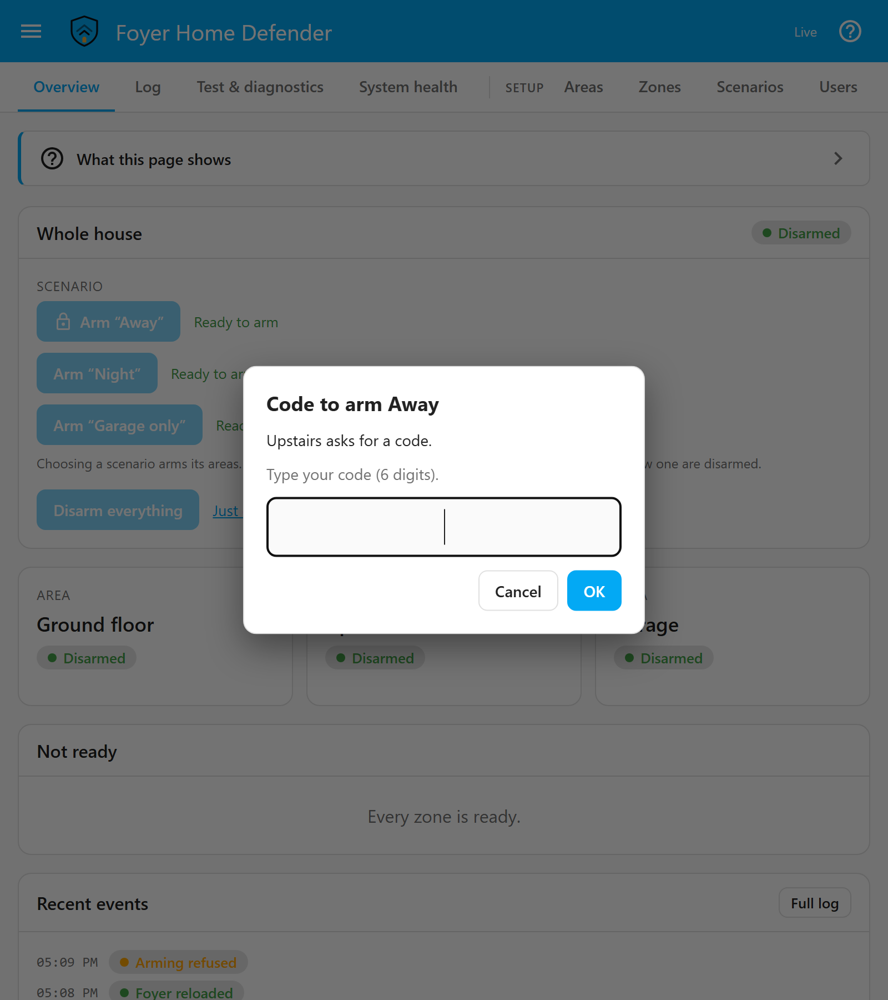
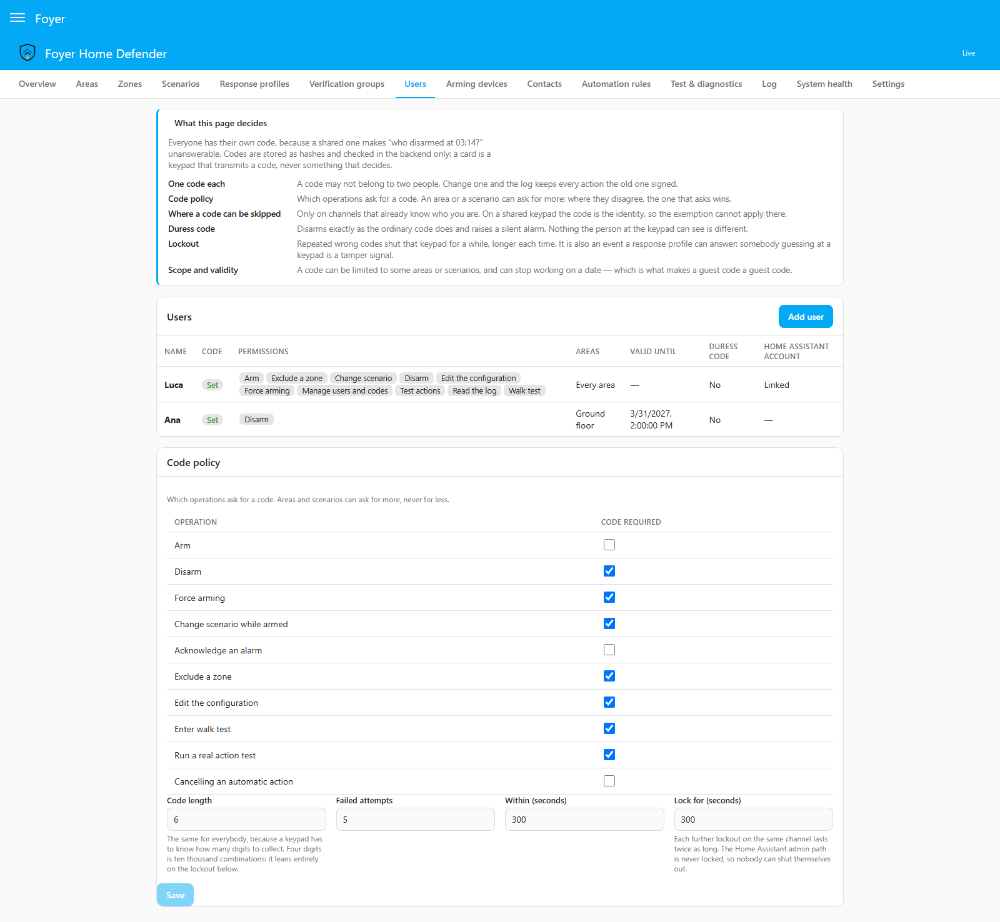
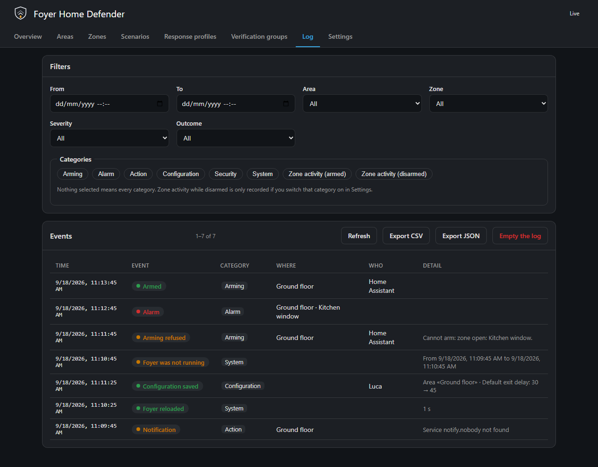

# Security model

**English** · [Italiano](security-model.it.md)

This page is for somebody deciding whether to trust Foyer with a house, and
for whoever is filling in the *Users* page. It says who Foyer's codes stop and
who they do not, what a Home Assistant administrator can do whatever Foyer
says, what each setting on the *Users* page changes, and which parts of the
system you can check for yourself rather than take on trust. Everything here
describes what the software does today; where a limit exists, it is written
down rather than left for you to discover.

---

## The boundary

> Foyer's codes protect against household members, guests, cleaners, non-admin
> Home Assistant users and anyone who finds an unlocked wall tablet. They do
> **not** protect against a Home Assistant administrator, who can read
> `.storage`, disable the integration or call any service directly. Foyer is not
> a certified alarm system.

The codes are there to stop the people who are *in* your house from disarming
it. They are not there to stop **you**: to somebody who administers Home
Assistant, no code in Foyer means anything, and the event log is
audit-*useful* rather than tamper-*proof* for exactly the same reason.

That is the honest boundary, and it is worth knowing before you rely on it.
What Foyer is, in the words setting it up asks you to accept:

> Foyer is offered as software that automates actions on rules, not as an
> alarm system. It is not certified (EN 50131, CEI 79-3), not monitored, not a
> fire alarm, and comes with no warranty and no promise of support
> (Apache-2.0, sections 7 and 8). Do not rely on it alone to protect people or
> property: keep certified smoke alarms, and a professional installation where
> a policy or a risk calls for one.

## What a Home Assistant administrator can do regardless

Whoever administers Home Assistant, or can reach its configuration directory,
can:

- **read `.storage/foyer.config`**, which holds every code and duress code as a
  bcrypt hash, every device token as a SHA-256 fingerprint, the acknowledgement
  webhook's id and the watchdog URL. The webhook's address, which the panel
  shows only once, is readable there at any time;
- **delete the log database**, `foyer-log.db` in the configuration directory,
  with no row left behind to say so;
- **disable or remove the integration**, which stops the alarm;
- **call any service directly**, from Developer Tools or an automation.

None of this is a leak Foyer could close: it is what administering Home
Assistant means. What Foyer does decide is how it treats an administrator who
uses its own surfaces:

- **An administrator is asked for the code like anybody else**, whenever the
  policy asks for one. Being an administrator identifies nobody: the unlocked
  wall tablet this page is about is almost always signed in as one.
- **An administrator is never locked out** of the panel, the card or the alarm
  panel entities. Their wrong codes are counted and logged, but the counter never
  shuts them out, because an administrator who could not get back in would
  disable the integration instead.
- **On the panel's configuration and log commands, an administrator is never
  refused for want of a permission** — refusing would buy nothing the
  paragraph above does not already give them. The code still applies.
- **An administrator with no way in can recover access, loudly** — one who
  holds no code in a house where others do, or whose own Foyer user was
  disabled or ran past its validity window. *Settings → Devices & services →
  Foyer → Configure*, which Home Assistant opens to administrators only, asks
  for an administrator's account (Home Assistant does not say who opened the
  step) and a new code, nobody else's. That account's Foyer user is enabled,
  its validity window removed and its code replaced; an account with none gets
  a new person with every permission. Once written, it is announced in a row
  under *Security*, a Home Assistant notification and a message to every
  enabled contact, each naming the account; one whose write failed leaves its
  row, marked failed, and one refused before anything is written — a code
  that is invalid or already in use — is answered in the form. Anybody else is given a way in from
  the *Users* page.

---

## Codes

### How a code is kept and checked

Every code, and every duress code, is stored as a bcrypt hash and is
write-only: no command, service or page returns a code or a hash, and neither
a Foyer backup nor the diagnostics download carries one. The panel says whether
somebody has a code, never what it is. The work factor is kept to tens of
milliseconds a comparison, because a wrong code typed at a keypad during an
entry delay is compared against every stored hash; only somebody who can read
`.storage` could guess offline, and what protects a code from guessing is the
lockout, not the hash.

Every service and every panel command that changes the state of the alarm or
its configuration checks the code in the backend, and refuses a request that
has it wrong, or is missing it where the policy asks for one. A card is a keypad that transmits a code; it
never decides. A PIN check in a browser would be decoration, because anybody
with access to Home Assistant can call the service directly.

### One code each

Every person has their own code, because a shared one makes *who disarmed at
03:14?* unanswerable. So a code may not belong to two people, and a duress code
counts in the same space as ordinary codes: saving a code that is already
somebody else's, or the same person's other code, is refused with *that code
already belongs to somebody* — and never says whose. The attempt is also
**counted as a wrong code**, against the lockout of whoever is saving:
otherwise the uniqueness check would be a way of testing codes against the
household without limit.

Changing somebody's code leaves every row the old one signed where it was.

### When nobody holds a code

**The code policy is inert until an enabled person holds a usable code** —
enabled, with a code, and inside their validity window. Nothing can be
verified before then, so enforcing the policy would make the alarm unusable
rather than safer; the panel says so plainly while it lasts, on the Overview
and as *Codes are not in force* on the *Users* page, and the card offers no
keypad to unfold (a card set to the *Keypad* layout still shows one, though
nothing will ask for a code). From the first such person on, the policy applies
in full. It is also why, while any area is armed, an edit that would leave
nobody with a usable code is refused (below).

### How long a code stays on a screen

**The panel** keeps a code that has worked, so that twenty saves do not
ask for it twenty times, and forgets it after two minutes unused, after every
arming or disarming whatever the answer, and when the panel is closed. A code
that was refused, or ran into a lockout, is forgotten on the spot.

**The card** keeps no code beyond the command it was typed for. Typed digits
go with the next command pressed, and once a command is waiting for a code,
only with that one, which the keypad names above them; they are forgotten
after 30 seconds without a key, after the command is sent, and when the card
leaves the screen. How the card asks is in [card.md](card.md).

---

## The Users page, setting by setting

### A person

| Setting | What it does |
|---|---|
| *Code* | Exactly as many digits as *Code length* says, and nobody else's. Left empty on an existing person, the current code is kept. |
| *Duress code* | Optional. Does everything the ordinary code does and raises a silent `duress` each time it is used — see [below](#the-duress-code). |
| *Home Assistant account* | Links the person to an account, so the panel knows who is acting without a code being typed. One account per person. The accounts are listed to administrators only. |
| *Valid from* / *Valid until* | A guest code: outside this window the code is refused, as *a user who is disabled or outside their validity period*. |
| *Permissions* | What this person may ask for at all — the next table. |
| *Areas* | *Everything*, or chosen areas. Every operation that acts on an area is refused when it touches one outside the list: arming an area or a scenario, excluding a zone, disarming — the *Whole house* disarm of every area included. Editing the configuration, reading the log and testing an action are never narrowed by areas. The *Walk test* is the one operation on an area it does not narrow. |
| *Scenarios* | *Everything*, or chosen scenarios. Outside the list the person can neither arm the scenario, switch to it, nor disarm the areas it armed. A scenario's own *Who may use it* list narrows the same three further. |
| *Skip the code where this person is identified* | The per-person exemption, off by default — see [which channels identify](#where-a-code-can-be-skipped). It needs a linked account. |
| *Enabled* | A disabled person's code is refused, and their history is kept. |

### Permissions

Checked in the backend on every command, whatever the page shows or hides.

| Permission | What it allows |
|---|---|
| *Arm* | Arming a scenario or an area. |
| *Disarm* | Disarming. |
| *Force arming* | Arming past a zone that blocks it — a distinct, logged command. |
| *Exclude a zone* | Excluding a zone by hand, and including it again. |
| *Change scenario* | Switching to another scenario while armed. |
| *Edit the configuration* | Every configuration page except people, tags and the code policy, restoring a backup and emptying the log. Reading the configuration needs it too, but no code; downloading a backup asks for one when the policy says so. |
| *Read the log* | The *Log* page and its exports, *Test & diagnostics* (the live table and the simulator) and *System health*. |
| *Test actions* | The action test, which really sounds the siren and really sends the message. |
| *Walk test* | Starting and ending a walk test. It reaches further than its name: [below](#whoever-may-start-a-walk-test-may-keep-the-house-quiet). |
| *Manage users and codes* | People, and everything that decides what a person may do or which key opens the house as whom. Saving or deleting a person, saving a tag, and the code policy and lockout settings need this permission. A change made under *Edit the configuration* that also touches people — the person a key switch acts as, a scenario's *Who may use it*, deleting a tag, restoring a backup or importing — needs both, or *Edit the configuration* would be a way to hand oneself, or somebody else, what this permission withholds. Erasing a person's history from the log needs it too. |

A person added on the *Users* page starts with *Arm*, *Disarm*, *Exclude a
zone*, *Change scenario* and *Read the log*. Only the first person, created by
the first-run wizard, and a person the recovery from *Configure* creates start
with every permission; the rest are given deliberately.

### The code policy

The table on the *Users* page says which operations ask for a code, for
everybody. The defaults are what real panels do — arming the house you are
standing in needs nothing, everything that lowers the guard needs a code:

| Operation | Code required by default |
|---|---|
| *Arm* | no |
| *Disarm* | yes |
| *Force arming* | yes |
| *Change scenario while armed* | yes |
| *Acknowledge an alarm* | no |
| *Exclude a zone* | yes |
| *Edit the configuration* | yes |
| *Start a walk test* | yes |
| *Run a real action test* | yes |
| *Cancel an automatic action* | no |

Acknowledging and cancelling a rule's countdown ask for no code by default
because both arrive as a button in a push notification, which carries none. An
installation may raise either; `button.foyer_acknowledge` then refuses where
somebody can see it refuse, and neither a push notification's button nor the
acknowledgement webhook can answer at all, because neither carries a code.

**Areas and scenarios have a say over arming and disarming.** Each area and
each scenario has *Code to arm* and *Code to disarm*, set to *As the global
policy*, *Code required* or *No code*. For a request, the explicit settings of
every area it touches and of its scenario decide, and where they disagree
**the strictest wins**: arming a scenario touches several areas at once, and
if any area involved — or the scenario itself — says *Code required*, a code
is asked. Only when none of them is set does the table above decide. The
failure of this rule is one code too many; the failure of the opposite rule
would be an area its owner deliberately protected, opened because a
permissive scenario included it. When the panel asks, it says which area or
scenario is asking.

Below the table:

| Setting | Default | Bounds | Notes |
|---|---|---|---|
| *Code length* | 6 | 4–12 | The same for everybody, because a keypad has to know how many digits to collect. Four digits is ten thousand combinations, and leans entirely on the lockout. |
| *Failed attempts* | 5 | 2–20 | How many wrong codes shut the channel... |
| *Within (seconds)* | 300 | 10–86 400 | ...inside this window. |
| *Lock for (seconds)* | 300 | 10–86 400 | How long it stays shut, never more than one hour whatever is set here. Each further lockout of the same channel doubles, up to that hour; a channel that has gone a day without one starts again from the first step. |

### Where a code can be skipped

**A code can be skipped only on a channel that already knows who is asking.**
In practice that is Home Assistant's own interface signed in as the account
linked to that person, with *Skip the code where this person is identified*
ticked. A per-person tag identifies too, but a tag carries no code at all
(below).

**On a channel that does not identify, the code *is* the identity**, so the
exemption never applies there: a shared keypad, a device on the endpoint, an
MQTT message, a service call, an automation. A message cannot claim to be an
identifying channel either — a service call may say it is `api` or
`automation` and nothing else, and a physical channel belongs to a device
declared under *Arming devices*.

When a code and a signed-in account disagree, the code wins: somebody typing
their own code on a tablet signed in as another member of the household is
that person, and the log says so. The exemption is not something an
administrator has automatically; it is each person's own switch. And a tablet
left signed in as an exempt person is a disarm anybody passing can press.

### A name somebody typed

A service call may say who is acting with `user_id`, because an adapter needs
some way to say it. That name **grants nothing** — not on arming, not on the
services that read the log or the configuration: a permission comes from a
code or a linked account, never from an id somebody typed. Claiming to be
somebody brings their restrictions, never their exemptions. And because
arming needs no code by default, such a row could otherwise credit a person on
nothing but the caller's word, so every row whose person was named rather than
established is marked *(not verified)* beside the name. A code or a tag
produces an unmarked row.

### The lockout

Wrong codes are counted **per origin**, so that one source guessing locks
itself out and not the household:

- **per Home Assistant account**: one counter shared by the panel, the card
  and the alarm panel entities, and another for `foyer.*` service calls; calls
  with no user behind them, such as automations, share a single counter;
- **per device**, for a keypad or device declared under *Arming devices*;
- **per source address**, at the device endpoint, for a missing or wrong
  token.

A lockout raises the `lockout` moment, which a response profile can answer —
somebody guessing at a keypad is a tamper signal — and is recorded under
*Security*. An administrator's wrong codes on the panel, the card and the
alarm panel entities are counted and recorded, and never lock them out.

---

## Whoever may start a walk test may keep the house quiet

A walk test is walked through the whole house, so it arms every disarmed area
it can — the areas the person starting it is not allowed included, though not
one still holding alarm memory — and until it ends no area answers an ordinary
detection, not even one somebody else armed. That lasts fifteen minutes after
the last detection by default (1–60 minutes), never more than three hours from
the start of one test — though nothing stops it being started again as soon as
it ends, each time with its notification and its log rows — and it needs *Walk
test*, not *Disarm*.

It is kept that way on purpose, and it is never quiet about itself: it asks
for a code by default, it puts a banner on every screen, the default profile
sends a Home Assistant notification when it starts and when it ends (untick
those two moments and it starts and ends unannounced), and both of its rows in
the log, under *System*, name the person when a code or a linked account said
who that was. What stays live through it: 24h, tamper, technical and panic
zones, an alarm already under way, and a duress code. The *Users* page warns
when *Walk test* is ticked. Give it to the people you would give *Disarm* to.

And unticking *Code required* beside *Start a walk test* hands it to anything
that can start one without being identified — any Home Assistant account
calling `foyer.walk_test`, linked to a person or not, since a service call
identifies a person only by a code; and an automation, a script or an account
linked to nobody through `switch.foyer_walk_test` or the panel — because
permissions are checked against the person asking, and a request that
identifies nobody has none to check.

What the walk test is for, and how to read it, is in
[simulator.md](simulator.md#walk-test--which-zones-never-saw-you).

---

## The duress code

**A duress code is its owner's code, and says so only to the log.** Each
person may have one besides their ordinary code. It is accepted wherever the
ordinary code is — arming, disarming, excluding a zone, acknowledging, a walk
test, the panel's settings and log commands, unlocking a device, a service
call, a keypad, the card — and does exactly what the ordinary code would,
answer included: the same permissions, the same lockout counter, and nothing
the person at the keypad sees or hears is different. The panel keeps it for
its two minutes like any other code, because forgetting it sooner would be a
difference somebody could see.

What differs is one silent event, `duress`, raised once for every request that
carried the code, whatever it asked for and whether or not it was allowed — a
locked-out channel and a device refusing an action outside its permissions
included — naming what was asked (`{{ operation }}` in a message). Only the
**default profile** answers it, and nothing does until you give it an action:
send it to somebody outside the house. It always runs silent — what the silent
list names, the siren, speech and the chime by default, is left out — it never
escalates, and a walk test never holds it back. A Home Assistant notification
is the wrong answer too, because it shows on every Home Assistant screen, the
wall tablet included.

The row is on the *Log* page and in an export, never on the Overview, in
`sensor.foyer_last_event` or in an API device's log. It is also on Home
Assistant's event bus as `foyer_event`, which is how an automation of yours
can answer it: one that shows security events somewhere in the house should
leave `duress` out. The bus carries only what the log writes, so switching the
*Security* category off under *Settings* stops that event too; the default
profile's answer does not depend on the log. Emptying the log with a duress
code does not erase that request's own `duress` row.

[Answering it](notification-channels.md#answering-a-duress-code).

---

## Credentials: shown once, never read back

Reading the configuration needs *Edit the configuration* and no code, and the
panel is read by more people than whoever set a credential — so a credential
the panel could read back is one the next person at the tablet could copy.
Foyer therefore says whether each exists, and never what it is:

- **Codes and duress codes** — never shown, as above.
- **A device's token** — shown once, in the answer that generates it. Foyer
  keeps a SHA-256 fingerprint and compares it in constant time. Generating a
  new one invalidates the old one at once and closes its open connections;
  generating and revoking are configuration changes, asking for *Edit the
  configuration* and, by default, a code.
- **The acknowledgement webhook** — shown once, below.
- **The watchdog URL** — written and never read back; *System health* says only
  that one is set. Whoever holds it could keep the check green for ever, which
  silences the one thing that reports Foyer's own death.
  [The detail](system-health.md#the-url-is-a-credential).

None of them is in a Foyer backup, and none is in Home Assistant's diagnostics
download, which also leaves out names, code hashes and real entity ids
([what it contains](system-health.md#the-diagnostics-download)). A Home Assistant backup is another matter: it copies the configuration
directory, `.storage/foyer.config` included, so it holds everything the list
above says an administrator can read.

**The acknowledgement webhook, if you switch it on, is an unauthenticated
URL.** It exists so a voice provider can feed back the key somebody pressed
during a call. Home Assistant webhooks are open to whoever holds the address,
so anybody who has it — or intercepts it — can acknowledge an alarm in
progress, which stops the escalation on its way to the next person. It cannot
arm, disarm, read the log or change anything. It does not exist until you
switch it on, the id is generated and random, the panel shows its address
once — when it is generated — and switching it off forgets it; to see it
again, you generate a new one.
[The details](notification-channels.md#twilio-voice-call).

---

## Devices

- **Declared before they may command.** A `device_id` this installation does
  not carry is refused whatever code it brings. On the arming services and
  over MQTT the refusal is also recorded under *Security*, at most once a
  minute per name, and raised as a Home Assistant notification. The lockout counts per device, so a
  caller free to invent a device name would be a caller who is never locked
  out.
- **The token authenticates the device; it does not encrypt anything.** Over
  plain HTTP the token and every code typed on the device can be read on the
  network. Such a device is still served, and carries an *Unencrypted*
  warning under *Arming devices* until a request from it arrives encrypted. A
  token alone never arms or disarms: every command through the endpoint —
  arming, disarming, excluding a zone, acknowledging — needs a code typed on
  the device, and a device never goes beyond the permissions ticked for
  it, whatever code is typed.
- **A right token is never refused for its address.** Behind the same router,
  reverse proxy or IPv6 /64 as somebody guessing, a device with its right token
  keeps working while that address is locked out, and its requests neither add
  to the address's count nor clear it. The rows recording what such a request
  asked for say the address was locked.
- **A stolen tag arms and disarms without a code.** A tag carries no code:
  possession is the credential, and the tag is its person's identity, so the
  code policy cannot reach it. Their permissions, areas and validity window
  still apply. A tag always names a person, and is never allowed on the
  endpoint, where the token alone would be the key to the house.

How each kind of device is set up: [keypads.md](keypads.md), and
[the device endpoint](keypads.md#the-device-endpoint).

---

## Home Assistant's own cards, and voice assistants

Home Assistant's alarm cards, dialogs and tiles talk to Foyer's
`alarm_control_panel` entities, and there Home Assistant decides before Foyer
does: an entity that says arming needs a code is refused a codeless arming by
Home Assistant itself, for everybody, before Foyer can see that the person
asking is exempt. So a panel says arming needs a code only while no enabled
person has the exemption switched on and an arming it offers asks for one —
for *Whole house*, as soon as one mode it can still arm asks. While anybody is
exempt, Home Assistant passes every arming on, and Foyer answers it: an exempt
person arms with no code, and anybody else it wants a code from is refused,
with a row in the log and a message saying where a code can be typed. An
automation calling the same actions identifies nobody, and is asked for the
code whenever the policy asks. How this looks from each card is in
[faq.md](faq.md).

**Mind which account a voice assistant is linked with**, because it acts as
that Home Assistant account for whoever is speaking. Linked through an account
that belongs to an exempt person, it hands that exemption to anybody within
earshot: arming with no code, and switching the house to another mode, which
disarms the areas only the old mode armed. Google Assistant sends the PIN
stored in its own configuration, if there is one: if that is somebody's Foyer
code, what it asks for is done in their name — and it is sent without anybody
saying it while arming needs no code; if it is not, it is a wrong code, and
counts towards the lockout. Link voice assistants through an account that is
not linked to an exempt person, and give Google's PIN, if it is a Foyer code,
to a person who holds only what you would let anybody near the speaker do —
*Arm*, say. Through Home Assistant Cloud they act as the Cloud's own account,
which the *Users* page does not offer to link.

---

## An armed house keeps its answer

While any area is not disarmed, an edit that would change how the house
answers an alarm, or what it asks a code for, is refused and says why: the
code policy, the code length and the lockout, and what *any* area or scenario
asks a code for — a disarmed area and a scenario that is not running included,
because the strictest-wins rule reads them for every command that touches the
armed area. Otherwise whoever holds *Edit the configuration* could lower the
guard of a house nobody disarmed, and nothing in the log would read as a
disarm. The full list is in [settings.md](settings.md).

**Who may command the house stays editable.** A person, their code, their
permissions and exemption, a tag, a device and its token can be added,
changed or revoked while armed — taking a guest's code or a lost phone's rule
away from the other side of the world is the edit an armed house needs most —
and the recovery from *Configure* works too. Every command they carry still
meets the code policy. The one refusal among them is **an edit that would
leave nobody with a usable code**, now or sooner than before when a validity
window ends: with no usable code the policy switches itself off, which would be
the policy changed by another route. Give somebody else a code first, or
disarm.

## Automatic disarming

Off by default, it cannot be switched on or off while any area is armed, and
**no rule ever disarms an area marked as the perimeter** — enforced in the
engine, with a test that asserts it on the decision itself. Presence is
inferred from a phone, and a stolen phone must not open the house.
[automation-rules.md](automation-rules.md#why-automatic-disarming-is-restricted)
says why without softening it.

## Outward, Foyer says the least

Inside the house — the panel, the card, the log, the entities — Foyer says
everything it knows. Anything that leaves the house starts at the least that
works, because a message is read by whoever holds the other end, and "armed,
nobody home" tells a third party exactly when to come:

- the **external watchdog's** ping is an empty request by default; the
  optional payload is off, and carries only two counts and a yes or no for
  health
  ([system-health.md](system-health.md#the-heartbeat-carries-nothing));
- the retained **MQTT state message** starts at its `minimal` level, with no
  scenario, no area names and no zone names, and is raised knowingly
  ([keypads.md](keypads.md#the-mqtt-contract));
- an **API device** reads nothing until its permissions are ticked; then, by
  default, the state of the alarm with its token alone, and everything else
  only after somebody types a code on it, until it has gone unread for a
  short while (two minutes by default) or somebody arms or disarms through it
  ([keypads.md](keypads.md#api-devices-displays-relays-and-modules-of-your-own)).

---

## How you can check it rather than trust it

Three of these you can do this evening: rehearse a night in the
[simulator](simulator.md#the-simulator), walk the house with the
[walk test](simulator.md#walk-test--which-zones-never-saw-you) and see which
zones never noticed you, and press the test button beside your siren. The rest
are structural, and they are why the first three are worth believing.

- **The part that decides is a pure function.** "This zone opened, this area is
  armed, what now?" is answered by code that cannot reach Home Assistant, has
  no clock of its own and cannot perform an action; it is tested on its own,
  and CI refuses a commit that lets Home Assistant in. That is what makes the
  simulator's answer truthful rather than optimistic: it is the same function,
  given a made-up world, and a test asserts that it and the running alarm reach
  an identical decision from identical inputs.
- **A gap in coverage is written down.** If Home Assistant was down for two
  hours, the log says so, with the duration. It never implies you were
  protected when you were not.
- **A name nothing verified is marked as such**, *(not verified)*, as above. A
  wrong answer to "who disarmed at 03:14?" is worse than no answer.
- **Every action reports whether it worked.** A siren that did not sound and a
  notification that did not send are rows in the log, marked failed — not
  silence.
- **The changelog says what changed in behaviour**, not "various fixes",
  because that is what you need in order to decide whether to take an update.

## The log is audit-useful, not tamper-proof

The log is what answers *who disarmed at 03:14?*, and inside Foyer it cannot
be quietly rewritten: *Empty the log*, on the *Log* page, needs *Edit the
configuration* and, by default, a code, and the emptying is itself recorded —
under *Configuration*, with how many rows it removed — so the log does not
pretend nothing happened. But an administrator with access to the configuration
directory can delete `foyer-log.db` outright, and nothing Foyer does changes
that. The log is there to answer honest questions afterwards, not to survive
somebody determined to rewrite it. What it holds about people, and how to let
one go: [privacy.md](privacy.md).

## Not a fire alarm system

**And it is not a fire alarm system.** The technical channel is genuinely
useful — it is live whether the house is armed or not, and disarming has no
authority over it — but a smoke detector wired into Home Assistant does not
replace certified, interconnected smoke alarms. Buy those separately. They are
not expensive, and this is the one item on the page where being wrong is not
about a burglary.

## Reporting a vulnerability

A way round a code, or a way to keep the alarm quiet, belongs in a private
report: [SECURITY.md](../SECURITY.md) says how, and what is out of scope.
