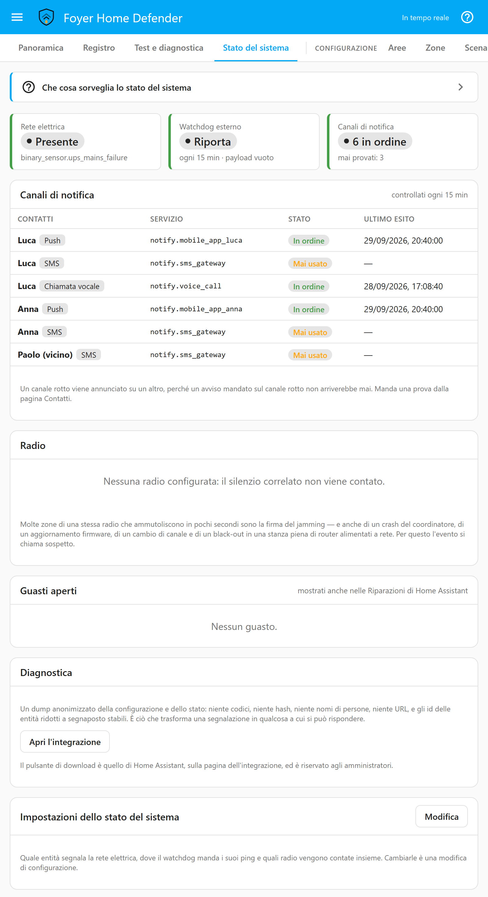

# Stato del sistema

[English](system-health.md) · **Italiano**

Un allarme che non sa dirti di aver smesso di funzionare ha smesso di
funzionare.

Questa pagina parla dei quattro guasti che mettono fuori gioco in silenzio un
allarme fatto in casa. Non hanno niente in comune, tranne che in ognuno di essi
la casa sembra perfettamente tranquilla:

- manca la corrente,
- il canale di notifica si rompe,
- la radio ammutolisce,
- Home Assistant muore.

Tutto quello che trovi qui si configura e si legge alla **pagina 14 — Stato del
sistema**. Prima dei dettagli, tre cose da sapere:

- **Niente di tutto questo è un'intrusione.** «Manca la rete elettrica» non è
  un furto e non entra mai nella coda delle intrusioni: non tocca nessun
  `alarm_control_panel`, e il disinserimento non ha alcun potere su di esso. Lo
  stato del sistema sta accanto al canale tecnico, non dentro l'allarme.
- **È uno stato che si risolve da solo.** A differenza del canale tecnico, qui
  niente aspetta che qualcuno ne prenda atto: ogni condizione che Foyer segnala
  ha un evento corrispondente che dice che è finita, e sparisce quando sparisce
  la causa. L'unica eccezione è la segnalazione di riparazione, che resta finché
  qualcuno non dice di averla vista: un problema che è comparso e sparito mentre
  nessuno guardava deve comunque lasciare una traccia là dove la gente guarda.
- **Un problema di salute avvisa, non blocca mai l'inserimento.** Una zona in
  guasto blocca l'inserimento, perché una zona che Foyer non riesce a leggere è
  un buco nel perimetro. Un'integrazione Telegram rimossa non è un buco nel
  perimetro, e una casa che nessuno riesce a inserire perché un'integrazione è
  stata rinominata è un esito peggiore di una che si inserisce e lo dice.

---

<a id="mains-power-and-the-ups"></a>

## Rete elettrica e UPS

<p align="center"></p>

Un UPS collegato tramite NUT, o una presa smart che riporta la propria
alimentazione, ti dà già un `binary_sensor`. Indicalo alla pagina 14 e di' quale
dei suoi stati significa che la rete elettrica è mancata.

Quel secondo campo non è una formalità. Il binary sensor di un UPS di solito è
`on` quando la rete è mancata; un sensore di alimentazione di solito è `off`. Un
valore predefinito tirato a indovinare produrrebbe un impianto che non segnala
mai un black-out, e lo scopriresti proprio la notte in cui contava: lo stesso
ragionamento dello stato di scatto di ogni zona.

Quando la rete manca, Foyer solleva `system_power_lost`, lo registra sotto
`system` con gravità di allarme, e il profilo di risposta predefinito lo
annuncia, come fa con un canale rotto, un watchdog sordo e un'interferenza
sospetta. Collega il momento a un tuo profilo per mandarlo altrove. Quando la
corrente torna, `system_power_restored` dice per quanto tempo è mancata.

Se l'entità stessa non si riesce a leggere, Foyer dice *questo*: la pagina
mostra «Non leggibile» e il sensore di stato del sistema porta `mains_unknown`.
Di proposito non viene segnalato come un black-out: altrimenti un'integrazione
UPS che non ha finito di caricarsi ne annuncerebbe uno a ogni riavvio.

**La stessa entità può essere anche una zona di tipo `technical`**, e in quel
caso conserva il suo allarme e la sua presa d'atto. Indicarla qui serve solo a
dire a Foyer qual è la rete elettrica.

Quello che succede dopo è l'argomento di [resilience.it.md](resilience.it.md), ed
è la versione breve di tutta questa pagina: un ladro che taglia la corrente ha
tagliato insieme anche il router, e ogni notifica che ha bisogno di internet
muore nello stesso istante.

---

<a id="notification-channel-health"></a>

## Salute dei canali di notifica

Ogni quarto d'ora, e dopo ogni invio vero, Foyer controlla che ogni canale
configurato sia ancora qualcosa che potrebbe funzionare:

| Controllo | Cosa significa |
|---|---|
| Il servizio `notify` è nel registro | Certezza. Le integrazioni vengono rimosse, rinominate, o non si caricano dopo un aggiornamento. Basta un controllo che non lo trovi più. |
| Gli ultimi invii sono riusciti | Indizio. Due fallimenti consecutivi rendono un canale rotto; un qualunque successo lo rimette a posto, perché un canale che ha appena consegnato un messaggio funziona, qualunque cosa abbia fatto la settimana scorsa. |

Un canale rotto viene mostrato in rosso alla pagina 14 e nella pagina Contatti,
segnalato come riparazione in Impostazioni, e annunciato, su un canale che
funziona ancora. Quest'ultima regola è il punto di tutto: avvisarti di un canale
morto usando il canale morto è la battuta che si scrive da sola. Foyer sceglie
il canale funzionante successivo dello stesso contatto e dice al profilo di
risposta che risponde a `notification_channel_down` quale sia. Quando a un
contatto non resta niente che funzioni, il messaggio lo dice.

Gli invii che riguardano i canali stessi (l'avviso che uno si è rotto e la nota
che è tornato, compreso qualunque loro passo trattenuto da un `delay`) non
vengono contati subito, e nemmeno qualunque altra cosa mandata da una decisione
presa sulla base di un resoconto di invii. Vengono contati con il successivo
invio vero, o al controllo successivo, quale arriva prima; una sirena, un
campanello o un interruttore non mandano niente e non portano niente. Se
venissero contati subito, un avviso fallito segnerebbe come rotto il canale su
cui è passato, e il suo avviso a sua volta potrebbe fallire sul canale
successivo, un canale dopo l'altro attraverso un'intera rubrica. Trattenuti,
vengono comunque contati (un secondo canale che fallisce viene comunque
scoperto), ma la catena non si alimenta mai da sola: ogni passo aspetta
qualcosa che la casa manda per motivi suoi, oppure un controllo.

Quello che risponde a un codice DURESS aspetta solo il controllo, non il
successivo invio vero. Un canale che trova rotto viene annunciato come
qualunque altro, sugli schermi che si vedono con un'occhiata, e se fosse contato
subito quell'annuncio potrebbe arrivare pochi secondi dopo che il codice è stato
digitato, sul tablet su cui è stato digitato, con il nome del contatto a cui era
destinato l'allarme. Al controllo viene comunque contato, fino a un quarto d'ora
dopo.

**Chi viene avvisato lo decidi tu.** `notification_channel_down` e
`notification_channel_restored` sono momenti come gli altri: collegali a un
profilo di risposta alla pagina 5 e indica i contatti. Senza questo, il fatto
resta comunque alla pagina 14, su `binary_sensor.foyer_system_health` e in
Impostazioni: semplicemente non fa squillare il telefono di nessuno.

**Un canale mai usato risulta mai usato, non in ordine.** Foyer può vedere che
un servizio esiste; solo un invio prova che consegna, quindi il controllo può
escludere un canale ma non può mai promuoverlo. Il pulsante di prova alla
pagina 6 manda davvero, ed è quello che trasforma «Mai usato» in una risposta.

**Un canale che Foyer ritiene rotto viene comunque tentato**, per tutto tranne
il messaggio che dice che è rotto. Due invii falliti possono essere un fornitore
con un singhiozzo, e sbagliarsi su un canale non deve mai essere il motivo per
cui un allarme non è arrivato a nessuno. L'unica eccezione è la regola stessa
del §12.2, ed è applicata, non solo descritta: l'avviso su un canale morto non
passa mai da quel canale.

---

<a id="the-external-watchdog"></a>

## Il watchdog esterno

Un sistema morto non può segnalare la propria morte. Questa frase è l'intera
ragione per cui esiste questa funzione.

Foyer chiama periodicamente un URL che scegli tu. Se Home Assistant va in crash,
viene fermato, perde la corrente o perde la connessione, i ping si fermano e il
servizio dall'altra parte dà l'allarme, da un posto che non è casa tua.

Non è legato a nessun fornitore: healthchecks.io, Uptime Kuma, Cronitor, o
qualunque cosa risponda a una richiesta HTTP. I valori predefiniti sono un ping
ogni quindici minuti con un timeout di trenta secondi.

<a id="the-heartbeat-carries-nothing"></a>

### Il battito non porta niente

Di base il ping è una `GET` vuota. Il suo arrivo è tutto il messaggio.

C'è un'opzione per includere lo stato della casa, è disattivata, e il pannello
ne spiega il motivo accanto all'interruttore: un ping che dice «inserito, non
c'è nessuno» dice a chi gestisce quel servizio esattamente quando venire. È un
messaggio che esce da casa tua verso una terza parte, e la regola che Foyer
applica a ogni canale del genere è dire il minimo che serve. Anche se attivato,
il contenuto è di tre numeri: quante aree sono inserite, quante ce ne sono, e se
c'è qualcosa che non va. Mai quale scenario, mai quali aree, mai quali zone sono
aperte.

<a id="foyer-watches-the-watchdog"></a>

### Foyer sorveglia il watchdog

Dopo tre ping falliti di fila Foyer lo dice in locale: alla pagina 14, sul
sensore di stato del sistema, nel registro e come segnalazione di riparazione.
Non è una cortesia. Non riuscire a raggiungere l'endpoint significa che la casa
non ha una strada funzionante verso internet, e quindi non partirebbe nemmeno
nessuna notifica push, nessun messaggio Telegram e nessuna chiamata Twilio. Il
watchdog che fallisce è il primo avviso che hai che l'allarme è diventato sordo.

«Non ha mai funzionato» viene segnalato come una cosa diversa da «ha smesso di
funzionare», perché quasi sempre è un URL scritto male. Foyer non può mostrarti
l'URL salvato perché tu lo controlli (vedi sotto), quindi il rimedio è
digitarlo di nuovo alla pagina 14.

<a id="the-url-is-a-credential"></a>

### L'URL è una credenziale

Chi ha in mano un URL di ping può tenere il controllo verde per sempre, e così
zittisce l'unica cosa che segnala la morte di Foyer. Per questo, una volta
salvato, Foyer non lo mostra mai più: non alla pagina 14, non nella
configurazione letta da una qualunque pagina, non in un backup né nel download
della diagnostica. La pagina 14 dice solo che un URL è impostato, e per cambiarlo
ne digiti uno nuovo sopra. Salvare la pagina lasciando il campo vuoto mantiene
quello memorizzato, e lo stesso fa spegnere il watchdog: riaccenderlo non
richiede di digitare niente di nuovo. Siccome nessuno può rileggerlo per
accorgersi di un errore, un URL che non comincia con `http://` o `https://`
viene rifiutato mentre lo digiti, con il watchdog acceso o spento. Se il
watchdog non si riesce a raggiungere, l'errore che riporta viene memorizzato
con l'URL tolto, host compreso, perché alcuni servizi ci mettono dentro il
token.

<a id="two-limits-stated-so-they-do-not-arrive-as-surprises"></a>

### Due limiti, detti perché non arrivino come sorprese

- **Un watchdog ospitato sulla stessa infrastruttura muore con essa** e non
  protegge niente. Se Home Assistant, il watchdog e il router stanno tutti nella
  stessa casa, un black-out li spegne tutti e tre e non resta nessuno ad
  avvisarti.
- **Il servizio esterno non sa distinguere «Home Assistant è giù» da «la linea
  è giù».** Va bene così. In entrambi i casi l'allarme non può più chiamarti,
  ed è proprio quello che ti serviva sapere.

E la conseguenza piacevole, insieme al sensore della rete elettrica qui sopra:
un black-out spegne Home Assistant *e* il router, il battito si ferma, e il
servizio esterno te lo dice. È così che scopri, da un'altra parte, che a casa è
mancata la corrente.

---

<a id="radio-interference"></a>

## Interferenze radio

**Questa è un'euristica, non un rilevamento di jamming.** Niente in questa
sezione prova che qualcuno stia disturbando qualcosa, e l'evento si chiama
`rf_interference_suspected` proprio per questo.

Né Zigbee né Z-Wave permettono a Home Assistant di misurare le interferenze. Ma
l'interferenza ha una firma: molte zone della stessa radio che diventano non
disponibili a pochi secondi l'una dall'altra. Un sensore che ammutolisce è una
batteria scarica. Otto che ammutoliscono nello stesso minuto sono un evento
radio.

<a id="what-foyer-counts"></a>

### Cosa conta Foyer

```
if  N or more zones sharing one radio
    became unavailable within T seconds of each other
    and the coordinator itself is still answering
    and it is all still true T2 seconds later
then raise rf_interference_suspected
```

| Parametro | Predefinito | Note |
|---|---|---|
| Zone | 4, oppure il 40% delle zone di quella radio se è meno | Mai meno di due, quindi una radio con due o tre zone scatta quando se ne vanno entrambe o due di esse |
| Finestra | 60 s | Quanto vicini sono cominciati i silenzi |
| Conferma | 60 s | Dopo questo tempo deve essere ancora vero |
| Ambito | per radio | Un'interruzione Zigbee non dice niente su Z-Wave |

**Una radio è il config entry di un'integrazione.** Home Assistant non ha una
nozione generale di radio, e il config entry è la cosa onesta più vicina: ogni
entità di una stessa installazione ZHA, Z-Wave JS o Zigbee2MQTT lo condivide.
Indica il config entry una volta alla pagina 14 e le zone si assegnano da sole.

Un'avvertenza da conoscere se usi Zigbee2MQTT: le sue entità vengono dal config
entry dell'integrazione MQTT, che porta anche ogni altro dispositivo MQTT della
casa. Foyer conterà anche quelli come se fossero sulla stessa «radio». Il
filtro del coordinatore e la soglia di solito lo assorbono, ma se hai molti
dispositivi MQTT che non c'entrano, imposta con cura il numero di zone di quella
radio.

**Una zona che è già illeggibile quando Foyer comincia a sorvegliarla non viene
contata** finché non è tornata leggibile. A un riavvio, i dispositivi finali a
batteria restano non disponibili finché non sono stati interrogati, mentre il
coordinatore alimentato a rete risponde subito: esattamente la firma qui sopra,
prodotta da nient'altro che un riavvio. Il prezzo è un tentativo di jamming che
comincia mentre Foyer è spento e non lascia mai tornare le sue zone: quelle zone
restano non contate. Ognuna di esse è un guasto per tutto il tempo, che blocca
l'inserimento e viene annunciato per ciascuna, quindi niente di tutto ciò passa
in silenzio.

Lo stesso vale dopo un'interruzione del coordinatore: mentre il coordinatore non
c'era, il silenzio di una zona non diceva niente su quella zona, quindi quelle
zone devono farsi sentire di nuovo prima di poter contare. Senza questo, un
coordinatore attaccato a uno switch che sta cedendo produrrebbe un allarme a
ogni sfarfallio.

<a id="the-coordinator-entity-is-the-whole-feature"></a>

### L'entità del coordinatore è tutta la funzione

Indica l'entità che rappresenta il coordinatore: il controller ZHA o Z-Wave JS,
o lo stato del bridge di Zigbee2MQTT.

Se il coordinatore risponde mentre i suoi sensori no, qualcosa sta interferendo
con la radio. Se anche il coordinatore è sparito, il problema è il
coordinatore: una chiavetta scollegata, un container che si è fermato, un
coordinatore Power-over-Ethernet morto insieme al suo switch. Sono guasti
diversi con rimedi diversi, e Foyer li segnala in modo diverso
(`radio_coordinator_down`).

**Senza un'entità del coordinatore, Foyer non solleva niente su quella radio.**
Non tira a indovinare quale entità sia il coordinatore. Mezza euristica è
un'euristica che insegna alla gente a ignorarla, e la configurazione rifiuta di
salvare una radio attiva senza un coordinatore indicato.

<a id="the-confirmation-window-and-what-walks-into-it"></a>

### La finestra di conferma, e cosa ci finisce dentro

Il silenzio deve esserci ancora sessanta secondi dopo. È qui che finiscono,
invece che nella sirena, il riavvio di un coordinatore, un breve aggiornamento
firmware e un breve singhiozzo della rete. Su un evento vero costa un minuto,
ed è un minuto in cui la radio era già sorda.

<a id="what-happens-when-it-is-confirmed"></a>

### Cosa succede quando è confermato

| Stato | Risposta |
|---|---|
| Disinserito | Un avviso: il momento, una notifica se un profilo vi risponde, una riga nel registro, una segnalazione di riparazione. |
| Inserito | Di livello allarme. Si apre un incidente, esattamente come fa una condizione di manomissione in una centrale professionale, e le aree con zone su quella radio vanno in `triggered`. |

L'incidente non porta nessuna zona, perché non è stata una zona a farlo: è
stata la radio.

**Le radio e le soglie non possono cambiare mentre un'area è inserita.** In una
casa inserita decidono se si apre un incidente, come lo stato di scatto di
una zona decide se lo apre una finestra, e cambiarle in quel momento
abbasserebbe la guardia di una casa che nessuno ha disinserito. La pagina 14 lo
dice sopra le radio, e un salvataggio che ci prova viene rifiutato indicando
l'impostazione. La rete elettrica, il watchdog e i controlli dei canali non
aprono mai un incidente, e restano modificabili qualunque cosa sia inserita.

**Un walk test non suona mai per questo.** Un walk test trattiene la risposta
di ogni area finché è in corso (le aree che ha inserito lui, e qualunque area
già inserita quando è cominciato, §11.3), quindi il momento viene comunque
sollevato e registrato, e nessun incidente si apre.

<a id="the-rule-that-defeats-the-feature-if-it-is-missed"></a>

### La regola che, se manca, vanifica la funzione

**Foyer non agisce attraverso la radio che ha appena deciso potrebbe essere
disturbata.**

A un'azione i cui bersagli stanno sulla radio coinvolta vengono tolti quei
bersagli, e un'azione a cui non resta niente viene saltata del tutto.
Annunciare un black-out Zigbee con una sirena Zigbee non è una notifica. Il
messaggio che segnala l'interferenza dice cosa è stato saltato e perché, così
nessuno scopre dopo che la sirena non ha suonato.

I canali di notifica passano dalla rete e non dalla radio, quindi non ne sono
toccati: ed è l'altra metà del ragionamento a favore di
[un canale GSM locale](resilience.it.md).

<a id="four-things-that-look-exactly-like-jamming"></a>

### Quattro cose che sembrano in tutto e per tutto jamming

Dette chiaramente, perché sono il motivo per cui la parola è *sospetta*:

1. Un crash del coordinatore, anche se il filtro del coordinatore ne intercetta
   la maggior parte.
2. Un aggiornamento firmware del coordinatore.
3. Un cambio di canale Zigbee, voluto o causato da una rete vicina.
4. Un black-out in una stanza piena di router alimentati a rete, che si porta
   dietro ogni dispositivo dormiente collegato a loro.

Per questo la prima riga dell'evento dice quante zone, su quante, su quale
radio, e che il coordinatore risponde ancora. Sono questi quattro fatti che ti
permettono di distinguere i casi la mattina dopo.

---

<a id="repair-issues"></a>

## Segnalazioni di riparazione

I problemi persistenti diventano segnalazioni di riparazione di Home Assistant,
in Impostazioni, dove un utente di Home Assistant le incontra senza mai aprire
il pannello di Foyer:

| Segnalazione | Viene aperta quando |
|---|---|
| Una zona non dà segni di vita | È illeggibile da due giorni |
| Un canale di notifica è rotto | Appena lo si sa |
| Il watchdog non ha mai risposto | Ha fallito tre volte di fila e non è mai riuscito nemmeno una volta |
| Il watchdog ha smesso di rispondere | Tre ping falliti di fila, dopo aver funzionato in passato |
| Sospetta interferenza radio | L'evento qui sopra è confermato |
| Il coordinatore di una radio è irraggiungibile | È sparito da un'ora |
| La casa sta andando senza rete elettrica | La rete manca da un'ora |

Ognuna può essere segnata come vista, e questo toglie la scheda finché il
problema non si è risolto e poi ripresentato. Risolvere il problema la toglie da
sola. Rimuovere Foyer si porta via le sue schede.

---

<a id="the-diagnostics-download"></a>

## Il download della diagnostica

Il pulsante **Scarica diagnostica** di Home Assistant, nella pagina
dell'integrazione in Impostazioni, produce un dump anonimizzato della
configurazione e dello stato. La pagina 14 rimanda lì invece di offrire un
secondo pulsante, perché quello è già riservato agli amministratori.

Cosa contiene: la forma dell'installazione. Quante aree, che tipo di zone, quali
politiche d'inserimento, a quali momenti risponde ogni profilo, quanti contatti
e di che tipo, ogni soglia, e cosa c'è che non va in questo momento.

Cosa non contiene, per come è costruito: nomi di persone, nomi di aree e zone,
codici, hash dei codici, l'URL del watchdog, l'id del webhook per la presa
d'atto, il token di un tastierino, numeri di telefono, chat id, testi dei
messaggi, topic MQTT ed entity id reali. È costruito come una lista di ciò che è
ammesso invece che come una lista di ciò che va oscurato, così un campo aggiunto
a Foyer fra sei mesi non può finire nel thread della tua segnalazione solo
perché qualcuno se n'è dimenticato.

Gli entity id diventano segnaposto (`binary_sensor.zone_3`, `cover.zone_8`),
numerati secondo l'ordine della configurazione di Foyer. Restano uguali fra due
download della stessa installazione, quindi un thread può citare `zone_3` due
volte e intendere la stessa zona. Non sono hash: l'hash di un entity id è
verificabile da chiunque indovini l'id, e questo è offuscamento, non
anonimato.

Il dominio viene mantenuto perché non è privato ed è gran parte di ciò che rende
leggibile il dump: `cover.zone_8` dice subito a chi legge che qualcuno sta
usando una porta del garage come zona.

---

<a id="the-entities"></a>

## Le entità

| Entità | Cosa dice |
|---|---|
| `binary_sensor.foyer_system_health` | `on` quando qualcosa non va, con le cause, i canali rotti e le zone in guasto come attributi |
| `binary_sensor.foyer_rf_interference_<radio>` | Una per radio: quante zone sono in silenzio, su quante, la soglia, e se il coordinatore risponde |

`binary_sensor.foyer_fault` esiste ancora e risponde a una domanda diversa.
Quello dice «posso inserire?»; questi dicono «Foyer è ancora in grado di fare il
suo lavoro?». Una casa il cui unico problema è un'integrazione rimossa ne
accende esattamente uno.

---

<a id="the-moments-a-profile-can-answer"></a>

## I momenti a cui un profilo può rispondere

`system_power_lost` · `system_power_restored` ·
`notification_channel_down` · `notification_channel_restored` ·
`watchdog_unreachable` · `watchdog_recovered` ·
`rf_interference_suspected` · `rf_interference_cleared` ·
`radio_coordinator_down` · `radio_coordinator_up`

Sono tutti registrati sotto `system`. Nessuno di essi è una riga `alarm`: l'unica
riga di allarme che produce un'interferenza confermata è il `triggered` delle
aree che ha mandato in allarme, e quella riga la scrive l'allarme, non questa
funzione.
