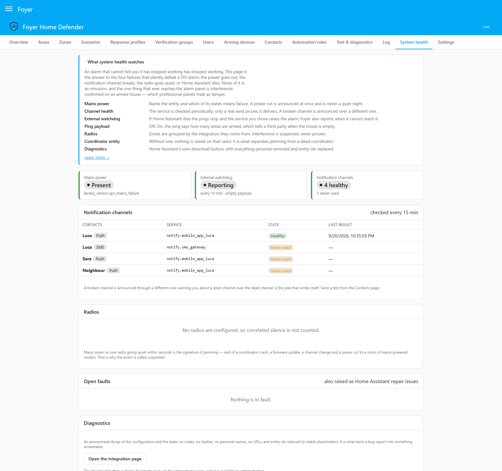

# System health

**English** · [Italiano](system-health.it.md)

An alarm that cannot tell you it has stopped working has stopped working.

This page is about the four failures that silently defeat a do-it-yourself
alarm. They have nothing in common except that in every one of them the house
looks perfectly quiet:

- the power goes out,
- the notification channel breaks,
- the radio goes quiet,
- Home Assistant dies.

Everything here is configured and read on **page 14 — System health**. Three
things are worth knowing before the detail:

- **None of this is an intrusion.** "The mains are down" is not a burglary and
  never enters the intrusion queue: it does not touch any
  `alarm_control_panel`, and disarming has no authority over it. System health
  sits beside the technical channel, not inside the alarm.
- **It is state that clears itself.** Unlike the technical channel, nothing
  here waits for somebody to acknowledge it: every condition Foyer raises has
  a matching event that says it is over, and it goes away when the cause does.
  The one exception is a repair issue, which stays until somebody says they
  have seen it — because a problem that came and went while nobody was looking
  should still leave a trace where people look.
- **A health problem warns, it never blocks arming.** A zone in fault blocks
  arming, because a zone Foyer cannot read is a hole in the perimeter. A
  removed Telegram integration is not a hole in the perimeter, and a house
  nobody can arm because an integration was renamed is a worse outcome than
  one that arms and says so.

---

## Mains power and the UPS

<p align="center"></p>

A UPS over NUT, or a smart plug that reports its own supply, already gives you
a `binary_sensor`. Name it on page 14 and say which of its states means the
mains has failed.

That second field is not a formality. A UPS binary sensor is usually `on` when
the mains has failed; a power sensor is usually `off`. A default that guessed
would produce an installation that never reports a power cut, discovered on
the night it mattered — the same reasoning as the trigger state on every zone.

When the mains fails, Foyer raises `system_power_lost`, logs it under
`system` at alarm severity, and the default response profile announces it —
as it does a broken channel, a deaf watchdog and suspected interference.
Attach the moment to a profile of your own to send it anywhere else. When the
power comes back, `system_power_restored` says how long it was gone.

If the entity itself cannot be read, Foyer says *that* instead — the page
shows "cannot be read" and the health sensor carries `mains_unknown`. It is
deliberately not reported as a power cut: a UPS integration that has not
finished loading would otherwise announce one at every restart.

**The same entity can also be a zone of type `technical`**, and if it is, it
keeps its own alarm and its own acknowledgement. Naming it here only tells
Foyer which one is the mains.

What happens next is the subject of [resilience.md](resilience.md), and it is
the short version of this whole page: a burglar who cuts the power has cut the
router with it, and every notification that needs the internet dies at the same
moment.

---

## Notification channel health

Foyer checks, every quarter of an hour and after every real send, that each
configured channel is still something that could work:

| Check | What it means |
|---|---|
| The `notify` service is in the registry | Certain. Integrations get removed, renamed, or fail to load after an update. One sweep that finds it gone is enough. |
| The last sends succeeded | Evidence. Two consecutive failures make a channel broken; any success clears it, because a channel that has just delivered a message works whatever it did last week. |

A broken channel is shown in red on page 14 and on the Contacts page, raised
as a repair issue in Settings, and announced — over a channel that still
works. That last rule is the whole point: warning you about a dead channel
over the dead channel is the joke that writes itself. Foyer picks the next
working channel of the same contact and tells the response profile answering
`notification_channel_down` which one that is. When a contact has nothing left
that works, the message says so.

The sends that are about channels themselves — the warning that one broke,
and the note that it is back, including any step of theirs a `delay` held
back — are not counted at once, and neither is anything else sent by a
decision made on a report of sends. They are counted with the next real
send, or at the next sweep, whichever comes first; a siren, a chime or a
switch sends nothing and carries nothing. Counted at once, a warning that
failed would mark the channel it went over as broken, whose own warning could
fail over the next, one channel after another through a whole address book.
Held, they are still counted — a second channel failing is still found — but
the chain never feeds itself: each step waits for something the house sends
for its own reasons, or for a sweep.

What answers a duress code waits for the sweep alone, not for the next real
send. A channel it finds broken is announced like any other, on the screens a
glance reaches, and counted at once that announcement could come seconds after
the code was typed, on the tablet it was typed at, naming the contact the
alert was for. At the sweep it is still counted, up to a quarter of an hour
later.

**Who is told is yours to configure.** `notification_channel_down` and
`notification_channel_restored` are ordinary moments: attach them to a
response profile on page 5 and name the contacts. Without that, the fact is
still on page 14, on `binary_sensor.foyer_system_health` and in Settings — it
simply does not ring anybody's phone.

**A channel that has never been used shows as never used, not as healthy.**
Foyer can see that a service exists; only a send proves it delivers, so the
sweep can rule a channel out and never rule one in. The test button on page 6
really sends, and it is what turns "never used" into an answer.

**A channel Foyer believes is broken is still tried**, for everything except
the message saying it is broken. Two failed sends can be a provider with a
hiccup, and being wrong about a channel must never be the reason an alarm
reached nobody. The one exception is §12.2's own rule, and it is enforced
rather than described: the warning about a dead channel is never routed
through it.

---

## The external watchdog

A dead system cannot report its own death. That sentence is the entire reason
this exists.

Foyer periodically calls a URL you choose. If Home Assistant crashes, is
stopped, loses power or loses its connection, the pings stop and the service
at the other end raises the alarm — from somewhere that is not your house.

It is tied to no vendor: healthchecks.io, Uptime Kuma, Cronitor, or anything
that answers an HTTP request. The defaults are a ping every fifteen minutes
with a thirty-second timeout.

### The heartbeat carries nothing

By default the ping is an empty `GET`. Its arrival is the whole message.

There is an option to include the state of the house, it is off, and the panel
states the reason where the switch is: a ping saying "armed, nobody home"
tells whoever runs that service exactly when to come. It is a message leaving
your house to a third party, and the rule Foyer applies to every such channel
is to say the least that works. Even switched on, the payload is three
numbers — how many areas are armed, how many there are, and whether anything
is wrong. Never which scenario, never which areas, never which zones are open.

### Foyer watches the watchdog

Three failed pings in a row and Foyer says so locally: on page 14, on the
health sensor, in the log, and as a repair issue. This is not courtesy. Being
unable to reach the endpoint means the house has no working route to the
internet, which means no push notification, no Telegram message and no Twilio
call would go out either. The watchdog failing is the earliest warning you get
that the alarm has gone deaf.

"It has never worked" is reported as a different thing from "it has stopped
working", because it is almost always a mistyped URL. Foyer cannot show you the
saved URL to check it (see below), so the remedy is to type it again on page 14.

### The URL is a credential

Whoever holds a ping URL can keep the check green for ever, which silences the
one thing that reports Foyer's own death. So once it is saved, Foyer never
shows it again — not on page 14, not in the configuration any page reads, not
in a backup or the diagnostics download. Page 14 says only that a URL is set,
and to change it you type a new one over it. Saving the page with the field
left empty keeps the one stored, and so does switching the watchdog off:
switching it back on needs nothing typed again. Because nobody can read it
back to spot a mistake, a URL that does not start with `http://` or
`https://` is refused as it is typed, with the watchdog on or off. If the
watchdog cannot be reached, the error it reports is stored with the URL taken
out of it — its host included, which some services put the token in.

### Two limits, stated so they do not arrive as surprises

- **A watchdog hosted on the same infrastructure dies with it** and protects
  nothing. If Home Assistant, the watchdog and the router are all in the same
  house, a power cut takes all three and nobody is left to tell you.
- **The external service cannot tell "Home Assistant is down" from "the line
  is down".** That is fine. Both mean the alarm can no longer call you, which
  is the thing you needed to know.

And the pleasing consequence, with the mains sensor above: a power cut kills
Home Assistant *and* the router, the heartbeat stops, and the external service
tells you — which is how you find out, from somewhere else, that the power
went out at home.

---

## Radio interference

**This is a heuristic, not jamming detection.** Nothing in this section proves
anybody is jamming anything, and the event is called
`rf_interference_suspected` for exactly that reason.

Neither Zigbee nor Z-Wave lets Home Assistant measure interference. But
interference has a signature: many zones on one radio going unavailable within
seconds of each other. One sensor going quiet is a flat battery. Eight going
quiet in the same minute is a radio event.

### What Foyer counts

```
if  N or more zones sharing one radio
    became unavailable within T seconds of each other
    and the coordinator itself is still answering
    and it is all still true T2 seconds later
then raise rf_interference_suspected
```

| Parameter | Default | Notes |
|---|---|---|
| Zones | 4, or 40% of that radio's zones if that is lower | Never fewer than two, so a radio with two or three zones raises when both or two of them go |
| Window | 60 s | How close together the silences began |
| Confirmation | 60 s | It has to still be true after this |
| Scope | per radio | A Zigbee outage says nothing about Z-Wave |

**A radio is one integration's config entry.** Home Assistant has no general
notion of a radio, and the config entry is the closest honest thing: every
entity of one ZHA, Z-Wave JS or Zigbee2MQTT installation shares it. Name the
entry once on page 14 and the zones assign themselves.

One caveat worth knowing if you use Zigbee2MQTT: its entities come from the
MQTT integration's config entry, which also carries every other MQTT device
in the house. Foyer will count those as being on the same "radio". The
coordinator gate and the threshold usually absorb it, but if you run a lot of
unrelated MQTT devices, set that radio's own zone count deliberately.

**A zone that is already unreadable when Foyer starts watching it is not
counted** until it has been readable again. At a restart, battery-powered end
devices are unavailable until they have been interviewed while the
mains-powered coordinator answers at once — the signature above exactly,
produced by nothing but a reboot. The cost is a jamming attempt that begins
while Foyer is down and never lets its zones back: those zones stay
uncounted. Every one of them is a fault the whole time, which blocks arming
and is announced on each, so nothing about it is silent.

The same applies after a coordinator outage: while the coordinator was gone,
a zone's silence said nothing about that zone, so those zones have to be
heard again before they can count. Without it a coordinator on a failing
switch would produce one alarm per flap.

### The coordinator entity is the whole feature

Name the entity that represents the coordinator — the ZHA or Z-Wave JS
controller, or the Zigbee2MQTT bridge state.

If the coordinator is answering while its sensors are not, something is
interfering with the radio. If the coordinator is gone too, the coordinator
is the problem: a stick that was unplugged, a container that stopped, a
Power-over-Ethernet coordinator that died with its switch. Those are different
faults with different fixes, and Foyer reports them differently
(`radio_coordinator_down`).

**Without a coordinator entity, Foyer raises nothing on that radio at all.**
It does not guess which entity is the coordinator. Half a heuristic is a
heuristic that teaches people to ignore it, and the configuration refuses to
save an enabled radio with no coordinator named.

### The confirmation window, and what walks into it

The silence has to still be there sixty seconds later. This is what a
coordinator reboot, a short firmware update and a brief network hiccup walk
into instead of the siren. It costs a minute on a real event, which is a minute
during which the radio was already deaf.

### What happens when it is confirmed

| State | Response |
|---|---|
| Disarmed | A warning: the moment, a notification if a profile answers it, a log row, a repair issue. |
| Armed | Alarm-grade. An incident opens, exactly as a tamper condition does in a professional panel, and the areas with zones on that radio go to `triggered`. |

The incident carries no zone, because no zone did this — the radio did.

**The radios and the thresholds cannot change while any area is armed.** On an
armed house they decide whether an incident opens, as a zone's trigger decides
whether a window does, and changing them there would lower the guard of a
house nobody disarmed. Page 14 says so above the radios, and a save that
tries is refused with the setting named. The mains, the watchdog and the
channel checks never open an incident, and stay editable whatever is armed.

**A walk test never sounds for this.** A walk test holds back the answer of
every area while it runs — the areas it armed, and any area already armed
when it began (§11.3) — so the moment is still raised and still logged, and
no incident opens.

### The rule that defeats the feature if it is missed

**Foyer does not act through the radio it has just decided may be jammed.**

An action whose targets sit on the affected radio has those targets removed,
and an action with nothing left is skipped entirely. Announcing a Zigbee
blackout through a Zigbee siren is not a notification. The message that reports
the interference names what was skipped and why, so nobody discovers later
that the siren did not sound.

Notification channels go over the network rather than the radio, so they are
unaffected — which is the other half of the argument for
[a local GSM channel](resilience.md).

### Four things that look exactly like jamming

Stated plainly, because they are why the word is *suspected*:

1. A coordinator crash — though the coordinator gate catches most of these.
2. A firmware update on the coordinator.
3. A Zigbee channel change, whether deliberate or from a neighbouring network.
4. A power cut to a room full of mains-powered routers, which takes every
   sleepy device behind them with it.

That is why the first line of the event says how many zones, of how many, on
which radio, and that the coordinator is still answering. Those four facts are
what let you tell the cases apart in the morning.

---

## Repair issues

Persistent problems become Home Assistant repair issues, in Settings, where a
Home Assistant user meets them without ever opening the Home Defender panel:

| Issue | Raised when |
|---|---|
| A zone has not been seen | It has been unreadable for two days |
| A notification channel is broken | As soon as it is known |
| The watchdog has never answered | It has failed three times in a row and has never once succeeded |
| The watchdog has stopped answering | Three failed pings in a row, having worked before |
| Radio interference is suspected | The event above is confirmed |
| A radio's coordinator is unreachable | It has been gone for an hour |
| The house is running without mains power | The mains has been out for an hour |

Every one of them can be marked as seen, which dismisses the card until the
problem has cleared and come back. Fixing the problem removes it on its own.
Removing Foyer takes its cards with it.

---

## The diagnostics download

Home Assistant's own **Download diagnostics** button, on the integration's
page in Settings, produces an anonymised dump of the configuration and the
state. Page 14 links to it rather than offering a second button, because that
one is already restricted to administrators.

What it contains: the shape of the installation. How many areas, what kind of
zones, which arm policies, which moments each profile answers, how many
contacts and of what kind, every threshold, and what is currently wrong.

What it does not contain, by construction: names of people, names of areas and
zones, codes, code hashes, the watchdog URL, the acknowledgement webhook's id,
a keypad's token, phone numbers, chat ids, message text, MQTT topics, and real
entity ids. It is built as an allow-list rather than a redaction list, so a
field added to Foyer in six months cannot walk into your issue thread by being
forgotten.

Entity ids become placeholders — `binary_sensor.zone_3`, `cover.zone_8` —
numbered from the order of Foyer's own configuration. They are stable across
two downloads of the same installation, so an issue thread can refer to
`zone_3` twice and mean the same zone. They are not hashes: a hash of an
entity id is verifiable by anybody who guesses the id, which is obfuscation
rather than anonymity.

The domain is kept because it is not private and it is most of what makes the
dump readable: `cover.zone_8` tells a reader at once that somebody is using a
garage door as a zone.

---

## The entities

| Entity | What it says |
|---|---|
| `binary_sensor.foyer_system_health` | `on` when anything is wrong, with the causes, the broken channels and the faulted zones as attributes |
| `binary_sensor.foyer_rf_interference_<radio>` | One per radio: how many zones are quiet, of how many, the threshold, and whether the coordinator is answering |

`binary_sensor.foyer_fault` still exists and answers a different question.
That one is "can I arm"; these are "is Foyer still able to do its job". A
house whose only trouble is a removed integration lights exactly one of them.

---

## The moments a profile can answer

`system_power_lost` · `system_power_restored` ·
`notification_channel_down` · `notification_channel_restored` ·
`watchdog_unreachable` · `watchdog_recovered` ·
`rf_interference_suspected` · `rf_interference_cleared` ·
`radio_coordinator_down` · `radio_coordinator_up`

All of them are logged under `system`. None of them is an `alarm` row: the one
alarm row a confirmed interference produces is the `triggered` of the areas it
put into alarm, and that row is written by the alarm, not by this.
