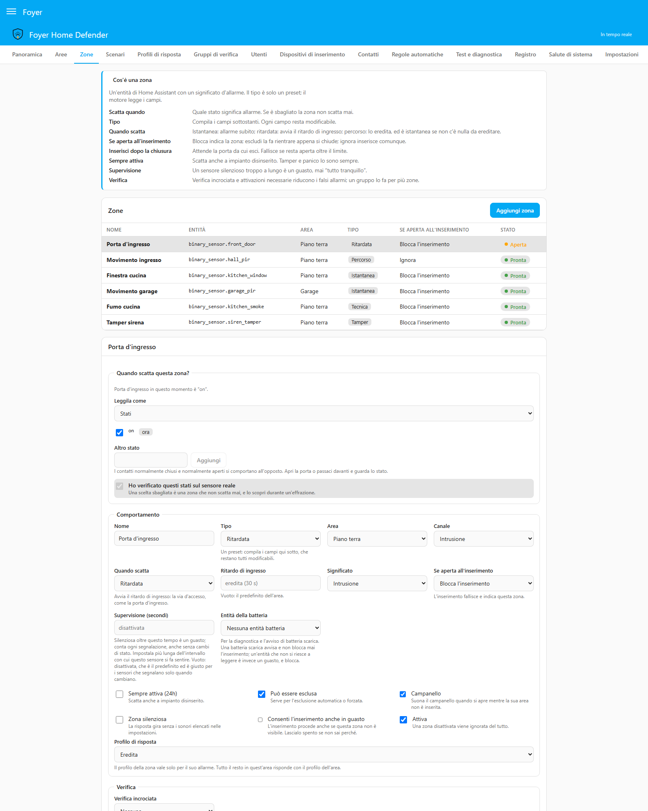
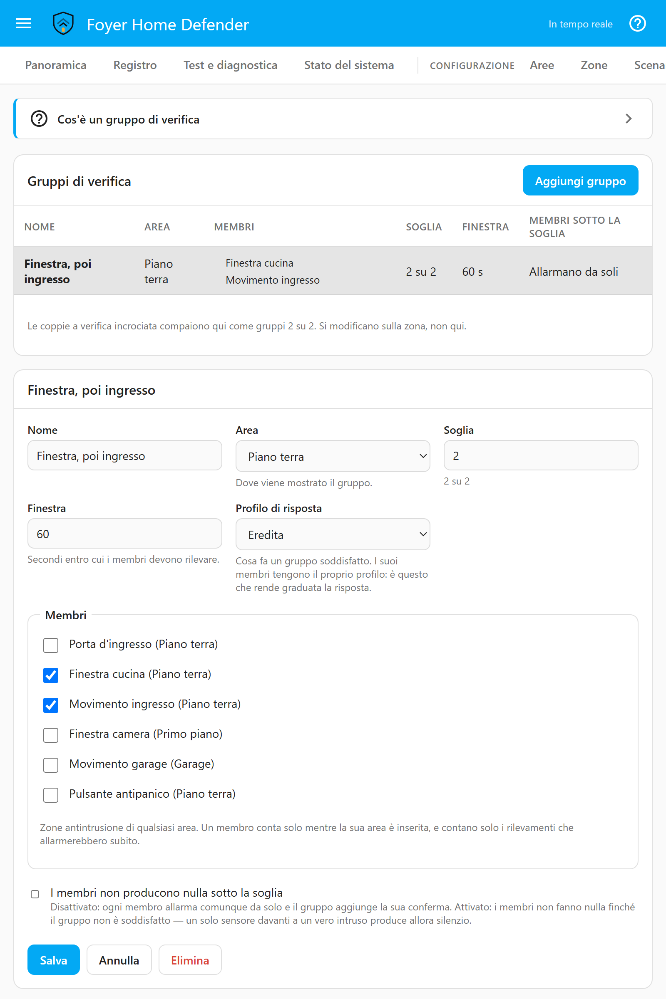

# Zone, aree e scenari

[English](zones.md) · **Italiano**

Questa pagina copre le quattro pagine del pannello che descrivono la casa —
*Aree*, *Zone*, *Scenari* e *Gruppi di verifica* — un'impostazione alla volta:
cosa fa, e perché funziona così. Copre anche quello che dipende da una zona:
le zone chiave, il canale tecnico per fumo, gas e acqua, il campanello, e la
durata delle sirene con la sua memoria d'allarme. È per chi configura la casa,
e per chi più avanti deve capire perché una zona ha fatto quello che ha fatto.

---

## Come si incastrano i pezzi

```
Zona  ──appartiene a──▶  Area  ──inserita da──▶  Scenario
                           │
                           └── il suo stato e la sua entità alarm_control_panel
```

- Una **zona** è un'entità di Home Assistant più quello che significa per
  l'allarme.
- Un'**area** è un gruppo di zone che si inseriscono insieme, con il suo stato
  e la sua entità `alarm_control_panel`, così il piano terra può essere
  inserito mentre tu sei al primo piano. Raggruppa per quello che inserisci
  insieme — perimetro, interno di giorno, interno di notte — non per stanza.
- Uno **scenario** è un insieme di aree con un nome: *Notte, solo piano
  terra*, *Solo garage*, *Cane in casa*. Quanti ne servono alla casa.
- **Tutta la casa**, `alarm_control_panel.foyer_master`, aggrega le aree. Non
  ha uno stato suo.

### Cosa riporta *Tutta la casa*

`triggered` se qualche area è in allarme; altrimenti `pending` se qualche area
sta contando il ritardo d'ingresso; altrimenti `arming` se qualcuna sta
contando il ritardo d'uscita; altrimenti inserito se **qualche** area è
inserita — una casa inserita in parte non è una casa disinserita; altrimenti
`disarmed`.

Quando è inserito, riporta la modalità dello scenario in corso — *Inserito
notte*, per esempio — solo finché sono inserite esattamente le aree di quello
scenario. Qualunque altro insieme inserito — un'area in più inserita per conto
suo, o un'area dello scenario che non è riuscita a inserirsi — viene riportato
come *Inserito personalizzato*, perché a HomeKit e agli assistenti vocali non
si deve dire «notte» quando quello che è inserito non è Notte. Lo scenario
esatto è sempre su `select.foyer_scenario` e nel registro.

### Tre modi per inserire

| Punto di accesso | Inserisce | Disinserisce |
|---|---|---|
| Il pannello di un'area, `alarm_control_panel.foyer_<area>` | Solo quell'area, fuori da ogni scenario, qualunque azione di inserimento venga chiamata | Solo quell'area |
| *Tutta la casa* | L'unico scenario il cui *Come appare in Home Assistant* è la modalità chiesta | Tutte le aree |
| `select.foyer_scenario`, il pannello, la card | Lo scenario scelto | — |

Il pannello di un'area inserisce solo la sua area: le aree indipendenti sono
il motivo per cui esistono, e un pulsante d'area che inserisse un intero
scenario chiuderebbe in trappola chi è in altre stanze. *Tutta la casa*
**rifiuta una modalità condivisa da due o più scenari**, e non la offre a Home
Assistant, perché tirare a indovinare quale scenario voglia dire «inserisci
notte» è il modo in cui una casa finisce inserita a metà senza che nessuno lo
sappia. Il select non trasporta un codice, quindi uno scenario che per
inserirsi ne chiede uno lì viene rifiutato, e lo dice.

---

<a id="areas"></a>
## Aree

| Impostazione | Cosa fa |
|---|---|
| *Nome* | Dà il nome anche alle sue entità: `alarm_control_panel.foyer_<name>`, `binary_sensor.foyer_ready_to_arm_<name>`, `sensor.foyer_countdown_<name>` |
| *Stato riportato a Home Assistant* | Lo stato che mostra il pannello dell'area quando è inserita — *Inserito fuori casa* per un'area nuova — e l'unica azione di inserimento che offre. È quello che vedono Home Assistant, HomeKit e gli assistenti vocali; non cambia niente del comportamento |
| *Ritardo d'ingresso predefinito* | Il tempo per disinserire dopo che si apre una zona ritardata, per le zone che non ne hanno uno loro. Un'area nuova parte dal *Ritardo d'ingresso predefinito* delle *Impostazioni* (30 s se non lo cambi), 0–300 s |
| *Ritardo d'uscita predefinito* | Il tempo per uscire dopo l'inserimento, a meno che lo scenario non ne abbia uno suo. Un'area nuova parte dal *Ritardo d'uscita predefinito* delle *Impostazioni* (30 s se non lo cambi), 0–300 s; a 0 l'area si inserisce subito |
| *Profilo di risposta* | Chi risponde a tutto quello che succede nell'area. Vuoto: quello dello scenario, poi il predefinito globale. L'editor mostra il profilo effettivo e da dove arriva |
| *Codice per inserire*, *Codice per disinserire* | *Come la politica globale*, *Codice richiesto* o *Senza codice* |
| *Area perimetrale* | L'anello di difesa esterno |

Un ritardo d'ingresso più lungo dà più tempo a te per arrivare al tastierino,
e altrettanto a un intruso. Non esiste un ritardo d'uscita per zona: il timer
d'uscita appartiene all'area. Cosa fa una zona ancora aperta alla fine del
ritardo d'uscita lo sceglie la zona
([più sotto](#zona-aperta-allinserimento-le-quattro-politiche)).

**Le impostazioni del codice** sostituiscono, per quest'area, la politica
globale che si imposta nella pagina *Utenti*; *Codice per inserire* vale anche
per un inserimento forzato e per un cambio di scenario che tocca l'area.
Inserire uno scenario tocca più aree insieme, quindi dove un'area e uno
scenario non sono d'accordo **vince quello che chiede un codice**, e il
pannello dice quale area lo sta chiedendo. Niente chiede un codice finché
nessuna persona attiva ne ha uno, e la pagina lo dice finché dura. La regola
completa è nel [modello di sicurezza](security-model.it.md).

**Una regola automatica non disinserisce mai un'area perimetrale**, qualunque
cosa dica la regola e qualunque azione usi. La presenza si deduce da un
telefono, e un telefono rubato deve comunque trovare protetta ogni porta e
finestra esterna. È imposto nel motore, con un test di regressione che lo
verifica direttamente; una regola che cambia scenario lascia invece l'area
perimetrale inserita per conto suo. Tu, un tastierino o una zona chiave la
disinserite come sempre. Il ragionamento è nelle
[regole automatiche](automation-rules.md#why-automatic-disarming-is-restricted)
(in inglese).

---

<a id="scenarios"></a>
## Scenari

| Impostazione | Cosa fa |
|---|---|
| *Nome* | L'opzione su `select.foyer_scenario`, e il pulsante di inserimento della Panoramica |
| *Come appare in Home Assistant* | La modalità che *Tutta la casa* riporta finché sono inserite esattamente le aree di questo scenario: *Inserito in casa*, *fuori casa*, *notte*, *vacanza* o *personalizzato*. Più scenari possono condividerne una; *Tutta la casa* allora la rifiuta, e la pagina lo dice sotto ciascuno |
| *Ritardo di uscita* | Sostituisce, per questo scenario, il ritardo d'uscita di ogni area. Vuoto: quello di ciascuna area. 0–300 s |
| *Durata delle sirene* | La durata delle sirene di questo scenario — uno scenario notturno può suonare meno. Vuoto: il valore globale in *Impostazioni*, 180 s di default. 1–900 s, mai di più |
| *Profilo di risposta* | Il profilo predefinito delle aree che inserisce, letto dopo quello dell'area |
| *Codice per inserire*, *Codice per disinserire* | Come per un'area; dove i due non sono d'accordo, vince quello che chiede |
| *Aree inserite* | Esattamente queste, e almeno una |
| *Chi può usarlo* | *Chiunque abbia il permesso*, o solo le persone spuntate |

**Chi può usarlo.** A una persona non spuntata lo scenario viene rifiutato, da
qualunque canale. Cambiare la lista richiede *Gestire utenti e codici* oltre a
*Modificare la configurazione*, perché decide cosa una persona può fare.
Lasciando *Chiunque abbia il permesso* si parte con tutte le persone
spuntate, e l'ultima non si può togliere: una lista vuota salvata per sbaglio
chiuderebbe fuori tutta la famiglia. La lista si controlla sulla persona che
una richiesta accerta, con un codice, un tag o un account collegato. Finché
qualcuno ha un codice, una richiesta che non accerta nessuno — un
inserimento senza codice, o uno `user_id` che un messaggio si limita a
dichiarare — viene rifiutata con *Serve un codice* quando inserisce lo
scenario, lo forza o ci passa, anche dove l'inserimento non chiede un codice:
la strada è un codice. Una regola automatica lo inserisce comunque.

### Cambiare scenario a impianto inserito

Scegliere un altro scenario mentre uno è in corso è un cambio, non un secondo
inserimento:

- le aree che il vecchio scenario aveva inserito e il nuovo non elenca vengono
  **disinserite**;
- le aree presenti in entrambi **restano inserite**, passano al nuovo e
  conservano l'eventuale memoria d'allarme, perché nessuno le ha inserite di
  nuovo;
- le aree del nuovo non ancora inserite passano dal loro ritardo d'uscita e
  partono pulite;
- le aree inserite per conto loro che il nuovo scenario non elenca restano
  esattamente come sono; una che elenca resta inserita e ora appartiene a lui.

Un cambio viene rifiutato finché un'area che toccherebbe è nel ritardo
d'ingresso o in allarme: cambiare scenario non deve mai zittire un allarme
senza un disinserimento. Di default chiede il codice di *Cambiare scenario*,
anche dove la politica generale non ne chiede per inserire; un'area o uno
scenario impostato su *Senza codice* per inserire non ne chiede nemmeno per il
cambio. Lo scenario resta attivo finché è
ancora inserita un'area che ha inserito lui.

---

<a id="zones"></a>
## Zone

Una zona sorveglia un'entità — `binary_sensor`, `sensor`, `cover`, `lock`,
`switch`, `input_boolean`, `device_tracker`, `person`, `event` o `tag` —
scelta quando la crei, e appartiene a una sola area.

### I tipi sono preimpostazioni

*Tipo* compila i campi sotto di sé, e ognuno resta modificabile. Il motore non
legge mai il tipo; legge i campi.

| Tipo | Cosa imposta | Per |
|---|---|---|
| *Istantanea* | Intrusione, istantanea | Finestre, quasi tutti i sensori di movimento |
| *Ritardata* | Intrusione, ritardata | La via d'ingresso, come la porta di casa |
| *Percorso* | Intrusione, percorso | Il corridoio che attraversi dopo la porta di casa |
| *24h* | Intrusione, *Sempre attiva*, non può essere esclusa | Scatta anche a impianto disinserito |
| *Manomissione* | Come 24h, *Significato*: manomissione | L'interruttore antimanomissione di un sensore |
| *Panico* | Come 24h, *Significato*: panico | Un pulsante antipanico |
| *Tecnica* | Canale tecnico, *Sempre attiva*, non può essere esclusa | Fumo, gas, acqua ([più sotto](#il-canale-tecnico)) |
| *Chiave* | Canale chiave, *Se aperta all'inserimento*: ignora | Inserisce o disinserisce invece di dare l'allarme ([più sotto](#zone-chiave)) |

Tutte le preimpostazioni tranne *Chiave* partono da *Blocca l'inserimento*,
tutte con *Zona silenziosa* spenta, e solo *Istantanea*, *Ritardata* e
*Percorso* possono essere escluse. La distinzione che conta è **intrusione o
no**: manomissione e panico sono eventi di sicurezza, fumo e gas non hanno
niente a che fare con un furto e non arrivano mai al canale d'intrusione.

### La condizione di scatto: quale stato significa allarme

Ogni zona dice da sé cosa vuol dire «scattata». Non c'è un'ipotesi globale
che `on` significhi allarme, perché **i contatti normalmente chiusi (NC) e
normalmente aperti (NA) si comportano al contrario**: uno riporta `on` quando
la porta si apre, l'altro quando si chiude. Una zona impostata al contrario
non dà falsi allarmi — non scatta mai, e lo scopri durante l'effrazione.

<p align="center"></p>

Per questo *Quando scatta questa zona?* dice cosa legge l'entità in questo
momento e fa una **proposta**: un tipo a partire dalla classe del dispositivo
(*door* suggerisce *Ritardata*, *window* e *motion* *Istantanea*, *smoke* e
*moisture* *Tecnica*), e gli stati di scatto a partire dal dominio — `on` per
un binary sensor, `open` e `opening` per una cover, `unlocked`, `open` e
`opening` per una serratura. Una proposta è un punto di partenza, mai una decisione:
**apri la porta o passa davanti al sensore, guarda cambiare lo stato, e
spunta *Ho verificato questi stati sul sensore reale*.** Finché non lo fai il
salvataggio resta disabilitato, il backend rifiuta il salvataggio senza la
conferma qualunque cosa mandi la pagina, e la conferma viene richiesta di
nuovo ogni volta che cambiano la condizione di scatto o l'entità.

*Leggila come* offre due letture:

- **Stati**: scattata finché l'entità è in uno qualsiasi degli stati spuntati,
  mostrati con le parole di Home Assistant e il valore grezzo accanto; *Altro
  stato* ne aggiunge uno che non ha ancora mostrato. `unavailable` e `unknown`
  non possono mai essere stati di scatto — sono guasti.
- **Un numero**: *Sopra*, *Sotto* o *Uguale a* una *Soglia*, letto dallo stato
  o da un *Attributo*. L'*Isteresi* è un margine: sopra 50 con un'isteresi di
  2, la zona scatta sopra 50 e torna normale solo a 48 o meno, così una
  lettura che oscilla intorno alla soglia non scatta di continuo. *Uguale a*
  non ne prevede. Un valore che non è un numero è un guasto.

Le entità `event` e `tag` contengono invece l'ora del loro ultimo evento. Una
zona **event** ha bisogno di un *Tipo di evento* e scatta a ogni nuovo evento
di quel tipo; una zona **tag** scatta a ogni scansione. Sono entrambe
momentanee, quindi mai «aperte» all'inserimento, e un cambio che esce da
`unavailable` è Home Assistant che ripristina l'ultimo evento all'avvio, non
un evento nuovo.

**La prima lettura di una zona è il suo riferimento, non un cambiamento.** Una
zona salvata mentre il sensore è già scattato scatta solo la volta successiva
che il sensore passa da normale a scattato — ed è anche quello che impedisce a
un interruttore a chiave già su on di inserire la casa nel momento in cui lo
salvi.

### Quando scatta: modalità d'ingresso e ritardi

| *Quando scatta* | In un'area inserita |
|---|---|
| *Istantanea* | L'area va subito in allarme |
| *Ritardata* | L'area avvia il suo ritardo d'ingresso; disinserisci prima che finisca |
| *Percorso* | Eredita un ritardo d'ingresso già in corso; istantanea se non ce n'è |

Una zona percorso eredita il tempo **rimasto**, mai un ritardo nuovo: passare
dalla porta di casa all'ingresso non fa ripartire il conto. Eredita sempre il
ritardo d'ingresso in corso nella sua area. *Segue anche* aggiunge zone
ritardate di **altre** aree — la porta di casa nell'area perimetrale, per un
sensore dell'ingresso in un'area interna. Le aree si raggruppano per funzione,
quindi le due stanno spesso in aree diverse, e una zona percorso che guardasse
solo la sua farebbe suonare l'allarme nel momento in cui entri. Se ne sono in
corso più d'uno prende quello che finisce per primo, e anche la sua area va
disinserita, altrimenti il ritardo finisce in un allarme.

Durante un ritardo d'ingresso una zona istantanea dà comunque l'allarme
subito: il ritardo protegge la via d'ingresso, non il resto della casa.
*Ritardo di ingresso* su una zona sostituisce quello dell'area per quella zona
(vuoto: quello dell'area; 0–300 s); una zona ritardata a 0 è istantanea. Le
zone *Sempre attiva* sono sempre istantanee.

### Zona aperta all'inserimento: le quattro politiche

| *Se aperta all'inserimento* | Cosa succede |
|---|---|
| *Blocca l'inserimento* (default) | L'inserimento viene rifiutato e nomina la zona. Una zona che si apre durante il ritardo d'uscita ed è ancora aperta quando finisce fa fallire l'inserimento, con *Inserimento fallito* |
| *Escludi automaticamente* | Inserisce comunque; alla fine del ritardo d'uscita la zona, se è ancora aperta, viene esclusa e segnalata, e **viene inclusa di nuovo da sola appena si chiude**. Richiede *Può essere esclusa* |
| *Inserisci dopo la chiusura* | Finito il ritardo d'uscita l'area resta in inserimento finché la zona non si chiude, e si inserisce appena si chiude. Se resta aperta troppo a lungo, l'inserimento fallisce come per *Blocca l'inserimento* |
| *Ignora* | Inserisce comunque; la zona scatta la prossima volta che passa da chiusa ad aperta |

*Blocca l'inserimento* è il default perché l'esclusione automatica ovunque
produce finestre non protette che nessuno ha scelto. *Inserisci dopo la
chiusura* è per chi preme inserisci e *poi* chiude la portafinestra. Richiede
sia la fine del ritardo d'uscita sia la chiusura — la sola chiusura
inserirebbe mentre stai ancora andando verso l'altra porta — e ha un limite,
perché aspettare per sempre lascia una casa convinta di star inserendo che non
protegge niente. *Attendi la chiusura al massimo* si conta dalla fine del
ritardo d'uscita: vuoto prende il valore globale in *Impostazioni*, 300 s di
default, 60–1800 s. Con più zone così aperte vale il limite più breve, e
l'inserimento si completa quando si chiude l'ultima.

### Inserimento forzato, ed escludere una zona a mano

Un inserimento rifiutato può essere **forzato** — *Inserisci senza queste
zone* nella Panoramica, o `force: true` su `foyer.arm`. È un comando a sé,
richiede *Inserimento forzato* e di default un codice, e viene registrato come
inserimento forzato. Esclude le zone aperte e in guasto che possono essere
escluse, e ognuna viene inclusa di nuovo quando è chiusa e leggibile; una zona
che non può essere esclusa lo rifiuta. Forzare non è mai il default e non è
mai implicito.

Una zona si può escludere **a mano** — *Escludi* nella lista *Non pronte*
della Panoramica e sulla card, o `foyer.bypass_zone` — e far rientrare con
*Includi di nuovo* o `foyer.unbypass_zone`. Richiede *Escludere una zona* e di
default un codice. Due regole:

- **senza durata**, l'esclusione finisce quando l'area viene disinserita;
- **con una durata** — *1 h*, *8 h* o un numero di minuti nella Panoramica,
  fino a 30 giorni dal servizio — sopravvive al disinserimento e finisce allo
  scadere del tempo; il ritorno della zona viene registrato, e annunciato da
  ogni profilo che spunta *Zona inclusa di nuovo*, perché una zona esclusa e
  dimenticata è proprio la finestra da cui entra qualcuno.

Chiudere la zona non fa mai finire un'esclusione manuale: chiudere la
finestra è proprio il motivo per cui era stata esclusa. Un'esclusione
automatica, invece, rientra quando la zona si chiude.

**`skip_exit_delay`** su `foyer.arm`, e sui comandi di inserimento MQTT e
dell'endpoint dei dispositivi, inserisce senza ritardo d'uscita, per l'ultima
persona che esce ed è già fuori. Non richiede un permesso suo — non scopre
niente, chiude prima — ma ogni zona è sorvegliata da quell'istante: la porta
di casa aperta uscendo avvia il ritardo d'ingresso, e un sensore di movimento
nell'ingresso dà subito l'allarme. Per questo la riga dell'inserimento lo
registra, e «perché ha suonato mentre ero ancora nell'ingresso?» ha una
risposta.

### Guasti e supervisione

Una zona che Foyer non riesce a leggere è un **guasto**, mai «tutto
tranquillo»: la sua entità è `unavailable`, `unknown` o non esiste (*Guasto:
non raggiungibile*), una condizione numerica legge qualcosa che non è un
numero, è rimasta in silenzio oltre il suo *Limite di silenzio*, oppure la sua
entità batteria non si può leggere. L'unica eccezione è un'entità `event` o
`tag` che legge `unknown`: è un'entità che non è mai scattata, non una che non
si può leggere, così un pulsante antipanico nuovo non tiene la sua area non
inserita finché qualcuno non lo preme; `unavailable` per lei resta un guasto.
Un guasto **blocca l'inserimento della sua area**, genera una volta *Guasto di zona*, accende `binary_sensor.foyer_fault`
e compare nella Panoramica, nella pagina *Zone* e in
[Test e diagnostica](simulator.md#diagnostics-am-i-looking-at-the-right-sensor)
(in inglese). Un'entità che diventa non disponibile conserva l'ultima lettura,
quindi non chiude mai una porta aperta. *Consenti l'inserimento anche in
guasto* fa sì che il guasto di questa sola zona non blocchi — per il sensore
di allagamento con la batteria scarica la mattina in cui parti. Lascialo
spento a meno che tu non sappia perché.

**La supervisione è spenta di default e si imposta sensore per sensore.**
*Limite di silenzio (secondi)* è quanto a lungo la zona può restare senza
nessun messaggio prima di diventare un guasto. Conta qualunque messaggio,
cambiato o no — Foyer legge `last_reported` di Home Assistant — quindi una
porta che resta chiusa per una settimana ma continua a farsi sentire è viva.
Impostalo più lungo dell'intervallo con cui quel sensore si fa sentire, da
60 s a 7 giorni, e lascialo spento per i sensori che riportano solo quando
cambiano, altrimenti metterà in guasto una porta rimasta chiusa.

Un'**entità batteria** — un `sensor` in percentuale o un `binary_sensor` di
batteria — alimenta la diagnostica e l'avviso di batteria scarica. Una
batteria scarica avvisa e non blocca mai l'inserimento; un'entità batteria che
non si può leggere è un guasto, e lo blocca. I motivi e la soglia sono nella
[pagina del simulatore](simulator.md#batteries) (in inglese).

### Le altre impostazioni di una zona

| Impostazione | Cosa fa |
|---|---|
| *Canale*, *Significato* | Quale parte dell'allarme alimenta la zona; per una zona d'intrusione, se uno scatto significa intrusione, manomissione o panico negli eventi e nel registro |
| *Sempre attiva (24h)* | Scatta anche quando la sua area è disinserita |
| *Può essere esclusa* | Serve per l'esclusione a mano, *Escludi automaticamente* e l'inserimento forzato |
| *Zona silenziosa* | La sua risposta gira senza i tipi di azione scelti in *Impostazioni* — di default la sirena, i messaggi vocali e il campanello. Un'altra zona che si unisce allo stesso allarme suona comunque. Vedi i [profili di risposta](response-profiles.it.md) |
| *Campanello* | Suona il campanello quando si apre mentre la sua area non la sta sorvegliando ([più sotto](#il-campanello)) |
| *Telecamere* | Le telecamere che mostrano questa zona e la stanza accanto, in ordine. Una notifica impostata per mostrare le telecamere delle zone le invia, al massimo quattro per allarme. Vedi i [profili di risposta](response-profiles.it.md) |
| *Profilo di risposta* | Letto solo quando questa zona dà l'allarme; tutto il resto dell'area risponde con quello dell'area. Vuoto: quello dell'area |
| *Attiva* | Una zona disattivata viene ignorata del tutto: niente allarme, niente guasto, nessun ruolo nell'inserimento |

La verifica — *Verifica incrociata* e *Attivazioni necessarie* — è
[più sotto](#gruppi-di-verifica).

### Zone arrivate da un'importazione

Una zona che arriva dall'importatore porta una condizione di scatto proposta a
partire dal tipo di sensore, che nessuno ha verificato. Arriva **spenta**,
segnata *Trigger da confermare*, e non si può accendere finché qualcuno non
prova il sensore, corregge la condizione se serve e spunta la conferma. Vale
su ogni percorso che salva una configurazione, compreso un backup
ripristinato. Vedi [migrare da Alarmo](migrating-from-alarmo.it.md).

---

## Durata delle sirene e memoria d'allarme

Le sirene di un'area in allarme suonano per la durata delle sirene — la
*Durata delle sirene* dello scenario, altrimenti il valore globale — e poi
**la sirena si ferma, ma il fatto che sia scattata no**. L'area torna dov'era:
inserita se era inserita, disinserita se una zona sempre attiva è scattata a
casa disinserita (lo stop delle sirene non inserisce mai niente), e un
inserimento interrotto riprende con la sua scadenza originale.

La **memoria d'allarme** resta finché l'area non viene **disinserita o
inserita di nuovo**, così qualcuno viene a sapere che c'è stato un allarme
mentre nessuno guardava. La Panoramica la mostra come un banner che nomina le
zone, e un'area disinserita che la conserva si può disinserire per azzerarla.

- Un disinserimento la azzera, generando *Memoria d'allarme azzerata*.
- Anche il successivo inserimento accettato dell'area la azzera, con lo
  stesso evento, chiunque l'abbia inserita, regola automatica compresa: una
  nuova sorveglianza non dovrebbe portarsi dietro la memoria di una notte
  precedente.
- **L'inserimento azzera la memoria, mai l'allarme.** Non prende atto di
  nessun incidente — di default l'inserimento non chiede un codice, e una
  lampada spenta non è qualcuno che ha visto l'allarme — quindi l'incidente e
  la sua escalation vanno avanti finché qualcuno non prende atto o disinserisce.
- Un inserimento rifiutato, lo stop delle sirene che fa riprendere un
  inserimento, e un'area che resta inserita durante un cambio di scenario
  lasciano la memoria; un walk test non inserisce un'area che la conserva.

---

## Zone chiave

Una zona *Chiave* comanda invece di dare l'allarme: un interruttore a chiave,
un telecomando o un pulsante collegato come entità.

| Impostazione | Opzioni |
|---|---|
| *Quando si attiva* | *Inserisci lo scenario*, *Disinserisci tutto*, *Inserisci o disinserisci* |
| *Scenario* | Quale scenario inserisce |
| *Agisce come* | La persona a cui il registro attribuisce quello che fa la chiave, o *Nessuno: il registro attribuisce l'azione alla chiave*. Cambiarla richiede *Gestire utenti e codici*. Una chiave che non nomina nessuno non accerta nessuno, quindi non può inserire uno scenario limitato da *Chi può usarlo*: indica la persona a cui appartiene |
| *Quando si rilascia* | *Niente*, o *Disinserisci tutto* — per un interruttore che resta su on finché la casa è inserita |

Il comando di una chiave non è legato alla sua area, quindi disinserisce tutte
le aree,
come fa *Tutta la casa*; *Inserisci o disinserisci* disinserisce tutto se
qualche area è inserita, e altrimenti inserisce il suo scenario. La chiave è
la credenziale: con lei non viaggia nessun codice. Un inserimento rifiutato
viene registrato come *Inserimento fallito*, mai in silenzio, altrimenti la
persona se ne va convinta che la casa sia inserita. La sua prima lettura è un
riferimento, anche quando viene riattivata dopo essere stata disattivata,
così un interruttore già su on non inserisce la casa. Se la sua entità non si
può leggere è un guasto, e blocca l'inserimento come quella di ogni zona.

---

<a id="the-technical-channel"></a>
## Il canale tecnico

Le zone *Tecnica* — fumo, gas, acqua, temperatura — girano su un **canale
separato** con il suo stato, la sua memoria e la sua presa d'atto, e non
toccano mai un `alarm_control_panel`: lì *triggered* significa *qualcuno è
entrato* per Home Assistant, HomeKit, Google e Alexa, e un rilevatore di fumo
fatto passare da lì annuncerebbe un furto mentre la cucina va a fuoco.

- **Le sue entità**: `binary_sensor.foyer_technical_alarm`, acceso finché c'è
  un allarme tecnico, e `sensor.foyer_technical_cause`, che nomina la zona
  scattata per prima.
- **Attivo qualunque sia l'inserimento** — inserito, disinserito o in
  inserimento, escluso o no.
- **Il disinserimento non lo azzera**, né ferma i suoi avvisatori: disinserire
  è un comando d'intrusione e qui non ha nessuna autorità.
- **Per azzerarlo servono una presa d'atto *e* il sensore tornato normale.**
  Finché non ci sono entrambi resta su ogni schermata: *In allarme*, *Tornato
  normale, senza presa d'atto*, o *Preso atto, non ancora tornato normale*.
  Una sola presa d'atto vale per tutti gli allarmi tecnici in sospeso — dal
  banner della Panoramica, da `button.foyer_acknowledge`, da
  `foyer.acknowledge` con `target: technical`, o dal pulsante di una notifica.
- **Una risposta tutta sua**: il profilo della zona, altrimenti il *Profilo
  tecnico* in *Impostazioni*, altrimenti il predefinito — mai quello
  dell'area o dello scenario, perché un rilevatore di fumo non deve rispondere
  in modo diverso a seconda di come è inserita la casa. La sua escalation è
  sua, e non si unisce mai a un incidente d'intrusione.
- **Un guasto blocca l'inserimento**, come per ogni zona, a meno che non sia
  accesa *Consenti l'inserimento anche in guasto*.
- **La prima lettura è un riferimento**: un rilevatore che sta già rilevando
  quando lo salvi dà l'allarme solo dopo essere tornato normale e aver
  rilevato di nuovo. Salvalo a riposo; l'editor lo dice.

Un rilevatore di fumo collegato a Home Assistant non sostituisce rilevatori
certificati e interconnessi.

---

## Il campanello

Una zona con *Campanello* spuntato suona il campanello quando si apre
**mentre la sua area non la sta sorvegliando** — non semplicemente mentre la
casa è disinserita, che lascerebbe un buco proprio negli scenari parziali per
cui esiste questo progetto: con solo il perimetro inserito, la porta interna
suona ancora il campanello. Si valuta area per area, comunque l'area sia
arrivata a essere inserita o no. Una zona sempre attiva è sempre sorvegliata e
non può suonare il campanello; una zona esclusa non lo suona.

Il campanello si imposta una volta sola, nella scheda *Campanello* della
pagina **Impostazioni**, non in un profilo di risposta:

| Impostazione | Cosa fa |
|---|---|
| *Suona su* | Media player, sirene, e servizi o entità `notify` — un telefono o Telegram riceve il nome della zona come messaggio. Finché non ne imposti uno, non suona niente. Una sirena si usa solo se accetta una durata |
| *Modalità* | *Suono singolo* (il *Contenuto da riprodurre*), o *Pronuncia il nome della zona* tramite un'entità di *Sintesi vocale*, che ti dice dalla stanza accanto *cosa* si è aperto |
| *Volume* | Impostato prima sui media player; vuoto lo lascia com'è |
| *Silenzio dalle … alle* | Nessun campanello in questa fascia, che può scavalcare la mezzanotte. Ogni destinazione può avere la sua fascia, che sostituisce quella globale: gli altoparlanti tutto il giorno, il telefono solo dalle nove alle dieci |
| *Anche durante il ritardo d'uscita* | Spento di default: la porta da cui esci ci si aspetta che si apra |

`switch.foyer_chime` lo spegne e lo riaccende da una card, un tastierino o
un'automazione. **Nessuna zona suona il campanello durante un walk test**: il
campanello viene trattenuto insieme a ogni altra azione che il test inibisce.
Una *Zona silenziosa* non suona il campanello finché il campanello è fra le
azioni di *Una zona silenziosa sopprime*, come è di default.

---

<a id="verification-groups"></a>
## Gruppi di verifica

Un gruppo dà l'allarme quando **almeno N delle sue zone membro** rilevano
entro una finestra di tempo: lo strumento più forte contro i falsi allarmi
negli spazi grandi — un open space con tre sensori di movimento, un giardino
con due barriere.

<p align="center"></p>

| Impostazione | Cosa fa |
|---|---|
| *Area* | Dove si mostra il gruppo e, se non ha un profilo suo, di chi è la catena che risponde per lui |
| *Soglia* | Quanti membri diversi devono rilevare: almeno 2, al massimo il numero dei membri |
| *Finestra* | Secondi entro cui devono farlo: 1–3600, 60 di default. Più è lunga, più è facile da soddisfare |
| *Profilo di risposta* | Cosa fa un gruppo soddisfatto |
| *Membri* | Due o più zone d'intrusione, in qualunque area |
| *I membri non producono nulla sotto la soglia* | Spento di default |

**I membri tengono il loro profilo**, ed è questo che rende utile un gruppo.
Dai ai membri un profilo discreto e al gruppo uno rumoroso: un PIR nell'open
space manda una notifica, due entro sessanta secondi fanno suonare la sirena.
Un membro non silenziato **dà l'allarme normalmente da solo** — la sua area va
in allarme e si apre un incidente — e il gruppo soddisfatto aggiunge
*Rilevamento confermato* e la sua risposta. Dove più profili alimentano un
solo incidente, l'escalation è quella del profilo più grave
([profili di risposta](response-profiles.it.md)).

**Con *I membri non producono nulla sotto la soglia*** il rilevamento di un
membro viene trattenuto finché il gruppo non è soddisfatto, poi rilasciato.
Non è il default: un singolo sensore davanti a un intruso vero che produce il
silenzio assoluto è indistinguibile dal sistema che funziona. Se restano
troppo pochi membri in grado di contare perché il gruppo possa mai essere
soddisfatto, un membro agisce da solo invece di restare trattenuto per sempre.

- **Conta solo un rilevamento che darebbe subito l'allarme**: una zona
  istantanea o 24h, una zona percorso senza niente da ereditare, qualunque
  cosa in un'area già in allarme. Un rilevamento assorbito dal ritardo
  d'ingresso agisce normalmente e non conta mai, così rientrare a casa non può
  mai soddisfare un gruppo.
- **I membri possono stare in aree diverse** — una finestra del perimetro
  confermata da un sensore di movimento interno è il caso tipico. Ognuno conta
  solo finché la sua area lo sorveglia, e agisce nella sua area.
- **Una zona appartiene al massimo a un gruppo o a una coppia di verifica
  incrociata**, altrimenti il suo rilevamento conterebbe due volte; l'editor
  offre solo le zone libere.
- Un gruppo ha bisogno di almeno tanti membri attivi quanto la sua soglia: un
  salvataggio che ne lascerebbe meno, compreso disattivare un membro, viene
  rifiutato e dice perché.

### Verifica incrociata

La *Verifica incrociata* su una zona è il caso comune — un sensore che ne
conferma un altro — tenuto come un unico campo sulla zona. Il motore la valuta
**come un gruppo di due in cui devono rilevare entrambi**: un solo motore, una
sola rappresentazione nella traccia del simulatore, e un test che verifica che
una coppia e il gruppo due-su-due equivalente diano risultati identici.

La coppia è **simmetrica** — A che punta a B forma {A, B}; non serve che B
punti indietro — e **non silenzia** i suoi membri: ognuno dà comunque
l'allarme da solo, e quando entrambi rilevano entro la finestra la coppia
viene registrata come confermata. È una conferma, non un filtro; il filtro è
un gruppo con *I membri non producono nulla sotto la soglia*. Dichiarata da
entrambi i lati, una coppia ha una sola finestra, quindi i due valori *Entro*
devono coincidere. Le coppie sono elencate in *Gruppi di verifica* come *dal
campo zona* e si modificano sulla zona.

### Attivazioni necessarie

*Attivazioni necessarie* è lo stesso motore su una sola zona: quante volte deve
rilevare *Entro* un certo tempo prima di dare l'allarme — 1 vuol dire subito,
fino a 10, entro 1–3600 s. Sotto il conteggio la zona non fa niente. Contano
solo i rilevamenti che darebbero subito l'allarme, come in un gruppo. Verifica,
conteggio e campanello riguardano solo le zone d'intrusione.

---

## Le entità

| Entità | Cosa dice |
|---|---|
| `binary_sensor.foyer_zone_<zone>` | `on` vuol dire scattata, secondo la condizione di scatto della zona, qualunque parola usi l'entità. Attributi: entità sorgente, tipo, esclusa e perché, in guasto, attiva |
| `binary_sensor.foyer_ready_to_arm` | Se inserire tutte le aree adesso riuscirebbe; `…_ready_to_arm_<area>` per ogni area. Gli attributi nominano le zone in guasto e aperte che bloccano |
| `sensor.foyer_open_zones` | Quante zone d'intrusione sono aperte, con i nomi come attributo |
| `binary_sensor.foyer_fault` | Qualche zona in guasto, con i nomi come attributo |
| `sensor.foyer_countdown_<area>` | I secondi che restano di un ritardo d'uscita o d'ingresso, o di un'attesa di *Inserisci dopo la chiusura* |
| `switch.foyer_chime` | Il campanello acceso o spento |

`ready_to_arm` legge la stessa funzione che usa il motore per rifiutare un
inserimento per un guasto o una zona aperta, quindi non può dire *pronto* dove
una zona lo bloccherebbe; un codice, un permesso o un walk test possono
comunque rifiutare la richiesta.

---

## Mentre la casa è inserita

Una casa inserita tiene la configurazione con cui è stata inserita. Finché
un'area non è disinserita, né lei, né le sue zone, né i gruppi che le
raggiungono si possono modificare, e nemmeno lo scenario in corso; finché
qualche area è inserita, per cosa un'area o uno scenario chiedono un codice
non può cambiare in nessuna delle due direzioni, perché l'impostazione più
severa vince su tutte. Quando rifiuta, la pagina dice perché; prima
disinserisci. Le aree disinserite si possono ancora programmare mentre altre
restano inserite. L'elenco completo è nella
[pagina delle impostazioni](settings.it.md).
