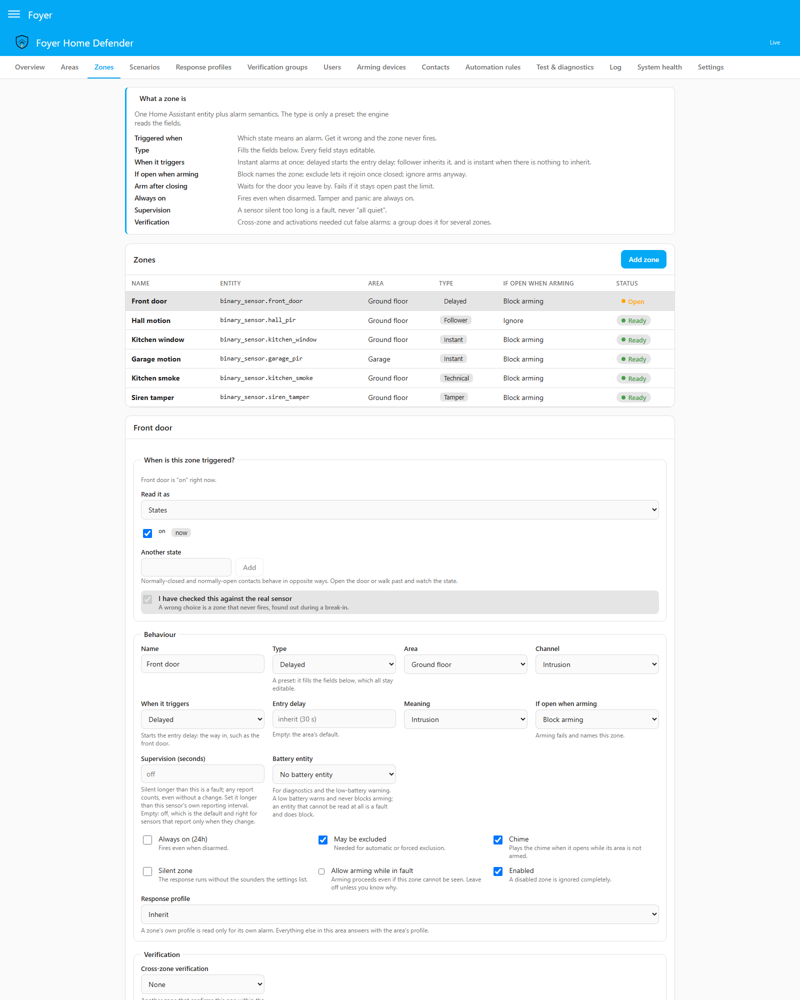
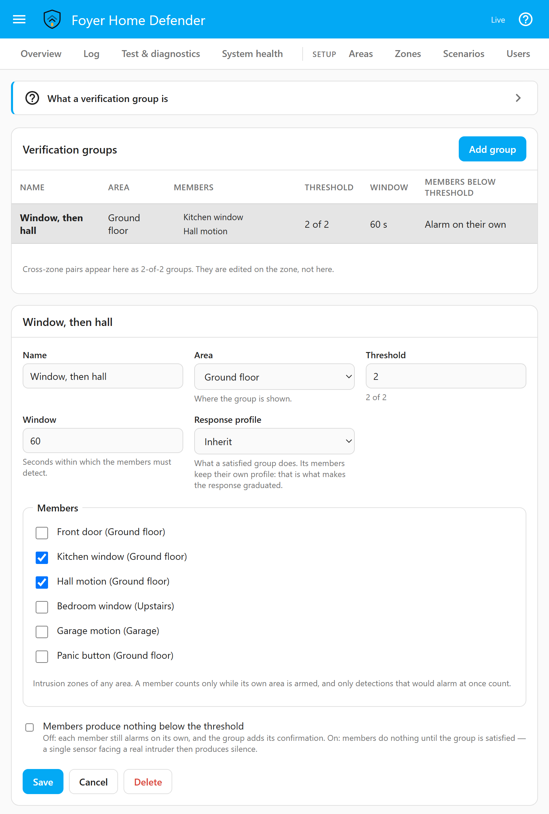

# Zones, areas and scenarios

**English** · [Italiano](zones.it.md)

This page covers the four pages of the panel that describe the house —
*Areas*, *Zones*, *Scenarios* and *Verification groups* — one setting at a
time: what it does, and why it works that way. It also covers what hangs off a
zone: key zones, the technical channel for smoke, gas and water, the chime,
and the siren cutoff with its alarm memory. It is for whoever sets the house
up, and for whoever later has to work out why a zone did what it did.

---

## How the pieces fit

```
Zone  ──belongs to──▶  Area  ──armed by──▶  Scenario
                         │
                         └── its own state and its own alarm panel entity
```

- A **zone** is one Home Assistant entity plus what it means to the alarm.
- An **area** is a group of zones armed together, with its own state and its
  own `alarm_control_panel` entity, so the ground floor can be armed while you
  are upstairs. Group by what you arm together — perimeter, interior by day,
  interior at night — rather than by room.
- A **scenario** is a named set of areas: *Night, ground floor only*, *Garage
  only*, *Dog at home*. As many as the house needs.
- **Whole house**, `alarm_control_panel.foyer_master`, aggregates the areas.
  It holds no state of its own.

### What *Whole house* reports

*Triggered* if any area is triggered; else *pending* if any area is counting
down its entry delay; else *arming* if any is counting down its exit delay;
else *armed* if **any** area is armed — a partly armed house is not a disarmed
house; else *disarmed*.

When it is armed, it reports the running scenario's mode — *Armed night*, say
— only while exactly that scenario's areas are armed. Any other armed set — an
extra area armed on its own, or one of the scenario's areas that failed to arm
— is reported as *Armed custom bypass*, because HomeKit and the voice
assistants must not be told "night" when what is armed is not Night. The exact
scenario is always on `select.foyer_scenario` and in the log.

### Three ways to arm

| Entry point | Arms | Disarms |
|---|---|---|
| An area's panel, `alarm_control_panel.foyer_<area>` | That area only, outside any scenario, whichever arm action is called | That area only |
| *Whole house* | The one scenario whose *Shown to Home Assistant as* is the mode asked for | Every area |
| `select.foyer_scenario`, the panel, the card | The chosen scenario | — |

An area's panel arms only its area: independent areas are the point of having
them, and an area button that armed a whole scenario would trap people in other
rooms. *Whole house* **refuses a mode that two or more scenarios share**, and
does not offer it to Home Assistant, because guessing which scenario "arm
night" means is how a house ends up half armed without anybody knowing. The
select carries no code, so a scenario whose arming asks for one is refused
there, and says so.

---

## Areas

| Setting | What it does |
|---|---|
| *Name* | Also names its entities: `alarm_control_panel.foyer_<name>`, `binary_sensor.foyer_ready_to_arm_<name>`, `sensor.foyer_countdown_<name>` |
| *Reports to Home Assistant as* | The state the area's panel shows when armed — *Armed away* for a new area — and the one arm action it offers. What Home Assistant, HomeKit and voice assistants see; it changes nothing about behaviour |
| *Default entry delay* | Time to disarm after a delayed zone opens, for zones that do not set their own. 30 s for a new area, 0–300 s |
| *Default exit delay* | Time to leave after arming, unless the scenario sets its own. 30 s for a new area, 0–300 s; at 0 the area arms at once |
| *Response profile* | What answers for everything that happens in the area. Empty: the scenario's, then the global default. The editor shows the effective profile and where it comes from |
| *Code to arm*, *Code to disarm* | *As the global policy*, *Code required* or *No code* |
| *Perimeter area* | The outer defence ring |

A longer entry delay gives you more time to reach the keypad, and an intruder
the same. There is no exit delay per zone: the exit timer belongs to the area.
What a zone still open at the end of the exit delay does is the zone's own
choice ([below](#open-when-arming-the-four-arm-policies)).

**The code settings** replace the global policy, set on the *Users* page, for
this area; *Code to arm* also covers a forced arming and a change of scenario
that touches the area. Arming a scenario touches several areas at once, so
where an area and a scenario disagree **the one that asks for a code wins**,
and the panel names the area asking. Nothing asks for a code until some
enabled person holds one, and the page says so while it lasts. The whole rule
is in [the security model](security-model.md).

**An automatic rule never disarms a perimeter area**, whatever the rule says
and whichever action it uses. Presence is inferred from a phone, and a stolen
phone must still find every external door and window protected. This is
enforced in the engine, with a regression test that asserts it directly; a rule
that switches scenario leaves a perimeter area armed on its own instead. You, a
keypad or a key zone disarm it as usual. The reasoning is in
[automatic rules](automation-rules.md#why-automatic-disarming-is-restricted).

---

## Scenarios

| Setting | What it does |
|---|---|
| *Name* | The option on `select.foyer_scenario`, and the Overview's arm button |
| *Shown to Home Assistant as* | The mode *Whole house* reports while exactly this scenario's areas are armed: *Armed home*, *away*, *night*, *vacation* or *custom bypass*. Several scenarios may share one; *Whole house* then refuses it, and the page says so under each |
| *Exit delay* | Replaces every area's own exit delay for this scenario. Empty: each area's own. 0–300 s |
| *Sirens sound for* | This scenario's siren cutoff — a night scenario may sound for less. Empty: the global value on *Settings*, 180 s by default. 1–900 s, never more |
| *Response profile* | The default profile of the areas it arms, read after the area's own |
| *Code to arm*, *Code to disarm* | As for an area; where the two disagree, the one that asks wins |
| *Areas armed* | Exactly these, and at least one |
| *Who may use it* | *Everyone with permission*, or only the people ticked |

**Who may use it.** A person not ticked is refused the scenario, on any
channel. Changing the list needs *Manage users and codes* as well as *Edit the
configuration*, because it decides what a person may do. Moving off *Everyone
with permission* starts with every person ticked, and the last one cannot be
unticked: an empty list saved by accident would lock the household out. The
list is checked against the person a request identifies; where arming asks no
code, a request that identifies nobody is not held to it — give the scenario
*Code to arm* if the list must hold.

### Switching scenario while armed

Choosing another scenario while one runs is a switch, not a second arming:

- areas the old scenario armed and the new one does not list are **disarmed**;
- areas in both **stay armed**, now belong to the new one, and keep any alarm
  memory, because nothing armed them again;
- areas of the new one not yet armed go through their exit delay and start
  clean;
- areas armed on their own that the new scenario does not list are left
  exactly as they are; one it does list stays armed and now belongs to it.

A switch is refused while any area it would touch is in its entry delay or
triggered: changing scenario must never silence an alarm without a disarm. It
asks for the *Change scenario* code by default, even where the global policy
asks none to arm; an area or scenario set to *No code* to arm asks none for
the switch either.
The scenario stays active while any area it armed is still armed.

---

## Zones

A zone watches one entity — `binary_sensor`, `sensor`, `cover`, `lock`,
`switch`, `input_boolean`, `device_tracker`, `person`, `event` or `tag` — chosen
when it is created, and belongs to exactly one area.

### Types are presets

*Type* fills in the fields below it, and every one stays editable. The engine
never reads the type; it reads the fields.

| Type | What it sets | For |
|---|---|---|
| *Instant* | Intrusion, instant | Windows, most motion sensors |
| *Delayed* | Intrusion, delayed | The way in, such as the front door |
| *Follower* | Intrusion, follower | The hallway you cross after the front door |
| *24h* | Intrusion, *Always on*, may not be excluded | Fires even when disarmed |
| *Tamper* | As 24h, *Meaning*: tamper | A sensor's tamper switch |
| *Panic* | As 24h, *Meaning*: panic | A panic button |
| *Technical* | Technical channel, *Always on*, may not be excluded | Smoke, gas, water ([below](#the-technical-channel)) |
| *Key* | Key channel, *If open when arming*: ignore | Arms or disarms instead of alarming ([below](#key-zones)) |

Every preset but *Key* starts on *Block arming*, all with *Silent zone* off,
and only *Instant*, *Delayed* and *Follower* may be excluded. The division that matters is
**intrusion or not**: tamper and panic are security events, smoke and gas have
nothing to do with a burglary and never reach the intrusion channel.

### The trigger: which state means an alarm

Every zone says for itself what "triggered" means. There is no global
assumption that `on` means alarm, because **normally-closed and normally-open
contact sensors behave in opposite ways**: one reports `on` when the door
opens, the other when it closes. A zone set the wrong way round does not raise
false alarms — it never fires, and you find out during the burglary.

<p align="center"></p>

So *When is this zone triggered?* says what the entity reads right now and
makes a **proposal**: a type from the entity's device class (*door* suggests
*Delayed*, *window* and *motion* *Instant*, *smoke* and *moisture*
*Technical*), and trigger states from its domain — `on` for a binary sensor,
`open` and `opening` for a cover, `unlocked`, `open` and `opening` for a
lock. A proposal is a
starting point, never a decision: **open the door or walk past, watch the
state change, and tick *I have checked this against the real sensor*.** Save
stays disabled until you do, the backend refuses the save without it whatever
the page sends, and it is asked again whenever the trigger or the entity
changes.

*Read it as* offers two readings:

- **States**: triggered while the entity is in any ticked state, shown in Home
  Assistant's words with the raw value beside it; *Another state* adds one it
  has not shown yet. `unavailable` and `unknown` can never be trigger states —
  they are faults.
- **A number**: *Above*, *Below* or *Equal to* a *Threshold*, read from the
  state or an *Attribute*. *Hysteresis* is a margin: above 50 with a
  hysteresis of 2, the zone triggers above 50 and is normal again only at or
  below 48, so a reading hovering at the threshold does not fire over and over.
  *Equal to* takes none. A value that is not a number is a fault.

`event` and `tag` entities hold the time of their last event instead. An
**event** zone needs an *Event type* and fires on each new event of it; a
**tag** fires on every scan. Both are momentary, so never "open" at arming,
and a change out of `unavailable` is Home Assistant restoring the last event at
start-up, not a new one.

**A zone's first reading is its baseline, not a change.** A zone saved while
its sensor is already triggered fires only the next time the sensor goes from
normal to triggered — which is also what stops a key switch that is already on
from arming the house the moment it is saved.

### When it triggers: entry modes and delays

| *When it triggers* | In an armed area |
|---|---|
| *Instant* | The area is triggered at once |
| *Delayed* | The area starts its entry delay; disarm before it runs out |
| *Follower* | Inherits an entry delay already running; instant when there is none |

A follower inherits the time **left**, never a fresh delay: walking from the
front door into the hall does not restart the clock. It always inherits its own
area's running entry delay. *Also follows* adds delayed zones of **other**
areas — the front door in the perimeter area, for a hall sensor in an interior
one. Areas are grouped by function, so the two often sit in different areas,
and a follower that looked only at its own would sound the alarm the moment
you walked in. With several running it takes the one that ends first, and its
own area must be disarmed too, or it runs out into an alarm.

During an entry delay an instant zone still alarms at once: the delay protects
the way in, not the rest of the house. *Entry delay* on a zone replaces the
area's for that zone (empty: the area's; 0–300 s); a delayed zone at 0 is
instant. *Always on* zones are always instant.

### Open when arming: the four arm policies

| *If open when arming* | What happens |
|---|---|
| *Block arming* (default) | Arming is refused and names the zone. A zone that opens during the exit delay and is still open when it ends fails the arming, with *Arming failed* |
| *Exclude automatically* | Arms anyway; at the end of the exit delay the zone, if still open, is excluded and announced, and **included again by itself the moment it closes**. Needs *May be excluded* |
| *Arm after closing* | Once the exit delay is over the area waits in *arming* until the zone closes, and arms the moment it does. Open too long, the arming fails as for *Block arming* |
| *Ignore* | Arms regardless; the zone fires the next time it goes from closed to open |

*Block arming* is the default because automatic exclusion everywhere breeds
unprotected windows nobody chose. *Arm after closing* is for the person who
presses arm and *then* pulls the patio door shut. It needs both the end of the
exit delay and the closure — the closure alone would arm while you are still
walking to the other door — and it has a limit, because holding for ever
leaves a house that believes it is arming and protects nothing. *Wait for it
to close, at most* is counted from the end of the exit delay: empty takes the
global value on *Settings*, 300 s by default, 60–1800 s. With several such
zones open, the shortest limit applies and arming completes when the last
closes.

### Forced arming, and excluding a zone by hand

A refused arming can be **forced** — *Arm without these zones* on the Overview,
or `force: true` on `foyer.arm`. It is a separate command, needs *Force arming*
and a code by default, and is logged as a forced arming. It excludes the open
and faulted zones that may be excluded, each included again once it is closed
and readable; a zone that may not be excluded refuses it. Forcing is never the
default and never implicit.

A zone can be excluded **by hand** — *Exclude* on the Overview's *Not ready*
list and on the card, or `foyer.bypass_zone` — and let back in with *Include
again* or `foyer.unbypass_zone`. It needs *Exclude a zone* and a code by
default. Two rules:

- **without a duration**, the exclusion ends when the area is disarmed;
- **with a duration** — *1 h*, *8 h* or a number of minutes on the Overview, up
  to 30 days through the service — it outlives the disarm and ends when its
  time is up; the zone's return is logged, and announced by any profile that
  ticks *Zone included again*, because a zone excluded and forgotten is
  exactly the window somebody comes through.

Closing the zone never ends a manual exclusion: closing the window is what it
was excluded for. An automatic exclusion, by contrast, rejoins as it closes.

**`skip_exit_delay`** on `foyer.arm`, and on the MQTT and device-endpoint arm
commands, arms with no exit delay, for the last person out who is already
outside. It needs no permission of its own — it uncovers nothing, it closes
sooner — but every zone is watched from that instant: the front door opened
on the way out starts the entry delay, and a motion sensor in the hall alarms
at once. So the armed row records it, and "why did it sound while I was still
in the hall?" has an answer.

### Faults and supervision

A zone Foyer cannot read is a **fault**, never "all quiet": its entity is
`unavailable`, `unknown` or missing (*Fault: not reachable*), a number trigger
reads something that is not a number, it has been silent past its *Silence
limit*, or its battery entity cannot be read. A fault **blocks arming its
area**, raises *Zone fault* once, lights `binary_sensor.foyer_fault`, and shows
on the Overview, the *Zones* page and in
[Test & diagnostics](simulator.md#diagnostics-am-i-looking-at-the-right-sensor).
An entity that goes unavailable keeps its last reading, so it never closes an
open door. *Allow arming while in fault* stops this one zone's fault from
blocking — for the flood sensor with a dead battery on the morning you leave.
Leave it off unless you know why.

**Supervision is off by default and set per sensor.** *Silence limit
(seconds)* is how long the zone may go without any report before it is a
fault. Any report counts, changed or not — Foyer reads Home Assistant's
`last_reported` — so a door that stays shut for a week but keeps checking in is
alive. Set it longer than that sensor's own reporting interval, 60 s to 7 days,
and leave it off for sensors that report only when they change, or it will
fault a door that stayed shut.

A **battery entity** — a percentage `sensor` or a battery `binary_sensor` —
feeds diagnostics and the low-battery warning. A low battery warns and never
blocks arming; a battery entity that cannot be read is a fault and does. The
reasons and the threshold are in [the simulator page](simulator.md#batteries).

### The rest of a zone's settings

| Setting | What it does |
|---|---|
| *Channel*, *Meaning* | Which part of the alarm the zone feeds; for an intrusion zone, whether a trigger means intrusion, tamper or panic in events and the log |
| *Always on (24h)* | Fires even when its area is disarmed |
| *May be excluded* | Needed for exclusion by hand, *Exclude automatically* and forced arming |
| *Silent zone* | Its response runs without the action kinds chosen on *Settings* — the siren, spoken messages and the chime by default. Another zone joining the same alarm still sounds. See [response profiles](response-profiles.md) |
| *Chime* | Chimes when it opens while its area is not watching it ([below](#the-chime)) |
| *Cameras* | The cameras that show this zone and the room next to it, in order. A notification set to show the zones' cameras sends them, at most four per alarm. See [response profiles](response-profiles.md) |
| *Response profile* | Read only when this zone alarms; everything else in the area answers with the area's. Empty: the area's |
| *Enabled* | A disabled zone is ignored completely: no alarm, no fault, no part in arming |

Verification — *Cross-zone verification* and *Activations needed* — is
[further down](#verification-groups).

### Zones brought in by an import

A zone from the importer carries a trigger proposed from the sensor's type
that nobody has checked. It arrives **switched off**, marked *Trigger to
confirm*, and cannot be switched on until somebody tests the sensor, corrects
the trigger if needed and ticks the confirmation. This holds on every path that
stores a configuration, a restored backup included. See
[migrating from Alarmo](migrating-from-alarmo.md).

---

## Siren cutoff and alarm memory

A triggered area's sirens sound for the siren cutoff — the scenario's *Sirens
sound for*, else the global value — and then **the siren stops, but the fact
that it fired does not**. The area returns to where it was: armed if it was
armed, disarmed if an always-on zone fired on a disarmed house (a cutoff never
arms anything), and an interrupted arming resumes with its original deadline.

**Alarm memory** stays until the area is **disarmed or armed again**, so that
somebody learns an alarm happened while nobody was looking. The Overview shows
it as a banner naming the zones, and a disarmed area holding it can be
disarmed to clear it.

- A disarm clears it, raising *Alarm memory cleared*.
- The next accepted arming of the area clears it too, with the same moment,
  whoever armed it, an automatic rule included: a new watch should not carry
  the memory of an earlier night.
- **Arming clears the memory, never the alarm.** It acknowledges no incident —
  arming asks no code by default, and a lamp switched off is not somebody who
  has seen the alarm — so the incident and its escalation go on until somebody
  acknowledges or disarms.
- A refused arming, a cutoff resuming an arming, and an area staying armed
  through a change of scenario leave the memory; a walk test does not arm an
  area that holds it.

---

## Key zones

A *Key* zone commands instead of alarming: a key switch, a remote or a button
wired as an entity.

| Setting | Options |
|---|---|
| *When activated* | *Arm the scenario*, *Disarm everything*, *Arm or disarm* |
| *Scenario* | Which scenario it arms |
| *When released* | *Nothing*, or *Disarm everything* — for a switch that stays on while the house is armed |

A key's command is not tied to its area, so it disarms every area, as *Whole
house* does;
*Arm or disarm* disarms everything if any area is armed, and otherwise arms its
scenario. The key is the credential: no code travels with it. A refused arming
is recorded as *Arming failed*, never silent, or the person walks away
believing the house is armed. Its first reading is a baseline, also when it is
switched back on after being disabled, so a switch already on does not arm the
house. Its entity unreadable is a fault, and blocks arming like any zone's.

---

## The technical channel

*Technical* zones — smoke, gas, water, temperature — run on a **separate
channel** with its own state, memory and acknowledgement, and never touch an
`alarm_control_panel`: *triggered* there means *someone has broken in* to Home
Assistant, HomeKit, Google and Alexa, and a smoke detector routed through it
would announce a burglary while the kitchen is on fire.

- **Its entities**: `binary_sensor.foyer_technical_alarm`, on while any
  technical alarm stands, and `sensor.foyer_technical_cause`, naming the zone
  that fired first.
- **Live regardless of arming** — armed, disarmed or arming, excluded or not.
- **Disarming does not clear it**, nor stop its sounders: disarming is an
  intrusion command and has no authority here.
- **Clearing takes an acknowledgement *and* the sensor back to normal.** Until
  both, it stays on every screen: *In alarm*, *Back to normal, not
  acknowledged*, or *Acknowledged, not back to normal yet*. One
  acknowledgement acts on every technical alarm pending — from the Overview's
  banner, `button.foyer_acknowledge`, `foyer.acknowledge` with `target:
  technical`, or a notification's button.
- **Its own response**: the zone's profile, else the *Technical profile* on
  *Settings*, else the default — never the area's or the scenario's, because a
  smoke detector must not answer differently depending on how the house is
  armed. Its escalation is its own, and never merges with an intrusion
  incident.
- **A fault blocks arming**, as for any zone, unless *Allow arming while in
  fault* is on.
- **The first reading is a baseline**: a detector already detecting when saved
  alarms only once it has returned to normal and detects again. Save it quiet;
  the editor says so.

A smoke detector wired into Home Assistant does not replace certified,
interconnected smoke alarms.

---

## The chime

A zone with *Chime* ticked chimes when it opens **while its area is not
watching it** — not merely while the house is disarmed, which would leave a
hole in exactly the partial scenarios this project exists for: with only the
perimeter armed, the internal door still chimes. It is read per area, however
the area came to be armed or not. An always-on zone is always watched and
cannot chime; an excluded zone does not.

The chime is set once, in the *Chime* card on the **Settings** page, not in a
response profile:

| Setting | What it does |
|---|---|
| *Play on* | Media players, sirens, and `notify` services or entities — a phone or Telegram receives the zone's name as a message. Nothing chimes until one is set. A siren is used only if it accepts a duration |
| *Mode* | *Single sound* (the *Media to play*), or *Speak the zone name* through a *Text-to-speech* entity, which tells you *what* opened from the next room |
| *Volume* | Set on the media players first; empty leaves it alone |
| *Quiet from … until* | No chime in this window, which may cross midnight. Each target may have its own window, replacing the global one: the speakers all day, the phone only from nine to ten |
| *Also during the exit delay* | Off by default: the door you leave by is expected to open |

`switch.foyer_chime` switches it off and on from a card, a keypad or an
automation. **No zone chimes during a walk test**: the chime is held back with
every other action the test inhibits. A *Silent zone* does not chime while the
chime is on the silent list, as it is by default.

---

## Verification groups

A group alarms when **at least N of its member zones** detect within a window:
the strongest tool against false alarms in large spaces — an open plan with
three motion sensors, a garden with two beams.

<p align="center"></p>

| Setting | What it does |
|---|---|
| *Area* | Where the group is shown and, without a profile of its own, whose chain answers for it |
| *Threshold* | How many different members must detect: at least 2, at most the number of members |
| *Window* | Seconds within which they must: 1–3600, 60 by default. Longer is easier to satisfy |
| *Response profile* | What a satisfied group does |
| *Members* | Two or more intrusion zones, in any area |
| *Members produce nothing below the threshold* | Off by default |

**Members keep their own profile**, which is what makes a group worth having.
Give the members a quiet profile and the group a loud one: one PIR in the open
plan sends a notification, two within sixty seconds sound the siren. A member
that is not suppressed **alarms normally on its own** — its area is triggered
and an incident opens — and the satisfied group adds *Detection confirmed* and
its own response. Where several profiles feed one incident, the escalation is
the highest-severity one's ([response profiles](response-profiles.md)).

**With *Members produce nothing below the threshold*** a member's detection is
held back until the group is satisfied, then released. It is not the default:
a single sensor facing a real intruder and producing complete silence is
indistinguishable from the system working. If too few members are left able to
count for the group ever to be satisfied, a member acts on its own rather than
being held for ever.

- **Only a detection that would alarm at once counts**: an instant or 24h zone,
  a follower with nothing to inherit, anything in an area already triggered. A
  detection the entry delay absorbs acts normally and never counts, so coming
  home can never satisfy a group.
- **Members may sit in different areas** — a perimeter window confirmed by an
  interior motion sensor is the common case. Each counts only while its own
  area watches it, and acts in its own area.
- **A zone belongs to one group or cross-zone pair at most**, or its detection
  would count twice; the editor offers only free zones.
- A group needs at least as many enabled members as its threshold: a save
  that would leave fewer, switching a member off included, is refused and
  says why.

### Cross-zone verification

*Cross-zone verification* on a zone is the common case — one sensor confirming
another — kept as one field on the zone. The engine evaluates it **as a group
of two where both must detect**: one engine, one representation in the
simulator's trace, and a test asserting that a pair and the equivalent
two-of-two group give identical results.

The pair is **symmetric** — A pointing at B forms {A, B}; B need not point back
— and it **does not suppress** its members: each still alarms on its own, and
when both detect within the window the pair is recorded as confirmed. It is a
confirmation, not a filter; the filter is a group with *Members produce nothing
below the threshold*. Declared from both ends, a pair has one window, so the two
*Within* values must match. Pairs are listed on *Verification groups* as *from
zone field* and edited on the zone.

### Activations needed

*Activations needed* is the same engine over one zone: how many times it must
detect within *Within* before it alarms — 1 means at once, up to 10, within
1–3600 s. Below the count the zone does nothing. Only detections that would
alarm at once count, as in a group. Verification, counting and the chime belong
to intrusion zones only.

---

## The entities

| Entity | What it says |
|---|---|
| `binary_sensor.foyer_zone_<zone>` | `on` means triggered, through the zone's own trigger, whatever word the entity uses. Attributes: source entity, type, excluded and why, in fault, enabled |
| `binary_sensor.foyer_ready_to_arm` | Whether arming every area would succeed now; `…_ready_to_arm_<area>` per area. Attributes name the faulted and open zones that block |
| `sensor.foyer_open_zones` | How many intrusion zones are open, names as an attribute |
| `binary_sensor.foyer_fault` | Any zone in fault, names as an attribute |
| `sensor.foyer_countdown_<area>` | Seconds left of an exit or entry delay, or of an *Arm after closing* wait |
| `switch.foyer_chime` | The chime on or off |

`ready_to_arm` reads the same function the engine uses to refuse an arming for
a fault or an open zone, so it cannot say *ready* where a zone would block; a
code, a permission or a walk test can still refuse the request.

---

## While the house is armed

An armed house keeps the configuration it was armed with. While an area is not
disarmed, it, its zones and the groups that reach them cannot be changed, nor
can the running scenario; while any area is armed, what any area or scenario
asks a code for cannot change in either direction, because the stricter
setting wins across all of them. The page says why when it refuses; disarm
first. Disarmed areas can still be programmed while others stay armed. The full
list is on [the Settings page](settings.md).
